# Complete Database Tutorial: From Zero to Hero with MariaDB

## Table of Contents
1. [What is a Database?](#what-is-a-database)
2. [Setting Up MariaDB](#setting-up-mariadb)
3. [Database Fundamentals](#database-fundamentals)
4. [Understanding Tables and Data Types](#understanding-tables-and-data-types)
5. [DDL - Data Definition Language](#ddl---data-definition-language)
6. [DML - Data Manipulation Language](#dml---data-manipulation-language)
7. [Entity Relationship Diagrams (ERD)](#entity-relationship-diagrams-erd)
8. [Relationships and Cardinality](#relationships-and-cardinality)
9. [Database Constraints](#database-constraints)
10. [Hands-On Practice](#hands-on-practice)

---

## What is a Database?

Think of a database as a **digital filing cabinet** that stores information in an organized way. Just like how you might organize physical files in folders, databases organize digital information in **tables**.

### Why Do We Need Databases?

Imagine trying to manage a library with thousands of books using only paper lists:
- **Hard to find information quickly**
- **Easy to lose or duplicate data**
- **Difficult to update information**
- **No way to ensure data accuracy**

Databases solve these problems by providing:
- **Fast searching and retrieval**
- **Data integrity and consistency**
- **Concurrent access by multiple users**
- **Backup and recovery capabilities**

### Real-World Examples
- **Netflix**: Stores movie information, user preferences, viewing history
- **Amazon**: Product catalogs, customer orders, inventory
- **Bank**: Account information, transactions, customer data
- **Hospital**: Patient records, appointments, medical history

---

## Setting Up MariaDB

### Installation

**Ubuntu/Debian:**
```bash
sudo apt update
sudo apt install mariadb-server
sudo mysql_secure_installation
```

**macOS (using Homebrew):**
```bash
brew install mariadb
brew services start mariadb
```

**Windows:**
Download from [MariaDB official website](https://mariadb.org/download/)

### Starting MariaDB Terminal
```bash
# Connect as root
sudo mysql -u root -p

# Or create a user and connect
mysql -u your_username -p
```

### Basic Terminal Navigation
```sql
-- Show all databases
SHOW DATABASES;

-- Create a new database
CREATE DATABASE my_first_db;

-- Use a database
USE my_first_db;

-- Show tables in current database
SHOW TABLES;

-- Show current database
SELECT DATABASE();

-- Exit MariaDB
EXIT;
```

---

## Database Fundamentals

### Key Concepts

**Database**: A collection of related tables
**Table**: A collection of related records (like a spreadsheet)
**Record/Row**: A single entry in a table
**Field/Column**: A single piece of information in a record
**Primary Key**: A unique identifier for each record

### Analogy: Library System
```
Database = Entire Library System
Table = Different sections (Books, Members, Loans)
Record = Individual book, member, or loan
Field = Title, Author, ISBN (for books)
Primary Key = Unique book ID
```

### Visual Representation


---

## Understanding Tables and Data Types

### Common Data Types in MariaDB

| Data Type | Description | Example | When to Use |
|-----------|-------------|---------|-------------|
| `INT` | Whole numbers | 42, -17, 0 | IDs, quantities, ages |
| `VARCHAR(n)` | Text up to n characters | 'John Doe', 'Email@example.com' | Names, emails, short text |
| `TEXT` | Long text | Article content, descriptions | Long descriptions, comments |
| `DATE` | Date values | '2024-01-15' | Birth dates, deadlines |
| `DATETIME` | Date and time | '2024-01-15 14:30:00' | Creation timestamps |
| `DECIMAL(m,d)` | Precise decimal numbers | 19.99, 1000.50 | Prices, financial data |
| `BOOLEAN` | True/False values | TRUE, FALSE | Yes/No questions |

### Data Type Selection Guide

```mermaid
flowchart TD
    A[What type of data?] --> B[Numbers]
    A --> C[Text]
    A --> D[Dates]
    A --> E[True/False]
    
    B --> B1[Whole numbers?<br/>→ INT]
    B --> B2[Decimal numbers?<br/>→ DECIMAL]
    
    C --> C1[Short text < 255 chars?<br/>→ VARCHAR]
    C --> C2[Long text?<br/>→ TEXT]
    
    D --> D1[Date only?<br/>→ DATE]
    D --> D2[Date + Time?<br/>→ DATETIME]
    
    E --> E1[BOOLEAN]
```


---

## DDL - Data Definition Language

**DDL** commands are used to **define and modify the structure** of database objects like databases, tables, indexes, etc. Think of DDL as the **architect's blueprints** - they define what your database will look like.

### Key DDL Commands

| Command | Purpose | Example |
|---------|---------|---------|
| `CREATE` | Create new database objects | CREATE TABLE, CREATE DATABASE |
| `ALTER` | Modify existing objects | ALTER TABLE ADD COLUMN |
| `DROP` | Delete objects | DROP TABLE, DROP DATABASE |
| `TRUNCATE` | Remove all data from table | TRUNCATE TABLE |

### 1. CREATE Commands

#### Creating a Database
```sql
-- Create a new database
CREATE DATABASE school_system;

-- Use the database
USE school_system;

-- Verify creation
SHOW DATABASES;
```

#### Creating Tables
```sql
-- Basic table creation
CREATE TABLE students (
    student_id INT,
    first_name VARCHAR(50),
    last_name VARCHAR(50),
    email VARCHAR(100),
    age INT
);

-- More detailed table with constraints
CREATE TABLE teachers (
    teacher_id INT AUTO_INCREMENT PRIMARY KEY,
    first_name VARCHAR(50) NOT NULL,
    last_name VARCHAR(50) NOT NULL,
    email VARCHAR(100) UNIQUE NOT NULL,
    subject VARCHAR(100),
    hire_date DATE,
    salary DECIMAL(10,2),
    is_active BOOLEAN DEFAULT TRUE,
    created_at DATETIME DEFAULT CURRENT_TIMESTAMP
);
```

**Explanation of CREATE TABLE components:**
- `AUTO_INCREMENT`: Automatically generates unique numbers (1, 2, 3...)
- `PRIMARY KEY`: Makes this column the unique identifier
- `NOT NULL`: This field must have a value
- `UNIQUE`: No two records can have the same value
- `DEFAULT`: Sets a default value if none provided

#### Creating Tables with Foreign Keys
```sql
-- Create courses table first
CREATE TABLE courses (
    course_id INT AUTO_INCREMENT PRIMARY KEY,
    course_name VARCHAR(100) NOT NULL,
    course_code VARCHAR(10) UNIQUE NOT NULL,
    credits INT DEFAULT 3,
    teacher_id INT,
    FOREIGN KEY (teacher_id) REFERENCES teachers(teacher_id)
);
```

### 2. ALTER Commands

**ALTER** is used to modify existing table structures.

#### Adding Columns
```sql
-- Add a single column
ALTER TABLE students 
ADD COLUMN phone VARCHAR(15);

-- Add multiple columns
ALTER TABLE students 
ADD COLUMN address TEXT,
ADD COLUMN enrollment_date DATE DEFAULT (CURRENT_DATE);

-- Add column with constraints
ALTER TABLE students 
ADD COLUMN student_code VARCHAR(10) UNIQUE NOT NULL;
```

#### Modifying Columns
```sql
-- Change column data type
ALTER TABLE students 
MODIFY COLUMN age INT NOT NULL;

-- Rename a column
ALTER TABLE students 
CHANGE COLUMN phone phone_number VARCHAR(20);

-- Change column with new constraints
ALTER TABLE students 
MODIFY COLUMN email VARCHAR(100) UNIQUE NOT NULL;
```

#### Adding Constraints
```sql
-- Add primary key
ALTER TABLE students 
ADD PRIMARY KEY (student_id);

-- Add foreign key
ALTER TABLE students 
ADD COLUMN course_id INT,
ADD FOREIGN KEY (course_id) REFERENCES courses(course_id);

-- Add check constraint
ALTER TABLE students 
ADD CONSTRAINT check_age CHECK (age >= 16 AND age <= 100);
```

#### Dropping Columns and Constraints
```sql
-- Drop a column
ALTER TABLE students 
DROP COLUMN address;

-- Drop foreign key constraint
ALTER TABLE students 
DROP FOREIGN KEY students_ibfk_1;

-- Drop index
ALTER TABLE students 
DROP INDEX email;
```

### 3. DROP Commands

**DROP** permanently deletes database objects.

```sql
-- Drop a table (CAREFUL - this deletes all data!)
DROP TABLE IF EXISTS old_table;

-- Drop a database (VERY CAREFUL!)
DROP DATABASE IF EXISTS old_database;

-- Drop specific constraints
ALTER TABLE students DROP CONSTRAINT check_age;
```

### 4. TRUNCATE Command

**TRUNCATE** removes all data from a table but keeps the structure.

```sql
-- Remove all data but keep table structure
TRUNCATE TABLE students;

-- This is faster than DELETE for removing all records
-- But you cannot use WHERE clause with TRUNCATE
```

### DDL Examples in Action

Let's create a complete student management system:

```sql
-- Step 1: Create database
CREATE DATABASE student_management;
USE student_management;

-- Step 2: Create departments table
CREATE TABLE departments (
    dept_id INT AUTO_INCREMENT PRIMARY KEY,
    dept_name VARCHAR(100) NOT NULL UNIQUE,
    dept_code VARCHAR(10) NOT NULL UNIQUE,
    created_at TIMESTAMP DEFAULT CURRENT_TIMESTAMP
);

-- Step 3: Create students table
CREATE TABLE students (
    student_id INT AUTO_INCREMENT PRIMARY KEY,
    first_name VARCHAR(50) NOT NULL,
    last_name VARCHAR(50) NOT NULL,
    email VARCHAR(100) UNIQUE NOT NULL,
    phone VARCHAR(15),
    date_of_birth DATE,
    dept_id INT,
    enrollment_date DATE DEFAULT (CURRENT_DATE),
    is_active BOOLEAN DEFAULT TRUE,
    FOREIGN KEY (dept_id) REFERENCES departments(dept_id)
);

-- Step 4: Modify students table to add more fields
ALTER TABLE students 
ADD COLUMN student_code VARCHAR(20) UNIQUE,
ADD COLUMN gpa DECIMAL(3,2) DEFAULT 0.00,
ADD CONSTRAINT check_gpa CHECK (gpa >= 0.00 AND gpa <= 4.00);

-- Step 5: Create courses table
CREATE TABLE courses (
    course_id INT AUTO_INCREMENT PRIMARY KEY,
    course_name VARCHAR(100) NOT NULL,
    course_code VARCHAR(10) UNIQUE NOT NULL,
    credits INT DEFAULT 3 CHECK (credits > 0),
    dept_id INT,
    FOREIGN KEY (dept_id) REFERENCES departments(dept_id)
);

-- View all tables
SHOW TABLES;

-- View table structure
DESCRIBE students;
DESCRIBE courses;
```

---

## DML - Data Manipulation Language

**DML** commands are used to **manipulate data** within tables. Think of DML as the **day-to-day operations** - adding, reading, updating, and deleting actual data.

### Key DML Commands

| Command | Purpose | Example |
|---------|---------|---------|
| `INSERT` | Add new data | INSERT INTO table VALUES (...) |
| `SELECT` | Retrieve data | SELECT * FROM table |
| `UPDATE` | Modify existing data | UPDATE table SET column = value |
| `DELETE` | Remove data | DELETE FROM table WHERE condition |

### 1. INSERT - Adding Data

#### Basic INSERT Syntax
```sql
-- Insert single record with all columns
INSERT INTO table_name (column1, column2, column3) 
VALUES (value1, value2, value3);

-- Insert single record without specifying columns (must match order)
INSERT INTO table_name 
VALUES (value1, value2, value3);
```

#### Practical INSERT Examples

```sql
-- First, let's add some departments
INSERT INTO departments (dept_name, dept_code) 
VALUES ('Computer Science', 'CS');

INSERT INTO departments (dept_name, dept_code) 
VALUES ('Mathematics', 'MATH');

INSERT INTO departments (dept_name, dept_code) 
VALUES ('Physics', 'PHYS');

-- Insert multiple records at once
INSERT INTO departments (dept_name, dept_code) VALUES
    ('Chemistry', 'CHEM'),
    ('Biology', 'BIO'),
    ('English', 'ENG');

-- Insert students
INSERT INTO students (first_name, last_name, email, phone, date_of_birth, dept_id, student_code) 
VALUES ('John', 'Doe', 'john.doe@email.com', '555-0123', '2000-05-15', 1, 'CS2024001');

INSERT INTO students (first_name, last_name, email, phone, date_of_birth, dept_id, student_code) 
VALUES ('Jane', 'Smith', 'jane.smith@email.com', '555-0456', '1999-08-22', 2, 'MATH2024001');

-- Insert multiple students
INSERT INTO students (first_name, last_name, email, dept_id, student_code) VALUES
    ('Mike', 'Johnson', 'mike.j@email.com', 1, 'CS2024002'),
    ('Sarah', 'Wilson', 'sarah.w@email.com', 3, 'PHYS2024001'),
    ('Tom', 'Brown', 'tom.b@email.com', 1, 'CS2024003');
```

#### INSERT with DEFAULT values
```sql
-- When you don't specify values for columns with DEFAULT
INSERT INTO students (first_name, last_name, email, dept_id) 
VALUES ('Alice', 'Davis', 'alice.d@email.com', 2);
-- enrollment_date will be today's date, is_active will be TRUE
```

### 2. SELECT - Retrieving Data

**SELECT** is the most frequently used SQL command. It's how you **read** data from tables.

#### Basic SELECT Syntax
```sql
-- Select all columns from all rows
SELECT * FROM table_name;

-- Select specific columns
SELECT column1, column2 FROM table_name;

-- Select with conditions
SELECT column1, column2 FROM table_name WHERE condition;
```

#### Practical SELECT Examples

```sql
-- Select all students
SELECT * FROM students;

-- Select specific columns
SELECT first_name, last_name, email FROM students;

-- Select with WHERE clause
SELECT first_name, last_name FROM students WHERE dept_id = 1;

-- Select with multiple conditions
SELECT * FROM students 
WHERE dept_id = 1 AND is_active = TRUE;

-- Select with OR condition
SELECT * FROM students 
WHERE dept_id = 1 OR dept_id = 2;

-- Select with LIKE (pattern matching)
SELECT * FROM students 
WHERE first_name LIKE 'J%';  -- Names starting with 'J'

SELECT * FROM students 
WHERE email LIKE '%@email.com';  -- Emails ending with '@email.com'

-- Select with IN (multiple values)
SELECT * FROM students 
WHERE dept_id IN (1, 2, 3);

-- Select with BETWEEN (range)
SELECT * FROM students 
WHERE date_of_birth BETWEEN '1999-01-01' AND '2001-12-31';

-- Select with NULL checks
SELECT * FROM students 
WHERE phone IS NOT NULL;

SELECT * FROM students 
WHERE phone IS NULL;
```

#### SELECT with Sorting and Limiting
```sql
-- Sort results (ORDER BY)
SELECT * FROM students 
ORDER BY last_name;  -- Ascending (A-Z)

SELECT * FROM students 
ORDER BY last_name DESC;  -- Descending (Z-A)

-- Sort by multiple columns
SELECT * FROM students 
ORDER BY dept_id, last_name;

-- Limit results
SELECT * FROM students 
LIMIT 5;  -- First 5 records

SELECT * FROM students 
LIMIT 5 OFFSET 10;  -- Skip 10, then get 5 records
```

#### SELECT with JOINs (combining tables)
```sql
-- INNER JOIN - only matching records
SELECT s.first_name, s.last_name, d.dept_name 
FROM students s
INNER JOIN departments d ON s.dept_id = d.dept_id;

-- LEFT JOIN - all students, even without department
SELECT s.first_name, s.last_name, d.dept_name 
FROM students s
LEFT JOIN departments d ON s.dept_id = d.dept_id;
```

#### SELECT with Aggregate Functions
```sql
-- Count records
SELECT COUNT(*) FROM students;

-- Count students per department
SELECT d.dept_name, COUNT(s.student_id) as student_count
FROM departments d
LEFT JOIN students s ON d.dept_id = s.dept_id
GROUP BY d.dept_id, d.dept_name;

-- Average, Min, Max
SELECT 
    AVG(gpa) as average_gpa,
    MIN(gpa) as lowest_gpa,
    MAX(gpa) as highest_gpa
FROM students 
WHERE gpa > 0;
```

### 3. UPDATE - Modifying Data

**UPDATE** changes existing data in tables.

#### Basic UPDATE Syntax
```sql
-- Update specific records
UPDATE table_name 
SET column1 = value1, column2 = value2 
WHERE condition;

-- Update all records (BE CAREFUL!)
UPDATE table_name 
SET column1 = value1;
```

#### Practical UPDATE Examples

```sql
-- Update a single student's information
UPDATE students 
SET phone = '555-9999', gpa = 3.75 
WHERE student_id = 1;

-- Update multiple students
UPDATE students 
SET is_active = FALSE 
WHERE dept_id = 3;

-- Update with calculations
UPDATE students 
SET gpa = gpa + 0.1 
WHERE gpa < 3.0;

-- Update using another table's data
UPDATE students s
JOIN departments d ON s.dept_id = d.dept_id
SET s.student_code = CONCAT(d.dept_code, '2024', LPAD(s.student_id, 3, '0'))
WHERE s.student_code IS NULL;

-- Update with CASE statement
UPDATE students 
SET gpa = CASE 
    WHEN gpa < 2.0 THEN 2.0
    WHEN gpa > 4.0 THEN 4.0
    ELSE gpa
END;
```

### 4. DELETE - Removing Data

**DELETE** removes records from tables.

#### Basic DELETE Syntax
```sql
-- Delete specific records
DELETE FROM table_name WHERE condition;

-- Delete all records (BE VERY CAREFUL!)
DELETE FROM table_name;
```

#### Practical DELETE Examples

```sql
-- Delete a specific student
DELETE FROM students 
WHERE student_id = 5;

-- Delete students from a specific department
DELETE FROM students 
WHERE dept_id = 4;

-- Delete inactive students
DELETE FROM students 
WHERE is_active = FALSE;

-- Delete students with no email
DELETE FROM students 
WHERE email IS NULL;

-- Delete using JOIN (students from deleted departments)
DELETE s FROM students s
JOIN departments d ON s.dept_id = d.dept_id
WHERE d.dept_name = 'Discontinued Program';
```

### DML Best Practices and Safety

#### Always Use WHERE with UPDATE and DELETE
```sql
-- BAD - Updates all records!
UPDATE students SET gpa = 0;

-- GOOD - Updates specific records
UPDATE students SET gpa = 0 WHERE student_id = 1;
```

#### Test with SELECT First
```sql
-- Before deleting, test your WHERE clause with SELECT
SELECT * FROM students WHERE is_active = FALSE;
-- If this shows the right records, then:
DELETE FROM students WHERE is_active = FALSE;
```

#### Use Transactions for Safety
```sql
-- Start transaction
START TRANSACTION;

-- Make changes
UPDATE students SET gpa = gpa + 0.5 WHERE dept_id = 1;

-- Check results
SELECT * FROM students WHERE dept_id = 1;

-- If good, commit; if bad, rollback
COMMIT;
-- OR
-- ROLLBACK;
```

### Complete DML Example Workflow

```sql
-- 1. INSERT: Add sample data
INSERT INTO courses (course_name, course_code, credits, dept_id) VALUES
    ('Database Systems', 'CS301', 4, 1),
    ('Calculus I', 'MATH101', 4, 2),
    ('Physics I', 'PHYS101', 4, 3);

-- 2. SELECT: View what we inserted
SELECT c.course_name, c.course_code, d.dept_name 
FROM courses c
JOIN departments d ON c.dept_id = d.dept_id;

-- 3. UPDATE: Modify course credits
UPDATE courses 
SET credits = 3 
WHERE course_code = 'CS301';

-- 4. SELECT: Verify the update
SELECT course_name, credits FROM courses WHERE course_code = 'CS301';

-- 5. DELETE: Remove a course
DELETE FROM courses WHERE course_code = 'PHYS101';

-- 6. SELECT: Confirm deletion
SELECT * FROM courses;
```

---

## Entity Relationship Diagrams (ERD)

An **Entity Relationship Diagram** is like a blueprint that shows:
- **What data you'll store** (entities)
- **How different pieces of data relate to each other** (relationships)
- **Rules about the data** (constraints)

### Basic ERD Components

**Entity**: A "thing" you want to store information about
- Rectangle shape
- Examples: Customer, Product, Order

**Attribute**: Properties of an entity
- Oval shape
- Examples: Customer name, Product price

**Relationship**: How entities connect
- Diamond shape
- Examples: Customer "places" Order

### Simple ERD Example


### ERD Symbols Explained


---

## Relationships and Cardinality

### Understanding Cardinality

Cardinality describes **how many** of one entity can relate to **how many** of another entity.

### Types of Relationships

#### 1. One-to-One (1:1)
**One entity relates to exactly one other entity**

**Example**: Person ↔ Passport
- One person has one passport
- One passport belongs to one person


**SQL Implementation:**
```sql
CREATE TABLE persons (
    person_id INT AUTO_INCREMENT PRIMARY KEY,
    first_name VARCHAR(50) NOT NULL,
    last_name VARCHAR(50) NOT NULL,
    birth_date DATE
);

CREATE TABLE passports (
    passport_id INT AUTO_INCREMENT PRIMARY KEY,
    person_id INT UNIQUE NOT NULL,  -- UNIQUE ensures 1:1
    passport_number VARCHAR(20) UNIQUE NOT NULL,
    issue_date DATE,
    expiry_date DATE,
    FOREIGN KEY (person_id) REFERENCES persons(person_id)
);
```

#### 2. One-to-Many (1:M)
**One entity can relate to many others, but each "many" relates to only one**

**Example**: Customer → Orders
- One customer can place many orders
- Each order belongs to one customer


**SQL Implementation:**
```sql
CREATE TABLE customers (
    customer_id INT AUTO_INCREMENT PRIMARY KEY,
    name VARCHAR(100) NOT NULL,
    email VARCHAR(100) UNIQUE,
    phone VARCHAR(15)
);

CREATE TABLE orders (
    order_id INT AUTO_INCREMENT PRIMARY KEY,
    customer_id INT NOT NULL,  -- No UNIQUE, allows multiple orders per customer
    amount DECIMAL(10,2),
    order_date DATE,
    status VARCHAR(20),
    FOREIGN KEY (customer_id) REFERENCES customers(customer_id)
);
```

#### 3. Many-to-Many (M:M)
**Many entities can relate to many others**

**Example**: Students ↔ Courses
- One student can enroll in many courses
- One course can have many students


**SQL Implementation:**
```sql
CREATE TABLE students (
    student_id INT AUTO_INCREMENT PRIMARY KEY,
    name VARCHAR(100) NOT NULL,
    email VARCHAR(100) UNIQUE
);

CREATE TABLE courses (
    course_id INT AUTO_INCREMENT PRIMARY KEY,
    course_name VARCHAR(100) NOT NULL,
    credits INT
);

-- Junction/Bridge table for Many-to-Many
CREATE TABLE enrollments (
    enrollment_id INT AUTO_INCREMENT PRIMARY KEY,
    student_id INT NOT NULL,
    course_id INT NOT NULL,
    enrollment_date DATE,
    grade VARCHAR(2),
    FOREIGN KEY (student_id) REFERENCES students(student_id),
    FOREIGN KEY (course_id) REFERENCES courses(course_id),
    UNIQUE(student_id, course_id)  -- Prevents duplicate enrollments
);
```

### Cardinality Symbols in ERD


### Relationship Examples in Real Life


---

## Database Constraints

Constraints are **rules** that ensure your data stays accurate and consistent.

### Types of Constraints

#### 1. PRIMARY KEY
- **Uniquely identifies each record**
- **Cannot be NULL**
- **Cannot be duplicated**
- **Only one per table**

```sql
CREATE TABLE products (
    product_id INT AUTO_INCREMENT PRIMARY KEY,  -- Method 1
    name VARCHAR(100) NOT NULL
);

-- OR Method 2
CREATE TABLE products (
    product_id INT AUTO_INCREMENT,
    name VARCHAR(100) NOT NULL,
    PRIMARY KEY (product_id)
);

-- Composite Primary Key (multiple columns)
CREATE TABLE order_items (
    order_id INT,
    product_id INT,
    quantity INT,
    PRIMARY KEY (order_id, product_id)
);
```

#### 2. FOREIGN KEY
- **Links tables together**
- **Ensures referenced record exists**
- **Maintains referential integrity**

```sql
CREATE TABLE orders (
    order_id INT AUTO_INCREMENT PRIMARY KEY,
    customer_id INT,
    order_date DATE,
    FOREIGN KEY (customer_id) REFERENCES customers(customer_id)
);

-- Foreign Key with actions
CREATE TABLE orders (
    order_id INT AUTO_INCREMENT PRIMARY KEY,
    customer_id INT,
    order_date DATE,
    FOREIGN KEY (customer_id) REFERENCES customers(customer_id)
        ON DELETE CASCADE    -- Delete orders when customer is deleted
        ON UPDATE CASCADE    -- Update orders when customer_id changes
);
```

**Foreign Key Actions:**
- `CASCADE`: Automatically update/delete child records
- `SET NULL`: Set foreign key to NULL
- `RESTRICT`: Prevent the action
- `NO ACTION`: Same as RESTRICT

#### 3. UNIQUE
- **Ensures no duplicate values**
- **Can be NULL (unless also NOT NULL)**
- **Can have multiple UNIQUE constraints per table**

```sql
CREATE TABLE users (
    id INT AUTO_INCREMENT PRIMARY KEY,
    username VARCHAR(50) UNIQUE NOT NULL,
    email VARCHAR(100) UNIQUE NOT NULL,
    phone VARCHAR(15) UNIQUE  -- Can be NULL, but if not NULL, must be unique
);

-- Composite UNIQUE constraint
CREATE TABLE courses (
    course_id INT AUTO_INCREMENT PRIMARY KEY,
    course_code VARCHAR(10),
    semester VARCHAR(10),
    year INT,
    UNIQUE (course_code, semester, year)  -- Combination must be unique
);
```

#### 4. NOT NULL
- **Field must have a value**
- **Prevents empty records**

```sql
CREATE TABLE employees (
    id INT AUTO_INCREMENT PRIMARY KEY,
    first_name VARCHAR(50) NOT NULL,    -- Required
    last_name VARCHAR(50) NOT NULL,     -- Required
    middle_name VARCHAR(50),            -- Optional
    email VARCHAR(100) NOT NULL,        -- Required
    phone VARCHAR(15)                   -- Optional
);
```

#### 5. CHECK
- **Custom validation rules**
- **Ensures data meets specific conditions**

```sql
CREATE TABLE products (
    id INT AUTO_INCREMENT PRIMARY KEY,
    name VARCHAR(100) NOT NULL,
    price DECIMAL(10,2) CHECK (price > 0),                    -- Price must be positive
    stock_quantity INT CHECK (stock_quantity >= 0),           -- Stock can't be negative
    category VARCHAR(50) CHECK (category IN ('Electronics', 'Clothing', 'Books'))
);

CREATE TABLE employees (
    id INT AUTO_INCREMENT PRIMARY KEY,
    name VARCHAR(100) NOT NULL,
    age INT CHECK (age >= 18 AND age <= 65),                  -- Age range
    salary DECIMAL(10,2) CHECK (salary >= 30000),             -- Minimum salary
    email VARCHAR(100) CHECK (email LIKE '%@%.%')             -- Basic email format
);
```

#### 6. DEFAULT
- **Sets automatic value when none provided**

```sql
CREATE TABLE orders (
    order_id INT AUTO_INCREMENT PRIMARY KEY,
    customer_id INT,
    order_date DATE DEFAULT (CURRENT_DATE),                   -- Today's date
    status VARCHAR(20) DEFAULT 'pending',                     -- Default status
    is_paid BOOLEAN DEFAULT FALSE,                            -- Default to unpaid
    created_at TIMESTAMP DEFAULT CURRENT_TIMESTAMP            -- Current time
);
```

### Constraint Validation Flow

```mermaid
flowchart TD
    A[Data Input] --> B{Primary Key Check}
    B -->|Unique?| C{Foreign Key Check}
    B -->|Duplicate| X[❌ Reject]
    C -->|Valid Reference?| D{NOT NULL Check}
    C -->|Invalid Reference| X
    D -->|Has Value?| E{UNIQUE Check}
    D -->|NULL where NOT NULL| X
    E -->|Unique?| F{CHECK Constraint}
    E -->|Duplicate| X
    F -->|Valid?| G[✅ Accept Data]
    F -->|Invalid| X
```


### Adding Constraints to Existing Tables

```sql
-- Add PRIMARY KEY
ALTER TABLE students ADD PRIMARY KEY (student_id);

-- Add FOREIGN KEY
ALTER TABLE enrollments 
ADD FOREIGN KEY (student_id) REFERENCES students(student_id);

-- Add UNIQUE constraint
ALTER TABLE students 
ADD CONSTRAINT unique_email UNIQUE (email);

-- Add CHECK constraint
ALTER TABLE students 
ADD CONSTRAINT check_age CHECK (age >= 16 AND age <= 100);

-- Add NOT NULL (modify column)
ALTER TABLE students 
MODIFY COLUMN first_name VARCHAR(50) NOT NULL;
```

### Dropping Constraints

```sql
-- Drop PRIMARY KEY
ALTER TABLE students DROP PRIMARY KEY;

-- Drop FOREIGN KEY (need constraint name)
ALTER TABLE enrollments DROP FOREIGN KEY enrollments_ibfk_1;

-- Drop UNIQUE constraint
ALTER TABLE students DROP INDEX unique_email;

-- Drop CHECK constraint
ALTER TABLE students DROP CONSTRAINT check_age;
```

---

## Hands-On Practice

Let's build a complete **School Management System** step by step using everything we've learned.

### Step 1: Create the Database
```sql
CREATE DATABASE school_management;
USE school_management;
```

### Step 2: Create Tables with DDL

#### Departments Table
```sql
CREATE TABLE departments (
    dept_id INT AUTO_INCREMENT PRIMARY KEY,
    dept_name VARCHAR(100) NOT NULL UNIQUE,
    dept_code VARCHAR(10) NOT NULL UNIQUE,
    head_of_dept VARCHAR(100),
    building VARCHAR(50),
    phone VARCHAR(15),
    created_at TIMESTAMP DEFAULT CURRENT_TIMESTAMP
);
```

#### Teachers Table
```sql
CREATE TABLE teachers (
    teacher_id INT AUTO_INCREMENT PRIMARY KEY,
    first_name VARCHAR(50) NOT NULL,
    last_name VARCHAR(50) NOT NULL,
    email VARCHAR(100) UNIQUE NOT NULL,
    phone VARCHAR(15),
    dept_id INT,
    hire_date DATE DEFAULT (CURRENT_DATE),
    salary DECIMAL(10,2) CHECK (salary > 0),
    is_active BOOLEAN DEFAULT TRUE,
    FOREIGN KEY (dept_id) REFERENCES departments(dept_id)
);
```

#### Students Table
```sql
CREATE TABLE students (
    student_id INT AUTO_INCREMENT PRIMARY KEY,
    first_name VARCHAR(50) NOT NULL,
    last_name VARCHAR(50) NOT NULL,
    email VARCHAR(100) UNIQUE NOT NULL,
    phone VARCHAR(15),
    date_of_birth DATE,
    address TEXT,
    dept_id INT,
    student_code VARCHAR(20) UNIQUE,
    gpa DECIMAL(3,2) DEFAULT 0.00 CHECK (gpa >= 0.00 AND gpa <= 4.00),
    enrollment_date DATE DEFAULT (CURRENT_DATE),
    is_active BOOLEAN DEFAULT TRUE,
    FOREIGN KEY (dept_id) REFERENCES departments(dept_id)
);
```

#### Courses Table
```sql
CREATE TABLE courses (
    course_id INT AUTO_INCREMENT PRIMARY KEY,
    course_name VARCHAR(100) NOT NULL,
    course_code VARCHAR(10) UNIQUE NOT NULL,
    description TEXT,
    credits INT DEFAULT 3 CHECK (credits > 0 AND credits <= 6),
    dept_id INT,
    teacher_id INT,
    max_students INT DEFAULT 30 CHECK (max_students > 0),
    semester VARCHAR(10) NOT NULL,
    year INT NOT NULL,
    FOREIGN KEY (dept_id) REFERENCES departments(dept_id),
    FOREIGN KEY (teacher_id) REFERENCES teachers(teacher_id),
    UNIQUE (course_code, semester, year)
);
```

#### Enrollments Table (Many-to-Many)
```sql
CREATE TABLE enrollments (
    enrollment_id INT AUTO_INCREMENT PRIMARY KEY,
    student_id INT NOT NULL,
    course_id INT NOT NULL,
    enrollment_date DATE DEFAULT (CURRENT_DATE),
    grade VARCHAR(2),
    grade_points DECIMAL(3,2),
    status ENUM('enrolled', 'completed', 'dropped', 'failed') DEFAULT 'enrolled',
    FOREIGN KEY (student_id) REFERENCES students(student_id),
    FOREIGN KEY (course_id) REFERENCES courses(course_id),
    UNIQUE (student_id, course_id)
);
```

### Step 3: Insert Data with DML

#### Insert Departments
```sql
INSERT INTO departments (dept_name, dept_code, head_of_dept, building, phone) VALUES
    ('Computer Science', 'CS', 'Dr. John Smith', 'Tech Building', '555-0100'),
    ('Mathematics', 'MATH', 'Dr. Sarah Johnson', 'Science Hall', '555-0200'),
    ('Physics', 'PHYS', 'Dr. Mike Wilson', 'Science Hall', '555-0300'),
    ('English', 'ENG', 'Dr. Lisa Brown', 'Liberal Arts', '555-0400');
```

#### Insert Teachers
```sql
INSERT INTO teachers (first_name, last_name, email, phone, dept_id, hire_date, salary) VALUES
    ('John', 'Smith', 'j.smith@school.edu', '555-1001', 1, '2020-08-15', 75000.00),
    ('Sarah', 'Johnson', 's.johnson@school.edu', '555-1002', 2, '2019-08-20', 70000.00),
    ('Mike', 'Wilson', 'm.wilson@school.edu', '555-1003', 3, '2021-01-10', 72000.00),
    ('Lisa', 'Brown', 'l.brown@school.edu', '555-1004', 4, '2018-08-25', 68000.00),
    ('David', 'Garcia', 'd.garcia@school.edu', '555-1005', 1, '2022-01-15', 65000.00);
```

#### Insert Students
```sql
INSERT INTO students (first_name, last_name, email, phone, date_of_birth, address, dept_id, student_code, gpa) VALUES
    ('Alice', 'Davis', 'alice.davis@student.edu', '555-2001', '2002-05-15', '123 Main St', 1, 'CS2024001', 3.75),
    ('Bob', 'Miller', 'bob.miller@student.edu', '555-2002', '2001-09-22', '456 Oak Ave', 1, 'CS2024002', 3.20),
    ('Carol', 'Wilson', 'carol.wilson@student.edu', '555-2003', '2002-01-08', '789 Pine Rd', 2, 'MATH2024001', 3.90),
    ('David', 'Taylor', 'david.taylor@student.edu', '555-2004', '2001-11-30', '321 Elm St', 3, 'PHYS2024001', 3.45),
    ('Emma', 'Anderson', 'emma.anderson@student.edu', '555-2005', '2002-07-12', '654 Maple Dr', 4, 'ENG2024001', 3.60);
```

#### Insert Courses
```sql
INSERT INTO courses (course_name, course_code, description, credits, dept_id, teacher_id, max_students, semester, year) VALUES
    ('Database Systems', 'CS301', 'Introduction to database design and SQL', 4, 1, 1, 25, 'Fall', 2024),
    ('Data Structures', 'CS201', 'Fundamental data structures and algorithms', 4, 1, 5, 30, 'Fall', 2024),
    ('Calculus I', 'MATH101', 'Differential and integral calculus', 4, 2, 2, 35, 'Fall', 2024),
    ('Linear Algebra', 'MATH201', 'Vectors, matrices, and linear transformations', 3, 2, 2, 30, 'Fall', 2024),
    ('Physics I', 'PHYS101', 'Mechanics and thermodynamics', 4, 3, 3, 25, 'Fall', 2024),
    ('English Composition', 'ENG101', 'Academic writing and critical thinking', 3, 4, 4, 20, 'Fall', 2024);
```

#### Insert Enrollments
```sql
INSERT INTO enrollments (student_id, course_id, grade, grade_points, status) VALUES
    (1, 1, 'A', 4.00, 'enrolled'),    -- Alice in Database Systems
    (1, 2, 'B+', 3.30, 'enrolled'),   -- Alice in Data Structures
    (2, 1, 'B', 3.00, 'enrolled'),    -- Bob in Database Systems
    (2, 2, 'A-', 3.70, 'enrolled'),   -- Bob in Data Structures
    (3, 3, 'A', 4.00, 'enrolled'),    -- Carol in Calculus I
    (3, 4, 'A', 4.00, 'enrolled'),    -- Carol in Linear Algebra
    (4, 5, 'B+', 3.30, 'enrolled'),   -- David in Physics I
    (5, 6, 'A-', 3.70, 'enrolled');   -- Emma in English Composition
```

### Step 4: Complete ERD for School System


### Step 5: Practical DML Queries

#### SELECT Queries - Retrieving Data
```sql
-- Basic SELECT - All students
SELECT * FROM students;

-- SELECT specific columns
SELECT first_name, last_name, email, gpa FROM students;

-- SELECT with WHERE - Students in CS department
SELECT s.first_name, s.last_name, s.gpa
FROM students s
JOIN departments d ON s.dept_id = d.dept_id
WHERE d.dept_code = 'CS';

-- SELECT with JOIN - Students and their departments
SELECT 
    s.first_name,
    s.last_name,
    s.student_code,
    d.dept_name
FROM students s
JOIN departments d ON s.dept_id = d.dept_id
ORDER BY s.last_name;

-- SELECT with multiple JOINs - Course enrollments
SELECT 
    s.first_name,
    s.last_name,
    c.course_name,
    c.course_code,
    e.grade,
    e.status
FROM enrollments e
JOIN students s ON e.student_id = s.student_id
JOIN courses c ON e.course_id = c.course_id
WHERE e.status = 'enrolled'
ORDER BY s.last_name, c.course_code;

-- Aggregate functions - Count students per department
SELECT 
    d.dept_name,
    COUNT(s.student_id) as student_count,
    AVG(s.gpa) as average_gpa
FROM departments d
LEFT JOIN students s ON d.dept_id = s.dept_id
GROUP BY d.dept_id, d.dept_name
ORDER BY student_count DESC;

-- Complex query - Teacher workload
SELECT 
    t.first_name,
    t.last_name,
    d.dept_name,
    COUNT(c.course_id) as courses_taught,
    SUM(c.max_students) as total_capacity
FROM teachers t
JOIN departments d ON t.dept_id = d.dept_id
LEFT JOIN courses c ON t.teacher_id = c.teacher_id
WHERE t.is_active = TRUE
GROUP BY t.teacher_id, t.first_name, t.last_name, d.dept_name
ORDER BY courses_taught DESC;
```

#### UPDATE Queries - Modifying Data
```sql
-- Update student GPA
UPDATE students 
SET gpa = 3.85 
WHERE student_id = 1;

-- Update multiple fields
UPDATE students 
SET phone = '555-2099', address = '999 New Street'
WHERE student_code = 'CS2024001';

-- Update with calculation
UPDATE students 
SET gpa = ROUND(gpa + 0.1, 2)
WHERE dept_id = 1 AND gpa < 3.5;

-- Update enrollment grades
UPDATE enrollments 
SET grade = 'A', grade_points = 4.00, status = 'completed'
WHERE student_id = 2 AND course_id = 1;

-- Update teacher salary (percentage increase)
UPDATE teachers 
SET salary = salary * 1.05
WHERE hire_date < '2020-01-01';
```

#### INSERT More Data
```sql
-- Add new student
INSERT INTO students (first_name, last_name, email, dept_id, student_code) 
VALUES ('Frank', 'Johnson', 'frank.j@student.edu', 1, 'CS2024003');

-- Add new course
INSERT INTO courses (course_name, course_code, credits, dept_id, teacher_id, semester, year) 
VALUES ('Web Development', 'CS202', 3, 1, 5, 'Spring', 2025);

-- Enroll student in course
INSERT INTO enrollments (student_id, course_id) 
VALUES (6, 7);
```

#### DELETE Queries - Removing Data
```sql
-- Delete specific enrollment
DELETE FROM enrollments 
WHERE student_id = 6 AND course_id = 7;

-- Delete inactive students
DELETE FROM students 
WHERE is_active = FALSE;

-- Delete courses with no enrollments
DELETE FROM courses 
WHERE course_id NOT IN (SELECT DISTINCT course_id FROM enrollments);
```

### Step 6: Useful Administrative Queries

```sql
-- Find students without enrollments
SELECT s.first_name, s.last_name, s.email
FROM students s
LEFT JOIN enrollments e ON s.student_id = e.student_id
WHERE e.student_id IS NULL;

-- Find courses that are full
SELECT 
    c.course_name,
    c.course_code,
    c.max_students,
    COUNT(e.enrollment_id) as current_enrollments
FROM courses c
LEFT JOIN enrollments e ON c.course_id = e.course_id
GROUP BY c.course_id, c.course_name, c.course_code, c.max_students
HAVING COUNT(e.enrollment_id) >= c.max_students;

-- Calculate department statistics
SELECT 
    d.dept_name,
    COUNT(DISTINCT s.student_id) as total_students,
    COUNT(DISTINCT t.teacher_id) as total_teachers,
    COUNT(DISTINCT c.course_id) as total_courses,
    AVG(s.gpa) as avg_student_gpa
FROM departments d
LEFT JOIN students s ON d.dept_id = s.dept_id
LEFT JOIN teachers t ON d.dept_id = t.dept_id
LEFT JOIN courses c ON d.dept_id = c.dept_id
GROUP BY d.dept_id, d.dept_name
ORDER BY total_students DESC;

-- Find high-performing students (GPA > 3.5)
SELECT 
    s.first_name,
    s.last_name,
    s.student_code,
    s.gpa,
    d.dept_name
FROM students s
JOIN departments d ON s.dept_id = d.dept_id
WHERE s.gpa > 3.5
ORDER BY s.gpa DESC;
```

---

## Summary and Key Takeaways

### What You've Learned

✅ **Database Fundamentals**: Understanding what databases are and why they're essential  
✅ **MariaDB Setup**: How to install and navigate the MariaDB terminal  
✅ **Data Types**: Choosing the right data type for different kinds of information  

✅ **DDL (Data Definition Language)**:
- `CREATE`: Building databases, tables, and structures
- `ALTER`: Modifying existing table structures  
- `DROP`: Removing database objects
- `TRUNCATE`: Clearing table data

✅ **DML (Data Manipulation Language)**:
- `INSERT`: Adding new data to tables
- `SELECT`: Retrieving and querying data
- `UPDATE`: Modifying existing records
- `DELETE`: Removing specific records

✅ **ERD (Entity Relationship Diagrams)**: Visual database design blueprints  
✅ **Relationships**: One-to-One, One-to-Many, Many-to-Many relationships  
✅ **Cardinality**: Understanding how entities relate in quantity  
✅ **Constraints**: Ensuring data quality and integrity  

### Key Concepts to Remember

**Database Design Process:**
1. **Identify Entities** (what you want to store)
2. **Define Attributes** (properties of each entity)
3. **Determine Relationships** (how entities connect)
4. **Apply Constraints** (rules for data quality)
5. **Create Tables** (implement with DDL)
6. **Populate Data** (add information with DML)

**Best Practices:**
- Always use meaningful names for tables and columns
- Choose appropriate data types
- Define proper constraints to maintain data integrity
- Use foreign keys to enforce relationships
- Test your queries with SELECT before UPDATE/DELETE
- Regular backups of important data

### Practice Exercises

Try these exercises to reinforce your learning:

1. **Design a Library System**: Create tables for Books, Authors, Members, and Loans
2. **Build an E-commerce Database**: Design Products, Customers, Orders, and Order Items
3. **Create a Hospital Management System**: Tables for Patients, Doctors, Appointments, and Treatments

### Next Steps in Your Database Journey

1. **Master Advanced SQL**: Learn complex JOINs, subqueries, and window functions
2. **Study Database Design**: Normal forms and optimization techniques  
3. **Explore Different Databases**: PostgreSQL, MongoDB, SQLite
4. **Learn Database Administration**: Backup, security, performance tuning
5. **Build Real Projects**: Apply your knowledge to actual applications

### Resources for Continued Learning

- **MariaDB Documentation**: [mariadb.org/documentation](https://mariadb.org/documentation/)
- **SQL Practice Platforms**: SQLBolt, HackerRank, LeetCode
- **Database Design Books**: "Database System Concepts" by Silberschatz
- **Online Communities**: Stack Overflow, Reddit r/Database

Remember: **Database skills are built through practice**. Start with simple projects and gradually work your way up to more complex systems. Every expert was once a beginner!

---

*Happy querying! 🗄️*