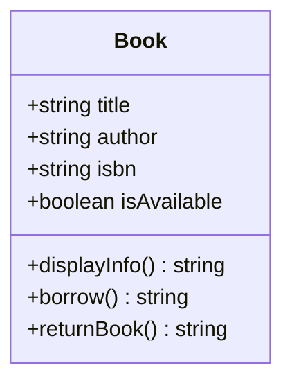
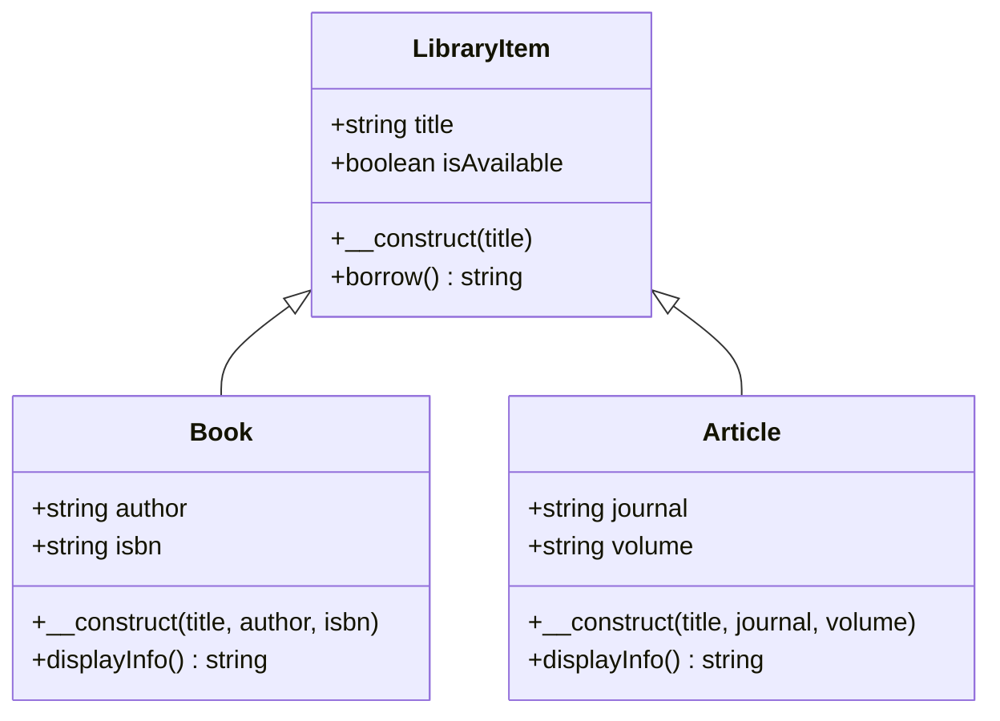
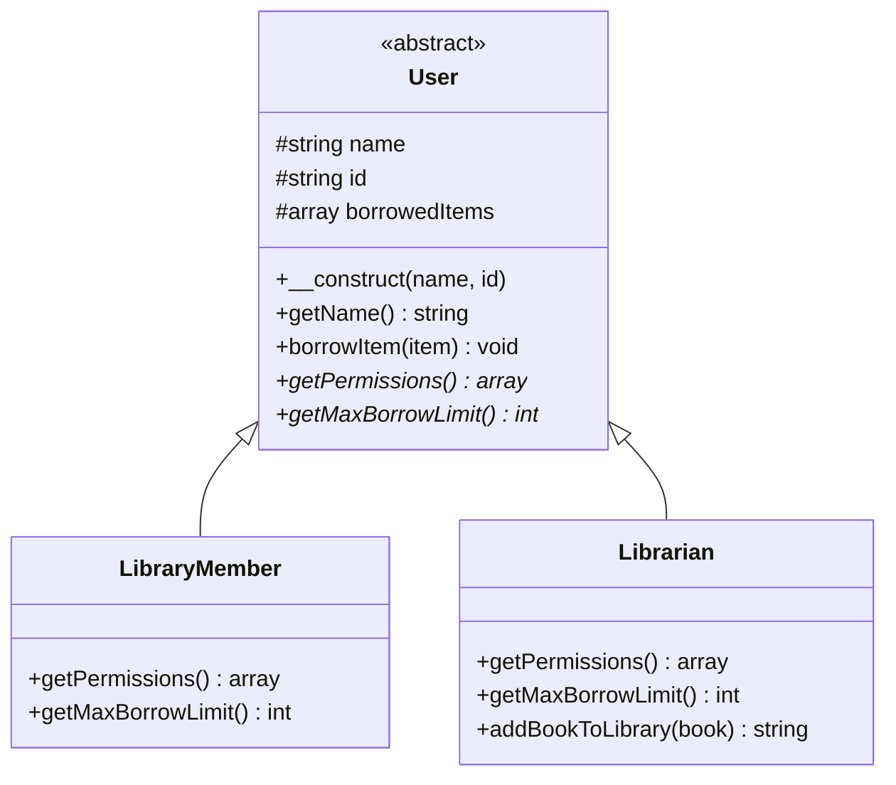
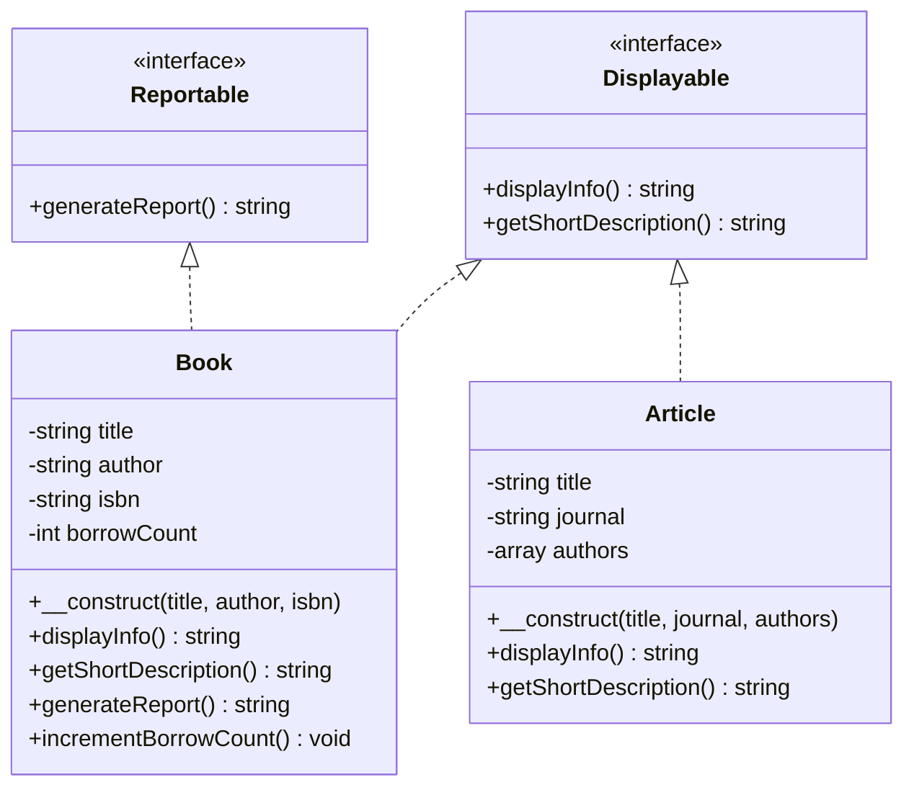

```mermaid
classDiagram
    class Book {
        +string title
        +string author
        +string isbn
        +boolean isAvailable
        +displayInfo() string
        +borrow() string
        +returnBook() string
    }
```

---

```mermaid
classDiagram
    class LibraryItem {
        +string title
        +boolean isAvailable
        +__construct(title)
        +borrow() string
    }

    class Book {
        +string author
        +string isbn
        +__construct(title, author, isbn)
        +displayInfo() string
    }

    class Article {
        +string journal
        +string volume
        +__construct(title, journal, volume)
        +displayInfo() string
    }

    LibraryItem <|-- Book
    LibraryItem <|-- Article
```

---

```mermaid
classDiagram
    class User {
        <<abstract>>
        #string name
        #string id
        #array borrowedItems
        +__construct(name, id)
        +getName() string
        +borrowItem(item) void
        +getPermissions()* array
        +getMaxBorrowLimit()* int
    }

    class LibraryMember {
        +getPermissions() array
        +getMaxBorrowLimit() int
    }

    class Librarian {
        +getPermissions() array
        +getMaxBorrowLimit() int
        +addBookToLibrary(book) string
    }

    User <|-- LibraryMember
    User <|-- Librarian

```

---

```mermaid
classDiagram
    class Displayable {
        <<interface>>
        +displayInfo() string
        +getShortDescription() string
    }

    class Reportable {
        <<interface>>
        +generateReport() string
    }

    class Book {
        -string title
        -string author
        -string isbn
        -int borrowCount
        +__construct(title, author, isbn)
        +displayInfo() string
        +getShortDescription() string
        +generateReport() string
        +incrementBorrowCount() void
    }

    class Article {
        -string title
        -string journal
        -array authors
        +__construct(title, journal, authors)
        +displayInfo() string
        +getShortDescription() string
    }

    Displayable <|.. Book
    Reportable <|.. Book
    Displayable <|.. Article

```
