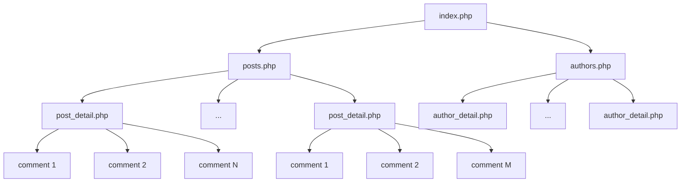

```
blog/
│
├── classes/
│   ├── seeds.css
│   └── FileBlog.php
│
├── css/
│   ├── home.css
│   ├── about.css
│   ├── contact.css
│   ├── authors.css
│   ├── author-detail.css
│   └── post-detail.css
├── includes/
│   ├── header.php
│   └── footer.php
│
├── about.php
├── contact.php
├── posts.php
├── post_detail.php
├── authors.php
├── author_detail.php
└── index.php

```


