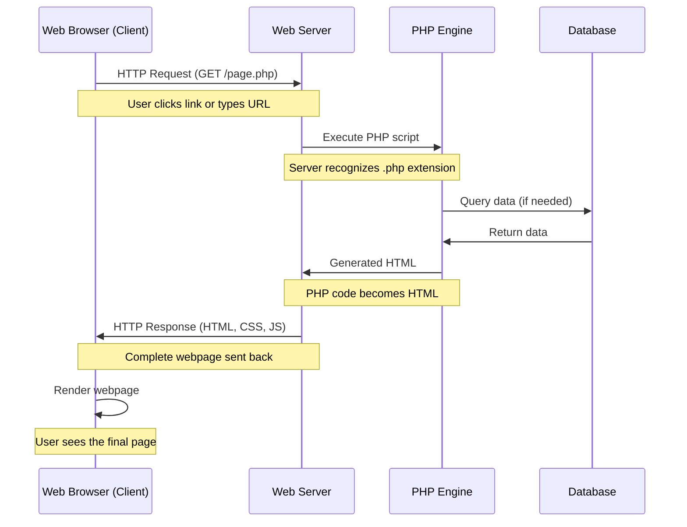
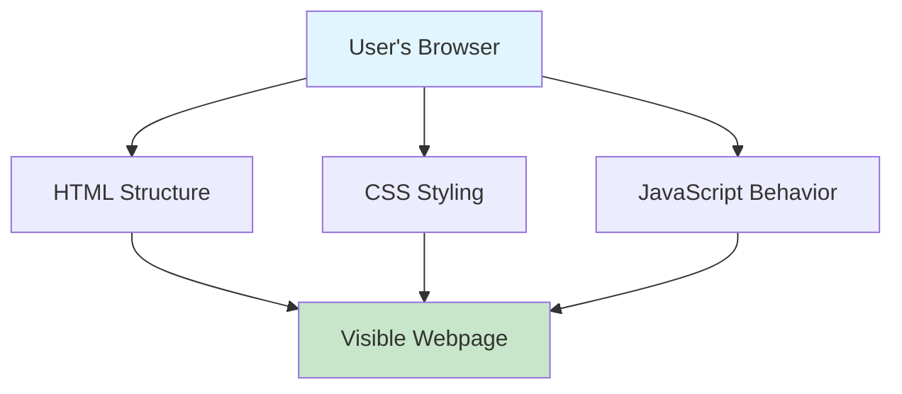
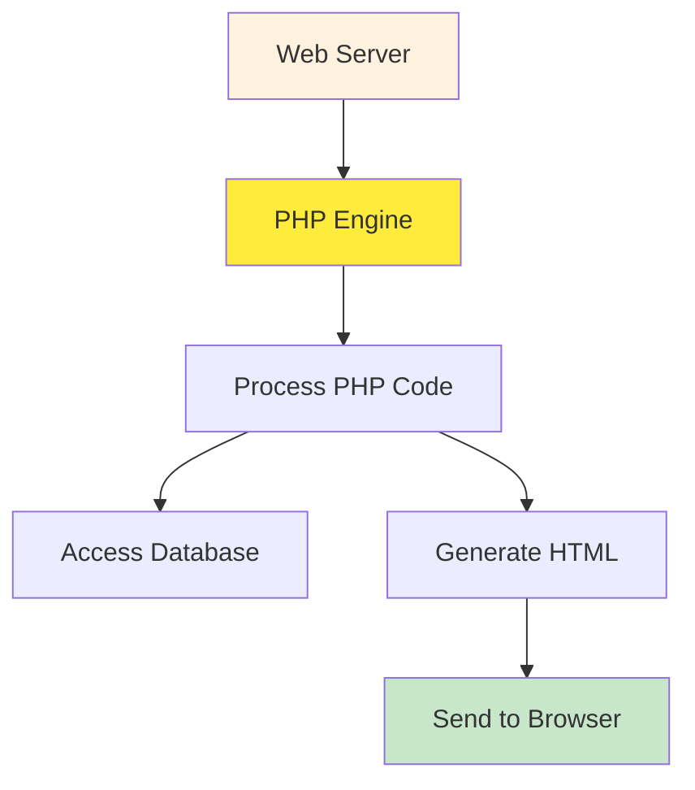

# Complete PHP Tutorial for Beginners

## Table of Contents

1. [Understanding Web Communication](#understanding-web-communication)
2. [Server-Side vs Client-Side](#server-side-vs-client-side)
3. [What is PHP?](#what-is-php)
4. [Setting Up PHP](#setting-up-php)
5. [PHP Syntax Basics](#php-syntax-basics)
6. [Variables and Data Types](#variables-and-data-types)
7. [Strings in PHP](#strings-in-php)
8. [Working with Numbers](#working-with-numbers)
9. [Practical Examples](#practical-examples)

---

## Understanding Web Communication

Before we dive into PHP, let's understand how web communication works. When you visit a website, there's a conversation happening between your browser (client) and a web server. This conversation follows a pattern called the HTTP request-response cycle.

### HTTP Request-Response Cycle



Think of this like ordering food at a restaurant. You (the browser) make a request to the waiter (web server). The waiter takes your order to the kitchen (PHP engine), which might check the pantry (database) for ingredients. The kitchen prepares your meal (generates HTML) and the waiter brings it back to you (HTTP response).

### What Happens in an HTTP Request?

When you type "www.example.com" in your browser, several things happen:

1. **Domain Resolution**: Your browser asks "Where is www.example.com?" and gets back an IP address like 192.168.1.100
2. **HTTP Request**: Your browser sends a message to that IP address saying "I want the homepage"
3. **Server Processing**: The web server receives this request and decides what to do with it
4. **Response**: The server sends back the webpage content

### HTTP Methods

There are different types of requests you can make:

- **GET**: "Please give me this page" (like clicking a link)
- **POST**: "Here's some data, please process it" (like submitting a form)
- **PUT**: "Please update this resource"
- **DELETE**: "Please remove this resource"

For beginners, GET and POST are the most important to understand.

---

## Server-Side vs Client-Side

Understanding the difference between server-side and client-side programming is crucial for web development.

### Client-Side Programming



Client-side code runs in the user's browser. Languages like HTML, CSS, and JavaScript are processed by the browser itself. This code is visible to anyone who views the page source.

**Example of client-side code:**

```html
<!DOCTYPE html>
<html>
  <head>
    <title>Client-Side Example</title>
  </head>
  <body>
    <h1>Welcome!</h1>
    <script>
      // This JavaScript runs in the browser
      document.write("Today is " + new Date());
    </script>
  </body>
</html>
```

### Server-Side Programming



Server-side code runs on the web server before anything is sent to the browser. PHP is a server-side language, which means it executes on the server and generates HTML that gets sent to the browser.

**Key differences:**

- **Client-side**: Visible to users, runs in browser, limited security
- **Server-side**: Hidden from users, runs on server, can access databases securely

---

## What is PHP?

PHP originally stood for "Personal Home Page" but now stands for "PHP: Hypertext Preprocessor" (a recursive acronym). It's a server-side scripting language designed specifically for web development.

### Why Use PHP?

1. **Easy to Learn**: PHP has a gentle learning curve for beginners
2. **Free and Open Source**: No licensing costs
3. **Cross-Platform**: Works on Windows, Mac, Linux
4. **Database Integration**: Excellent support for databases like MySQL
5. **Large Community**: Extensive documentation and support
6. **Web-Focused**: Built specifically for web development

### How PHP Works


When a web server encounters a PHP file, it doesn't send the PHP code to the browser. Instead, it processes the PHP code and sends the resulting HTML.

---

## Setting Up PHP

To start learning PHP, you need a web server with PHP installed. Here are the easiest options:

### Option 1: Local Development Environment

- **XAMPP** (Windows, Mac, Linux): Includes Apache, MySQL, PHP
- **WAMP** (Windows): Similar to XAMPP
- **MAMP** (Mac): Mac-specific version

### Option 2: Online PHP Editors

- **PHP Sandbox**: Try PHP code online
- **CodePen**: For quick testing
- **Repl.it**: Full development environment

### Your First PHP File

Create a file called `hello.php`:

```php
<?php
echo "Hello, World!";
?>
```

When you run this file through a web server, it will display "Hello, World!" in the browser.

---

## PHP Syntax Basics

PHP code is embedded in HTML using special tags. Let's understand the basic syntax rules.

### PHP Tags

PHP code must be enclosed in PHP tags:

```php
<?php
// Your PHP code goes here
?>
```

You can also use the short tag (if enabled):

```php
<?= "This is a shortcut for echo" ?>
```

### Mixing PHP with HTML

```php
<!DOCTYPE html>
<html>
<head>
    <title>PHP Example</title>
</head>
<body>
    <h1><?php echo "Welcome to PHP!"; ?></h1>
    <p>Today is <?php echo date('Y-m-d'); ?></p>
</body>
</html>
```

### Comments in PHP

Comments help document your code and are ignored by the PHP engine:

```php
<?php
// This is a single-line comment

/* This is a
   multi-line comment */

# This is also a single-line comment (less common)

echo "Hello"; // Comment at end of line
?>
```

### Statements and Semicolons

Every PHP statement must end with a semicolon:

```php
<?php
echo "First statement";
echo "Second statement";
$name = "John";
?>
```

### Case Sensitivity

PHP is partially case-sensitive:

- Variables are case-sensitive: `$name` and `$Name` are different
- Function names are case-insensitive: `echo` and `ECHO` work the same
- Class names are case-insensitive

---

## Variables and Data Types

Variables in PHP are like containers that store data. Think of them as labeled boxes where you can put different types of information.

### Creating Variables

Variables in PHP start with a dollar sign ($):

```php
<?php
$name = "John";        // String variable
$age = 25;             // Integer variable
$height = 5.9;         // Float variable
$isStudent = true;     // Boolean variable
?>
```

### Variable Rules

1. Must start with a dollar sign ($)
2. Must start with a letter or underscore after the $
3. Can contain letters, numbers, and underscores
4. Cannot start with a number
5. Are case-sensitive

```php
<?php
// Valid variable names
$name = "John";
$_age = 25;
$first_name = "Jane";
$userName = "admin";

// Invalid variable names
// $2names = "Invalid";  // Can't start with number
// $first-name = "Invalid"; // Can't use hyphens
?>
```

### Data Types in PHP

PHP supports several data types, but let's focus on the most common ones:

#### 1. String

Text data enclosed in quotes:

```php
<?php
$firstName = "John";
$lastName = 'Doe';
$message = "Hello, my name is $firstName"; // Variable interpolation
$literal = 'Hello, my name is $firstName'; // No interpolation
?>
```

#### 2. Integer

Whole numbers:

```php
<?php
$age = 25;
$negative = -10;
$zero = 0;
?>
```

#### 3. Float (Decimal numbers)

Numbers with decimal points:

```php
<?php
$price = 19.99;
$temperature = -5.5;
$pi = 3.14159;
?>
```

#### 4. Boolean

True or false values:

```php
<?php
$isLoggedIn = true;
$isComplete = false;
$hasPermission = TRUE; // Case-insensitive
?>
```

#### 5. Array

Collections of data:

```php
<?php
$colors = array("red", "green", "blue");
$ages = [25, 30, 35]; // Alternative syntax
?>
```

### Checking Variable Types

```php
<?php
$name = "John";
$age = 25;

echo gettype($name); // Outputs: string
echo gettype($age);  // Outputs: integer

// Check specific types
var_dump(is_string($name)); // bool(true)
var_dump(is_int($age));     // bool(true)
?>
```

---

## Strings in PHP

Strings are sequences of characters and are fundamental in web development. PHP provides powerful tools for working with strings.

### Creating Strings

```php
<?php
// Single quotes - literal strings
$name = 'John Doe';
$message = 'Hello, World!';

// Double quotes - allow variable interpolation
$greeting = "Hello, $name!";
$info = "Your name is $name and you are welcome.";

// Heredoc syntax for multi-line strings
$longText = <<<EOT
This is a long text
that spans multiple lines
and can contain $variables.
EOT;

// Nowdoc syntax (like single quotes, no interpolation)
$literal = <<<'EOT'
This text will not
interpret $variables.
EOT;
?>
```

### String Concatenation

Joining strings together:

```php
<?php
$firstName = "John";
$lastName = "Doe";

// Using the concatenation operator (.)
$fullName = $firstName . " " . $lastName;
echo $fullName; // Outputs: John Doe

// Using the concatenation assignment operator (.=)
$message = "Hello, ";
$message .= $firstName;
$message .= "!";
echo $message; // Outputs: Hello, John!
?>
```

### Useful String Functions

```php
<?php
$text = "Hello, World!";

// String length
echo strlen($text); // Outputs: 13

// Convert to uppercase/lowercase
echo strtoupper($text); // Outputs: HELLO, WORLD!
echo strtolower($text); // Outputs: hello, world!

// Find position of substring
echo strpos($text, "World"); // Outputs: 7

// Replace text
echo str_replace("World", "PHP", $text); // Outputs: Hello, PHP!

// Extract substring
echo substr($text, 0, 5); // Outputs: Hello

// Trim whitespace
$messy = "  Hello, World!  ";
echo trim($messy); // Outputs: Hello, World!
?>
```

### String Interpolation Examples

```php
<?php
$name = "Alice";
$age = 30;
$city = "New York";

// Different ways to include variables in strings
echo "My name is $name"; // Direct interpolation
echo "I am {$age} years old"; // Curly braces for clarity
echo "I live in " . $city; // Concatenation

// Complex interpolation
$person = [
    'name' => 'Bob',
    'age' => 25
];

echo "Hello, {$person['name']}!"; // Using array in string
?>
```

### Escape Characters

Special characters in strings:

```php
<?php
// Common escape sequences
echo "He said, \"Hello!\""; // Outputs: He said, "Hello!"
echo 'She\'s happy'; // Outputs: She's happy
echo "Line 1\nLine 2"; // New line
echo "Tab\tSeparated"; // Tab character
echo "Back\\slash"; // Backslash
?>
```

---

## Working with Numbers

PHP handles both integers and floating-point numbers with ease. Let's explore mathematical operations and number formatting.

### Basic Math Operations

```php
<?php
$a = 10;
$b = 3;

// Basic arithmetic
echo $a + $b; // Addition: 13
echo $a - $b; // Subtraction: 7
echo $a * $b; // Multiplication: 30
echo $a / $b; // Division: 3.333...
echo $a % $b; // Modulus (remainder): 1
echo $a ** $b; // Exponentiation: 1000

// Assignment operators
$x = 5;
$x += 3; // Same as $x = $x + 3; Result: 8
$x -= 2; // Same as $x = $x - 2; Result: 6
$x *= 4; // Same as $x = $x * 4; Result: 24
$x /= 3; // Same as $x = $x / 3; Result: 8
?>
```

### Number Formatting

```php
<?php
$price = 1234.5678;

// Round numbers
echo round($price); // Outputs: 1235
echo round($price, 2); // Outputs: 1234.57

// Format with thousands separator
echo number_format($price); // Outputs: 1,235
echo number_format($price, 2); // Outputs: 1,234.57

// Ceiling and floor
echo ceil(4.3); // Outputs: 5 (round up)
echo floor(4.8); // Outputs: 4 (round down)
?>
```

### Useful Math Functions

```php
<?php
// Absolute value
echo abs(-15); // Outputs: 15

// Maximum and minimum
echo max(5, 10, 3); // Outputs: 10
echo min(5, 10, 3); // Outputs: 3

// Square root
echo sqrt(16); // Outputs: 4

// Random numbers
echo rand(1, 10); // Random number between 1 and 10
echo mt_rand(1, 100); // Better random number generator

// Mathematical constants
echo M_PI; // 3.14159...
echo M_E;  // 2.71828...
?>
```

### Type Conversion

```php
<?php
$stringNumber = "123";
$floatString = "45.67";

// Convert to integer
$int = (int) $stringNumber;
$int2 = intval($floatString); // Outputs: 45

// Convert to float
$float = (float) $stringNumber; // Outputs: 123.0
$float2 = floatval($floatString); // Outputs: 45.67

// Check if numeric
var_dump(is_numeric("123")); // bool(true)
var_dump(is_numeric("abc")); // bool(false)
?>
```

---

## Practical Examples

Let's put everything together with real-world examples that demonstrate PHP concepts.

### Example 1: Personal Information Display

```php
<!DOCTYPE html>
<html>
<head>
    <title>Personal Info</title>
</head>
<body>
    <?php
    // Define personal information
    $firstName = "John";
    $lastName = "Doe";
    $age = 28;
    $email = "john.doe@example.com";
    $salary = 75000;
    $isEmployed = true;

    // Calculate full name
    $fullName = $firstName . " " . $lastName;

    // Format salary
    $formattedSalary = "$" . number_format($salary);

    // Determine employment status
    $employmentStatus = $isEmployed ? "Employed" : "Unemployed";
    ?>

    <h1>Personal Information</h1>
    <p><strong>Name:</strong> <?= $fullName ?></p>
    <p><strong>Age:</strong> <?= $age ?> years old</p>
    <p><strong>Email:</strong> <?= $email ?></p>
    <p><strong>Salary:</strong> <?= $formattedSalary ?></p>
    <p><strong>Status:</strong> <?= $employmentStatus ?></p>

    <?php
    // Calculate years until retirement (assuming retirement at 65)
    $retirementAge = 65;
    $yearsUntilRetirement = $retirementAge - $age;
    ?>

    <p><strong>Years until retirement:</strong> <?= $yearsUntilRetirement ?></p>
</body>
</html>
```
