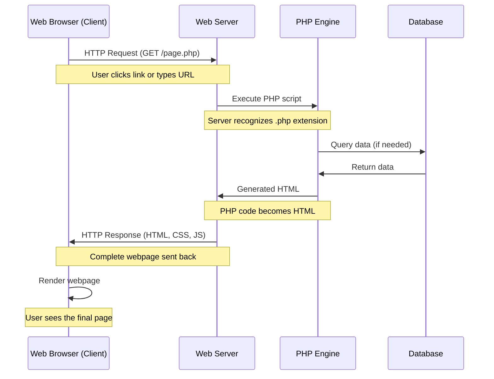
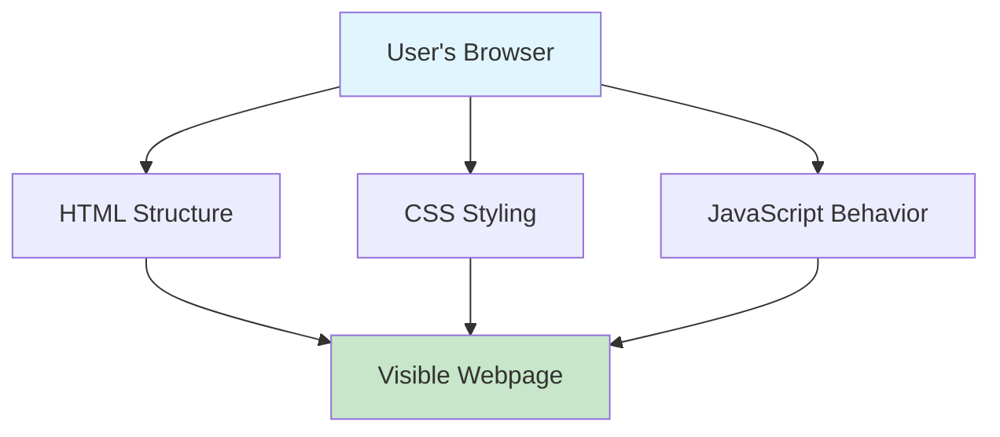
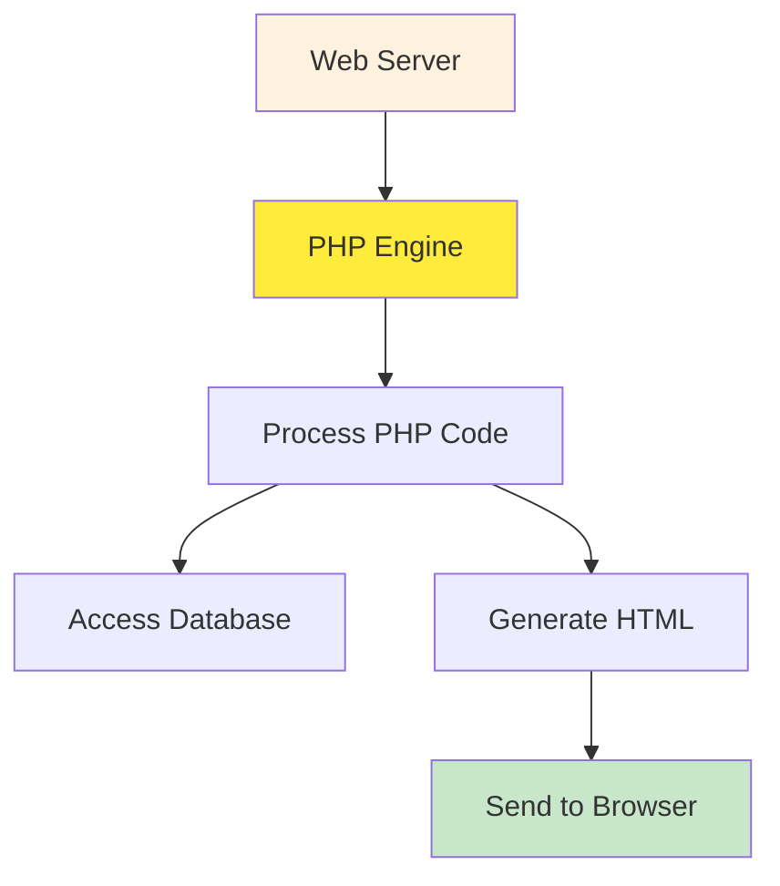
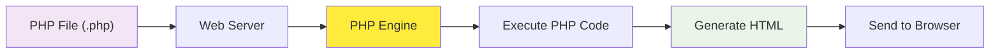

# Complete PHP Tutorial for Beginners

## Table of Contents

1. [Understanding Web Communication](#understanding-web-communication)
2. [Server-Side vs Client-Side](#server-side-vs-client-side)
3. [What is PHP?](#what-is-php)
4. [Setting Up PHP](#setting-up-php)
5. [PHP Syntax Basics](#php-syntax-basics)
6. [Variables and Data Types](#variables-and-data-types)
7. [Strings in PHP](#strings-in-php)
8. [Working with Numbers](#working-with-numbers)
9. [Practical Examples](#practical-examples)

---

## Understanding Web Communication

Before we dive into PHP, let's understand how web communication works. When you visit a website, there's a conversation happening between your browser (client) and a web server. This conversation follows a pattern called the HTTP request-response cycle.

### HTTP Request-Response Cycle



Think of this like ordering food at a restaurant. You (the browser) make a request to the waiter (web server). The waiter takes your order to the kitchen (PHP engine), which might check the pantry (database) for ingredients. The kitchen prepares your meal (generates HTML) and the waiter brings it back to you (HTTP response).

### What Happens in an HTTP Request?

When you type "www.example.com" in your browser, several things happen:

1. **Domain Resolution**: Your browser asks "Where is www.example.com?" and gets back an IP address like 192.168.1.100
2. **HTTP Request**: Your browser sends a message to that IP address saying "I want the homepage"
3. **Server Processing**: The web server receives this request and decides what to do with it
4. **Response**: The server sends back the webpage content

### HTTP Methods

There are different types of requests you can make:

- **GET**: "Please give me this page" (like clicking a link)
- **POST**: "Here's some data, please process it" (like submitting a form)
- **PUT**: "Please update this resource"
- **DELETE**: "Please remove this resource"

For beginners, GET and POST are the most important to understand.

---

## Server-Side vs Client-Side

Understanding the difference between server-side and client-side programming is crucial for web development.

### Client-Side Programming



Client-side code runs in the user's browser. Languages like HTML, CSS, and JavaScript are processed by the browser itself. This code is visible to anyone who views the page source.

**Example of client-side code:**

```html
<!DOCTYPE html>
<html>
  <head>
    <title>Client-Side Example</title>
  </head>
  <body>
    <h1>Welcome!</h1>
    <script>
      // This JavaScript runs in the browser
      document.write("Today is " + new Date());
    </script>
  </body>
</html>
```

### Server-Side Programming



Server-side code runs on the web server before anything is sent to the browser. PHP is a server-side language, which means it executes on the server and generates HTML that gets sent to the browser.

**Key differences:**

- **Client-side**: Visible to users, runs in browser, limited security
- **Server-side**: Hidden from users, runs on server, can access databases securely

---

## What is PHP?

PHP originally stood for "Personal Home Page" but now stands for "PHP: Hypertext Preprocessor" (a recursive acronym). It's a server-side scripting language designed specifically for web development.

### Why Use PHP?

1. **Easy to Learn**: PHP has a gentle learning curve for beginners
2. **Free and Open Source**: No licensing costs
3. **Cross-Platform**: Works on Windows, Mac, Linux
4. **Database Integration**: Excellent support for databases like MySQL
5. **Large Community**: Extensive documentation and support
6. **Web-Focused**: Built specifically for web development

### How PHP Works



When a web server encounters a PHP file, it doesn't send the PHP code to the browser. Instead, it processes the PHP code and sends the resulting HTML.

---

## Setting Up PHP

To start learning PHP, you need a web server with PHP installed. Here are the easiest options:

### Option 1: Local Development Environment

- **XAMPP** (Windows, Mac, Linux): Includes Apache, MySQL, PHP
- **WAMP** (Windows): Similar to XAMPP
- **MAMP** (Mac): Mac-specific version

### Option 2: Online PHP Editors

- **PHP Sandbox**: Try PHP code online
- **CodePen**: For quick testing
- **Repl.it**: Full development environment

### Your First PHP File

Create a file called `hello.php`:

```php
<?php
echo "Hello, World!";
?>
```

When you run this file through a web server, it will display "Hello, World!" in the browser.

---

## PHP Syntax Basics

PHP code is embedded in HTML using special tags. Let's understand the basic syntax rules.

### PHP Tags

PHP code must be enclosed in PHP tags:

```php
<?php
// Your PHP code goes here
?>
```

You can also use the short tag (if enabled):

```php
<?= "This is a shortcut for echo" ?>
```

### Mixing PHP with HTML

```php
<!DOCTYPE html>
<html>
<head>
    <title>PHP Example</title>
</head>
<body>
    <h1><?php echo "Welcome to PHP!"; ?></h1>
    <p>Today is <?php echo date('Y-m-d'); ?></p>
</body>
</html>
```

### Comments in PHP

Comments help document your code and are ignored by the PHP engine:

```php
<?php
// This is a single-line comment

/* This is a
   multi-line comment */

# This is also a single-line comment (less common)

echo "Hello"; // Comment at end of line
?>
```

### Statements and Semicolons

Every PHP statement must end with a semicolon:

```php
<?php
echo "First statement";
echo "Second statement";
$name = "John";
?>
```

### Case Sensitivity

PHP is partially case-sensitive:

- Variables are case-sensitive: `$name` and `$Name` are different
- Function names are case-insensitive: `echo` and `ECHO` work the same
- Class names are case-insensitive

---

## Variables and Data Types

Variables in PHP are like containers that store data. Think of them as labeled boxes where you can put different types of information.

### Creating Variables

Variables in PHP start with a dollar sign ($):

```php
<?php
$name = "John";        // String variable
$age = 25;             // Integer variable
$height = 5.9;         // Float variable
$isStudent = true;     // Boolean variable
?>
```

### Variable Rules

1. Must start with a dollar sign ($)
2. Must start with a letter or underscore after the $
3. Can contain letters, numbers, and underscores
4. Cannot start with a number
5. Are case-sensitive

```php
<?php
// Valid variable names
$name = "John";
$_age = 25;
$first_name = "Jane";
$userName = "admin";

// Invalid variable names
// $2names = "Invalid";  // Can't start with number
// $first-name = "Invalid"; // Can't use hyphens
?>
```

### Data Types in PHP

PHP supports several data types, but let's focus on the most common ones:

#### 1. String

Text data enclosed in quotes:

```php
<?php
$firstName = "John";
$lastName = 'Doe';
$message = "Hello, my name is $firstName"; // Variable interpolation
$literal = 'Hello, my name is $firstName'; // No interpolation
?>
```

#### 2. Integer

Whole numbers:

```php
<?php
$age = 25;
$negative = -10;
$zero = 0;
?>
```

#### 3. Float (Decimal numbers)

Numbers with decimal points:

```php
<?php
$price = 19.99;
$temperature = -5.5;
$pi = 3.14159;
?>
```

#### 4. Boolean

True or false values:

```php
<?php
$isLoggedIn = true;
$isComplete = false;
$hasPermission = TRUE; // Case-insensitive
?>
```

#### 5. Array

Collections of data:

```php
<?php
$colors = array("red", "green", "blue");
$ages = [25, 30, 35]; // Alternative syntax
?>
```

### Checking Variable Types

```php
<?php
$name = "John";
$age = 25;

echo gettype($name); // Outputs: string
echo gettype($age);  // Outputs: integer

// Check specific types
var_dump(is_string($name)); // bool(true)
var_dump(is_int($age));     // bool(true)
?>
```

### Variable Scope

Variable scope determines where variables can be accessed:

```php
<?php
$globalVar = "I'm global"; // Global scope

function testScope() {
    $localVar = "I'm local"; // Local scope
    echo $localVar; // Works fine
    // echo $globalVar; // This would cause an error
}

testScope();
echo $globalVar; // Works fine
// echo $localVar; // This would cause an error
?>
```

---

## Strings in PHP

Strings are sequences of characters and are fundamental in web development. PHP provides powerful tools for working with strings.

### Creating Strings

```php
<?php
// Single quotes - literal strings
$name = 'John Doe';
$message = 'Hello, World!';

// Double quotes - allow variable interpolation
$greeting = "Hello, $name!";
$info = "Your name is $name and you are welcome.";

// Heredoc syntax for multi-line strings
$longText = <<<EOT
This is a long text
that spans multiple lines
and can contain $variables.
EOT;

// Nowdoc syntax (like single quotes, no interpolation)
$literal = <<<'EOT'
This text will not
interpret $variables.
EOT;
?>
```

### String Concatenation

Joining strings together:

```php
<?php
$firstName = "John";
$lastName = "Doe";

// Using the concatenation operator (.)
$fullName = $firstName . " " . $lastName;
echo $fullName; // Outputs: John Doe

// Using the concatenation assignment operator (.=)
$message = "Hello, ";
$message .= $firstName;
$message .= "!";
echo $message; // Outputs: Hello, John!
?>
```

### Useful String Functions

```php
<?php
$text = "Hello, World!";

// String length
echo strlen($text); // Outputs: 13

// Convert to uppercase/lowercase
echo strtoupper($text); // Outputs: HELLO, WORLD!
echo strtolower($text); // Outputs: hello, world!

// Find position of substring
echo strpos($text, "World"); // Outputs: 7

// Replace text
echo str_replace("World", "PHP", $text); // Outputs: Hello, PHP!

// Extract substring
echo substr($text, 0, 5); // Outputs: Hello

// Trim whitespace
$messy = "  Hello, World!  ";
echo trim($messy); // Outputs: Hello, World!
?>
```

### String Interpolation Examples

```php
<?php
$name = "Alice";
$age = 30;
$city = "New York";

// Different ways to include variables in strings
echo "My name is $name"; // Direct interpolation
echo "I am {$age} years old"; // Curly braces for clarity
echo "I live in " . $city; // Concatenation

// Complex interpolation
$person = [
    'name' => 'Bob',
    'age' => 25
];

echo "Hello, {$person['name']}!"; // Using array in string
?>
```

### Escape Characters

Special characters in strings:

```php
<?php
// Common escape sequences
echo "He said, \"Hello!\""; // Outputs: He said, "Hello!"
echo 'She\'s happy'; // Outputs: She's happy
echo "Line 1\nLine 2"; // New line
echo "Tab\tSeparated"; // Tab character
echo "Back\\slash"; // Backslash
?>
```

---

## Working with Numbers

PHP handles both integers and floating-point numbers with ease. Let's explore mathematical operations and number formatting.

### Basic Math Operations

```php
<?php
$a = 10;
$b = 3;

// Basic arithmetic
echo $a + $b; // Addition: 13
echo $a - $b; // Subtraction: 7
echo $a * $b; // Multiplication: 30
echo $a / $b; // Division: 3.333...
echo $a % $b; // Modulus (remainder): 1
echo $a ** $b; // Exponentiation: 1000

// Assignment operators
$x = 5;
$x += 3; // Same as $x = $x + 3; Result: 8
$x -= 2; // Same as $x = $x - 2; Result: 6
$x *= 4; // Same as $x = $x * 4; Result: 24
$x /= 3; // Same as $x = $x / 3; Result: 8
?>
```

### Number Formatting

```php
<?php
$price = 1234.5678;

// Round numbers
echo round($price); // Outputs: 1235
echo round($price, 2); // Outputs: 1234.57

// Format with thousands separator
echo number_format($price); // Outputs: 1,235
echo number_format($price, 2); // Outputs: 1,234.57

// Ceiling and floor
echo ceil(4.3); // Outputs: 5 (round up)
echo floor(4.8); // Outputs: 4 (round down)
?>
```

### Useful Math Functions

```php
<?php
// Absolute value
echo abs(-15); // Outputs: 15

// Maximum and minimum
echo max(5, 10, 3); // Outputs: 10
echo min(5, 10, 3); // Outputs: 3

// Square root
echo sqrt(16); // Outputs: 4

// Random numbers
echo rand(1, 10); // Random number between 1 and 10
echo mt_rand(1, 100); // Better random number generator

// Mathematical constants
echo M_PI; // 3.14159...
echo M_E;  // 2.71828...
?>
```

### Type Conversion

```php
<?php
$stringNumber = "123";
$floatString = "45.67";

// Convert to integer
$int = (int) $stringNumber;
$int2 = intval($floatString); // Outputs: 45

// Convert to float
$float = (float) $stringNumber; // Outputs: 123.0
$float2 = floatval($floatString); // Outputs: 45.67

// Check if numeric
var_dump(is_numeric("123")); // bool(true)
var_dump(is_numeric("abc")); // bool(false)
?>
```

---

## Practical Examples

Let's put everything together with real-world examples that demonstrate PHP concepts.

### Example 1: Personal Information Display

```php
<!DOCTYPE html>
<html>
<head>
    <title>Personal Info</title>
</head>
<body>
    <?php
    // Define personal information
    $firstName = "John";
    $lastName = "Doe";
    $age = 28;
    $email = "john.doe@example.com";
    $salary = 75000;
    $isEmployed = true;

    // Calculate full name
    $fullName = $firstName . " " . $lastName;

    // Format salary
    $formattedSalary = "$" . number_format($salary);

    // Determine employment status
    $employmentStatus = $isEmployed ? "Employed" : "Unemployed";
    ?>

    <h1>Personal Information</h1>
    <p><strong>Name:</strong> <?= $fullName ?></p>
    <p><strong>Age:</strong> <?= $age ?> years old</p>
    <p><strong>Email:</strong> <?= $email ?></p>
    <p><strong>Salary:</strong> <?= $formattedSalary ?></p>
    <p><strong>Status:</strong> <?= $employmentStatus ?></p>

    <?php
    // Calculate years until retirement (assuming retirement at 65)
    $retirementAge = 65;
    $yearsUntilRetirement = $retirementAge - $age;
    ?>

    <p><strong>Years until retirement:</strong> <?= $yearsUntilRetirement ?></p>
</body>
</html>
```

### Example 2: Simple Calculator

```php
<!DOCTYPE html>
<html>
<head>
    <title>Simple Calculator</title>
</head>
<body>
    <h1>Simple Calculator</h1>

    <?php
    // Define numbers and operation
    $num1 = 15;
    $num2 = 4;
    $operation = "addition"; // Could be: addition, subtraction, multiplication, division

    // Perform calculation based on operation
    $result = 0;
    $operationSymbol = "";

    if ($operation == "addition") {
        $result = $num1 + $num2;
        $operationSymbol = "+";
    } elseif ($operation == "subtraction") {
        $result = $num1 - $num2;
        $operationSymbol = "-";
    } elseif ($operation == "multiplication") {
        $result = $num1 * $num2;
        $operationSymbol = "*";
    } elseif ($operation == "division") {
        if ($num2 != 0) {
            $result = $num1 / $num2;
            $operationSymbol = "/";
        } else {
            $result = "Error: Division by zero";
            $operationSymbol = "/";
        }
    }
    ?>

    <p><strong>Calculation:</strong> <?= $num1 ?> <?= $operationSymbol ?> <?= $num2 ?> = <?= $result ?></p>

    <?php
    // Show additional information
    if (is_numeric($result)) {
        echo "<p><strong>Result type:</strong> " . gettype($result) . "</p>";
        echo "<p><strong>Rounded result:</strong> " . round($result, 2) . "</p>";
    }
    ?>
</body>
</html>
```

### Example 3: Dynamic Greeting System

```php
<!DOCTYPE html>
<html>
<head>
    <title>Dynamic Greeting</title>
</head>
<body>
    <?php
    // Get current time information
    $currentHour = date('H'); // 24-hour format
    $currentDate = date('Y-m-d');
    $currentTime = date('H:i:s');
    $dayOfWeek = date('l');

    // Determine greeting based on time
    $greeting = "";
    $timeOfDay = "";

    if ($currentHour < 12) {
        $greeting = "Good morning";
        $timeOfDay = "morning";
    } elseif ($currentHour < 17) {
        $greeting = "Good afternoon";
        $timeOfDay = "afternoon";
    } else {
        $greeting = "Good evening";
        $timeOfDay = "evening";
    }

    // User information
    $userName = "Alice";
    $userAge = 25;
    ?>

    <h1><?= $greeting ?>, <?= $userName ?>!</h1>

    <div style="background-color: #f0f0f0; padding: 20px; border-radius: 5px;">
        <h2>Current Information</h2>
        <p><strong>Today is:</strong> <?= $dayOfWeek ?>, <?= $currentDate ?></p>
        <p><strong>Current time:</strong> <?= $currentTime ?></p>
        <p><strong>Time of day:</strong> <?= $timeOfDay ?></p>
    </div>

    <?php
    // Create a personalized message
    $personalizedMessage = "Welcome back, " . $userName . "! ";
    $personalizedMessage .= "It's a beautiful " . $dayOfWeek . " " . $timeOfDay . ". ";

    if ($timeOfDay == "morning") {
        $personalizedMessage .= "Hope you have a productive day ahead!";
    } elseif ($timeOfDay == "afternoon") {
        $personalizedMessage .= "Hope you're having a great day so far!";
    } else {
        $personalizedMessage .= "Hope you had a wonderful day!";
    }
    ?>

    <p style="font-style: italic; color: #666;"><?= $personalizedMessage ?></p>

    <?php
    // Fun fact about the user's age
    $daysAlive = $userAge * 365;
    $hoursAlive = $daysAlive * 24;
    ?>

    <div style="background-color: #e8f5e8; padding: 15px; border-radius: 5px;">
        <h3>Fun Facts About You</h3>
        <p>You are approximately <strong><?= number_format($daysAlive) ?></strong> days old!</p>
        <p>That's about <strong><?= number_format($hoursAlive) ?></strong> hours of life experience!</p>
    </div>
</body>
</html>
```

### Example 4: Product Information System

```php
<!DOCTYPE html>
<html>
<head>
    <title>Product Information</title>
    <style>
        .product-card {
            border: 1px solid #ddd;
            padding: 20px;
            margin: 10px;
            border-radius: 5px;
            background-color: #f9f9f9;
        }
        .price {
            color: #e74c3c;
            font-weight: bold;
            font-size: 1.2em;
        }
        .discount {
            color: #27ae60;
            font-weight: bold;
        }
    </style>
</head>
<body>
    <h1>Product Catalog</h1>

    <?php
    // Product information
    $productName = "Wireless Bluetooth Headphones";
    $originalPrice = 199.99;
    $discountPercent = 25;
    $inStock = true;
    $stockQuantity = 15;
    $rating = 4.5;
    $reviewCount = 127;

    // Calculate discounted price
    $discountAmount = ($originalPrice * $discountPercent) / 100;
    $finalPrice = $originalPrice - $discountAmount;

    // Determine stock status
    $stockStatus = "";
    if ($inStock && $stockQuantity > 10) {
        $stockStatus = "In Stock";
    } elseif ($inStock && $stockQuantity > 0) {
        $stockStatus = "Low Stock";
    } else {
        $stockStatus = "Out of Stock";
    }

    // Create rating display
    $fullStars = floor($rating);
    $hasHalfStar = ($rating - $fullStars) >= 0.5;
    $emptyStars = 5 - $fullStars - ($hasHalfStar ? 1 : 0);

    $ratingDisplay = str_repeat("★", $fullStars);
    if ($hasHalfStar) {
        $ratingDisplay .= "☆";
    }
    $ratingDisplay .= str_repeat("☆", $emptyStars);
    ?>

    <div class="product-card">
        <h2><?= $productName ?></h2>

        <div class="price">
            <?php if ($discountPercent > 0): ?>
                <span style="text-decoration: line-through; color: #888;">$<?= number_format($originalPrice, 2) ?></span>
                <span class="discount">$<?= number_format($finalPrice, 2) ?></span>
                <span style="color: #27ae60;">(<?= $discountPercent ?>% OFF)</span>
            <?php else: ?>
                $<?= number_format($originalPrice, 2) ?>
            <?php endif; ?>
        </div>

        <p><strong>Stock Status:</strong>
            <span style="color: <?= $stockQuantity > 10 ? 'green' : ($stockQuantity > 0 ? 'orange' : 'red') ?>">
                <?= $stockStatus ?>
            </span>
            <?php if ($inStock): ?>
                (<?= $stockQuantity ?> available)
            <?php endif; ?>
        </p>

        <p><strong>Rating:</strong>
            <?= $ratingDisplay ?>
            <?= $rating ?>/5
            (<?= $reviewCount ?> reviews)
        </p>

        <?php
        // Calculate savings
        if ($discountPercent > 0) {
            echo "<p class='discount'>You save: $" . number_format($discountAmount, 2) . "</p>";
        }

        // Delivery estimation
        $deliveryDays = $inStock ? rand(2, 5) : 0;
        if ($deliveryDays > 0) {
            echo "<p><strong>Estimated delivery:</strong> " . $deliveryDays . " business days</p>";
        }
        ?>
    </div>

    <?php
    // Additional product suggestions
    $relatedProducts = [
        "Wireless Mouse" => 29.99,
        "USB-C Cable" => 12.99,
        "Phone Stand" => 15.99
    ];
    ?>

    <h3>Related Products</h3>
    <?php foreach ($relatedProducts as $productName => $price): ?>
        <div style="display: inline-block; margin: 10px; padding: 10px; border: 1px solid #ddd; border-radius: 5px;">
            <strong><?= $productName ?></strong><br>
            <span class="price">$<?= number_format($price, 2) ?></span>
        </div>
    <?php endforeach; ?>
</body>
</html>
```

---

## Control Structures: Making Decisions in PHP

Control structures are the building blocks that make your PHP programs intelligent. They allow your code to make decisions, repeat actions, and respond to different conditions. Think of them as the "brain" of your program that decides what to do based on the information it receives.

### Conditional Statements (if/else)

Conditional statements let your program make decisions based on whether certain conditions are true or false.

#### Basic if Statement

```php
<?php
$temperature = 75;

if ($temperature > 70) {
    echo "It's a warm day!";
}
?>
```

#### if/else Statement

```php
<?php
$age = 17;

if ($age >= 18) {
    echo "You are eligible to vote.";
} else {
    echo "You are not old enough to vote yet.";
}
?>
```

#### if/elseif/else Statement

```php
<?php
$grade = 85;

if ($grade >= 90) {
    echo "Excellent! You got an A.";
} elseif ($grade >= 80) {
    echo "Good job! You got a B.";
} elseif ($grade >= 70) {
    echo "You got a C. Keep working!";
} elseif ($grade >= 60) {
    echo "You got a D. You need to improve.";
} else {
    echo "You failed. Don't give up!";
}
?>
```

### Comparison Operators

Understanding comparison operators is crucial for making decisions:

```php
<?php
$a = 10;
$b = 20;

// Equal to
if ($a == $b) {
    echo "a equals b";
}

// Identical (equal and same type)
if ($a === $b) {
    echo "a is identical to b";
}

// Not equal
if ($a != $b) {
    echo "a is not equal to b";
}

// Not identical
if ($a !== $b) {
    echo "a is not identical to b";
}

// Greater than
if ($a > $b) {
    echo "a is greater than b";
}

// Less than or equal to
if ($a <= $b) {
    echo "a is less than or equal to b";
}
?>
```

### Logical Operators

Combine multiple conditions:

```php
<?php
$age = 25;
$hasLicense = true;
$hasInsurance = true;

// AND operator (&&)
if ($age >= 18 && $hasLicense && $hasInsurance) {
    echo "You can drive legally!";
}

// OR operator (||)
if ($age < 16 || !$hasLicense) {
    echo "You cannot drive.";
}

// NOT operator (!)
if (!$hasInsurance) {
    echo "You need insurance to drive.";
}
?>
```

### Switch Statement

When you need to compare a variable against many values:

```php
<?php
$dayOfWeek = 3;

switch ($dayOfWeek) {
    case 1:
        echo "Monday - Start of the work week";
        break;
    case 2:
        echo "Tuesday - Getting into the groove";
        break;
    case 3:
        echo "Wednesday - Hump day!";
        break;
    case 4:
        echo "Thursday - Almost there";
        break;
    case 5:
        echo "Friday - TGIF!";
        break;
    case 6:
    case 7:
        echo "Weekend - Time to relax!";
        break;
    default:
        echo "Invalid day";
}
?>
```

### Ternary Operator (Shorthand if/else)

For simple conditional assignments:

```php
<?php
$age = 20;

// Long form
if ($age >= 18) {
    $status = "adult";
} else {
    $status = "minor";
}

// Shorthand (ternary operator)
$status = ($age >= 18) ? "adult" : "minor";

echo "You are an $status";
?>
```

---

## Arrays: Working with Collections of Data

Arrays are like containers that can hold multiple values. Instead of creating separate variables for related data, you can store them all in one array.

### Creating Arrays

```php
<?php
// Method 1: Using array() function
$colors = array("red", "green", "blue");

// Method 2: Using square brackets (PHP 5.4+)
$fruits = ["apple", "banana", "orange"];

// Method 3: Creating an empty array and adding elements
$numbers = [];
$numbers[] = 10;
$numbers[] = 20;
$numbers[] = 30;
?>
```

### Indexed Arrays

Arrays with numeric indexes (starting from 0):

```php
<?php
$students = ["Alice", "Bob", "Charlie", "Diana"];

// Accessing elements
echo $students[0]; // Outputs: Alice
echo $students[2]; // Outputs: Charlie

// Modifying elements
$students[1] = "Robert";

// Adding elements
$students[] = "Eve"; // Adds to the end
$students[10] = "Frank"; // Specific index

// Array length
echo count($students); // Number of elements
?>
```

### Associative Arrays

Arrays with named keys:

```php
<?php
$person = [
    "name" => "John Doe",
    "age" => 30,
    "email" => "john@example.com",
    "city" => "New York"
];

// Accessing elements
echo $person["name"]; // Outputs: John Doe
echo $person["age"];  // Outputs: 30

// Modifying elements
$person["age"] = 31;
$person["phone"] = "123-456-7890"; // Adding new key-value pair
?>
```

### Multidimensional Arrays

Arrays containing other arrays:

```php
<?php
$employees = [
    [
        "name" => "Alice",
        "department" => "IT",
        "salary" => 60000
    ],
    [
        "name" => "Bob",
        "department" => "Marketing",
        "salary" => 55000
    ],
    [
        "name" => "Charlie",
        "department" => "HR",
        "salary" => 50000
    ]
];

// Accessing elements
echo $employees[0]["name"]; // Outputs: Alice
echo $employees[1]["salary"]; // Outputs: 55000
?>
```

### Useful Array Functions

```php
<?php
$numbers = [3, 1, 4, 1, 5, 9, 2, 6];

// Sort array
sort($numbers);
print_r($numbers); // [1, 1, 2, 3, 4, 5, 6, 9]

// Array functions
echo array_sum($numbers); // Sum of all elements
echo array_max($numbers); // Maximum value
echo array_min($numbers); // Minimum value

// Check if value exists
if (in_array(5, $numbers)) {
    echo "5 is in the array";
}

// Find array keys
$fruits = ["apple", "banana", "orange"];
$keys = array_keys($fruits);
print_r($keys); // [0, 1, 2]

// Merge arrays
$array1 = [1, 2, 3];
$array2 = [4, 5, 6];
$merged = array_merge($array1, $array2);
print_r($merged); // [1, 2, 3, 4, 5, 6]
?>
```

---

## Loops: Repeating Actions

Loops allow you to repeat code multiple times without writing the same code over and over. They're essential for processing arrays and performing repetitive tasks.

### For Loop

When you know exactly how many times you want to repeat something:

```php
<?php
// Basic for loop
for ($i = 1; $i <= 5; $i++) {
    echo "Number: $i<br>";
}

// Counting backwards
for ($i = 10; $i >= 1; $i--) {
    echo "Countdown: $i<br>";
}

// Skip numbers
for ($i = 0; $i <= 20; $i += 2) {
    echo "Even number: $i<br>";
}
?>
```

### While Loop

When you want to repeat while a condition is true:

```php
<?php
$counter = 1;

while ($counter <= 5) {
    echo "Counter: $counter<br>";
    $counter++; // Don't forget to increment!
}

// Practical example: Password attempts
$password = "secret123";
$userInput = "";
$attempts = 0;

while ($userInput != $password && $attempts < 3) {
    $userInput = "wrong" . $attempts; // Simulating user input
    $attempts++;
    echo "Attempt $attempts: Incorrect password<br>";
}
?>
```

### Do-While Loop

Execute code at least once, then check condition:

```php
<?php
$number = 1;

do {
    echo "Number: $number<br>";
    $number++;
} while ($number <= 5);
?>
```

### Foreach Loop

Perfect for iterating through arrays:

```php
<?php
// Simple array
$fruits = ["apple", "banana", "orange"];

foreach ($fruits as $fruit) {
    echo "I like $fruit<br>";
}

// Associative array
$person = [
    "name" => "John",
    "age" => 30,
    "city" => "New York"
];

foreach ($person as $key => $value) {
    echo "$key: $value<br>";
}

// Multidimensional array
$students = [
    ["name" => "Alice", "grade" => 85],
    ["name" => "Bob", "grade" => 92],
    ["name" => "Charlie", "grade" => 78]
];

foreach ($students as $student) {
    echo $student["name"] . " scored " . $student["grade"] . "<br>";
}
?>
```

### Loop Control: Break and Continue

```php
<?php
// Break: Exit the loop completely
for ($i = 1; $i <= 10; $i++) {
    if ($i == 5) {
        break; // Stop when $i equals 5
    }
    echo "Number: $i<br>";
}

// Continue: Skip current iteration
for ($i = 1; $i <= 10; $i++) {
    if ($i % 2 == 0) {
        continue; // Skip even numbers
    }
    echo "Odd number: $i<br>";
}
?>
```

---

## Functions: Creating Reusable Code

Functions are like mini-programs within your program. They allow you to group related code together and use it multiple times without rewriting it.

### Creating Basic Functions

```php
<?php
// Function without parameters
function sayHello() {
    echo "Hello, World!";
}

// Call the function
sayHello(); // Outputs: Hello, World!

// Function with parameters
function greetUser($name) {
    echo "Hello, $name!";
}

greetUser("Alice"); // Outputs: Hello, Alice!
greetUser("Bob");   // Outputs: Hello, Bob!
?>
```

### Functions with Return Values

```php
<?php
function addNumbers($a, $b) {
    return $a + $b;
}

$result = addNumbers(5, 3);
echo $result; // Outputs: 8

// Function with multiple parameters and return
function calculateTax($price, $taxRate) {
    $tax = $price * ($taxRate / 100);
    return $tax;
}

$tax = calculateTax(100, 8.5);
echo "Tax: $" . number_format($tax, 2); // Outputs: Tax: $8.50
?>
```

### Default Parameter Values

```php
<?php
function greetWithTitle($name, $title = "Mr.") {
    echo "Hello, $title $name!";
}

greetWithTitle("Smith"); // Outputs: Hello, Mr. Smith!
greetWithTitle("Johnson", "Dr."); // Outputs: Hello, Dr. Johnson!
?>
```

### Variable Scope in Functions

```php
<?php
$globalVar = "I'm global";

function testScope() {
    $localVar = "I'm local";
    echo $localVar; // Works fine

    // To access global variable, use 'global' keyword
    global $globalVar;
    echo $globalVar; // Now this works
}

testScope();
?>
```

### Practical Function Examples

```php
<?php
// Function to format currency
function formatCurrency($amount, $currency = "USD") {
    return $currency . " " . number_format($amount, 2);
}

// Function to calculate age
function calculateAge($birthYear) {
    $currentYear = date('Y');
    return $currentYear - $birthYear;
}

// Function to validate email
function isValidEmail($email) {
    return filter_var($email, FILTER_VALIDATE_EMAIL) !== false;
}

// Function to generate random password
function generatePassword($length = 8) {
    $chars = 'abcdefghijklmnopqrstuvwxyzABCDEFGHIJKLMNOPQRSTUVWXYZ0123456789';
    $password = '';

    for ($i = 0; $i < $length; $i++) {
        $password .= $chars[rand(0, strlen($chars) - 1)];
    }

    return $password;
}

// Using the functions
echo formatCurrency(1234.56); // Outputs: USD 1,234.56
echo calculateAge(1990); // Outputs: current year - 1990
echo isValidEmail("test@example.com") ? "Valid" : "Invalid";
echo generatePassword(12); // Outputs: random 12-character password
?>
```

---

## Advanced Practical Examples

Let's combine everything we've learned with more complex, real-world examples.

### Example 1: Student Grade Management System

```php
<!DOCTYPE html>
<html>
<head>
    <title>Student Grade Management</title>
    <style>
        .student-card {
            border: 1px solid #ddd;
            padding: 15px;
            margin: 10px 0;
            border-radius: 5px;
        }
        .pass { background-color: #d4edda; }
        .fail { background-color: #f8d7da; }
        .honor { background-color: #fff3cd; }
    </style>
</head>
<body>
    <h1>Student Grade Management System</h1>

    <?php
    // Student data
    $students = [
        ["name" => "Alice Johnson", "grades" => [85, 92, 78, 96, 89]],
        ["name" => "Bob Smith", "grades" => [72, 68, 75, 71, 69]],
        ["name" => "Charlie Brown", "grades" => [95, 97, 94, 98, 96]],
        ["name" => "Diana Prince", "grades" => [58, 62, 59, 61, 60]],
        ["name" => "Eve Wilson", "grades" => [88, 91, 87, 93, 90]]
    ];

    // Functions for grade calculations
    function calculateAverage($grades) {
        return array_sum($grades) / count($grades);
    }

    function getLetterGrade($average) {
        if ($average >= 90) return "A";
        if ($average >= 80) return "B";
        if ($average >= 70) return "C";
        if ($average >= 60) return "D";
        return "F";
    }

    function getStatus($average) {
        if ($average >= 95) return "Honor Roll";
        if ($average >= 70) return "Pass";
        return "Fail";
    }

    function getStatusClass($status) {
        switch ($status) {
            case "Honor Roll": return "honor";
            case "Pass": return "pass";
            case "Fail": return "fail";
            default: return "";
        }
    }

    // Process each student
    foreach ($students as $student) {
        $average = calculateAverage($student["grades"]);
        $letterGrade = getLetterGrade($average);
        $status = getStatus($average);
        $statusClass = getStatusClass($status);

        echo "<div class='student-card $statusClass'>";
        echo "<h3>{$student['name']}</h3>";
        echo "<p><strong>Grades:</strong> " . implode(", ", $student["grades"]) . "</p>";
        echo "<p><strong>Average:</strong> " . number_format($average, 1) . "%</p>";
        echo "<p><strong>Letter Grade:</strong> $letterGrade</p>";
        echo "<p><strong>Status:</strong> $status</p>";
        echo "</div>";
    }

    // Calculate class statistics
    $allAverages = [];
    foreach ($students as $student) {
        $allAverages[] = calculateAverage($student["grades"]);
    }

    $classAverage = array_sum($allAverages) / count($allAverages);
    $highestAverage = max($allAverages);
    $lowestAverage = min($allAverages);

    echo "<div style='background-color: #f8f9fa; padding: 20px; margin-top: 20px; border-radius: 5px;'>";
    echo "<h2>Class Statistics</h2>";
    echo "<p><strong>Class Average:</strong> " . number_format($classAverage, 1) . "%</p>";
    echo "<p><strong>Highest Average:</strong> " . number_format($highestAverage, 1) . "%</p>";
    echo "<p><strong>Lowest Average:</strong> " . number_format($lowestAverage, 1) . "%</p>";
    echo "</div>";
    ?>
</body>
</html>
```

### Example 2: Shopping Cart System

```php
<!DOCTYPE html>
<html>
<head>
    <title>Shopping Cart System</title>
    <style>
        .cart-item {
            display: flex;
            justify-content: space-between;
            align-items: center;
            padding: 10px;
            border-bottom: 1px solid #eee;
        }
        .cart-summary {
            background-color: #f8f9fa;
            padding: 20px;
            border-radius: 5px;
            margin-top: 20px;
        }
        .discount {
            color: #28a745;
            font-weight: bold;
        }
        .total {
            font-size: 1.2em;
            font-weight: bold;
            color: #dc3545;
        }
    </style>
</head>
<body>
    <h1>Shopping Cart System</h1>

    <?php
    // Product catalog
    $products = [
        1 => ["name" => "Laptop", "price" => 999.99],
        2 => ["name" => "Mouse", "price" => 29.99],
        3 => ["name" => "Keyboard", "price" => 79.99],
        4 => ["name" => "Monitor", "price" => 299.99],
        5 => ["name" => "Headphones", "price" => 149.99]
    ];

    // Shopping cart (product_id => quantity)
    $cart = [
        1 => 1,  // 1 Laptop
        2 => 2,  // 2 Mice
        3 => 1,  // 1 Keyboard
        5 => 1   // 1 Headphones
    ];

    // Discount rules
    $discountRules = [
        "SAVE10" => 10,    // 10% off
        "WELCOME" => 5,    // 5% off
        "STUDENT" => 15    // 15% off
    ];

    $appliedDiscount = "SAVE10"; // Simulating applied discount

    // Functions
    function calculateSubtotal($cart, $products) {
        $subtotal = 0;
        foreach ($cart as $productId => $quantity) {
            if (isset($products[$productId])) {
                $subtotal += $products[$productId]["price"] * $quantity;
            }
        }
        return $subtotal;
    }

    function calculateTax($subtotal, $taxRate = 8.5) {
        return $subtotal * ($taxRate / 100);
    }

    function calculateDiscount($subtotal, $discountPercent) {
        return $subtotal * ($discountPercent / 100);
    }

    function calculateShipping($subtotal, $freeShippingThreshold = 100) {
        return $subtotal >= $freeShippingThreshold ? 0 : 9.99;
    }

    // Display cart items
    echo "<h2>Cart Items</h2>";
    $subtotal = 0;

    foreach ($cart as $productId => $quantity) {
        if (isset($products[$productId])) {
            $product = $products[$productId];
            $itemTotal = $product["price"] * $quantity;
            $subtotal += $itemTotal;

            echo "<div class='cart-item'>";
            echo "<div>";
            echo "<strong>{$product['name']}</strong><br>";
            echo "Price: $" . number_format($product["price"], 2) . " × $quantity";
            echo "</div>";
            echo "<div>$" . number_format($itemTotal, 2) . "</div>";
            echo "</div>";
        }
    }

    // Calculate totals
    $discountPercent = isset($discountRules[$appliedDiscount]) ? $discountRules[$appliedDiscount] : 0;
    $discountAmount = calculateDiscount($subtotal, $discountPercent);
    $discountedSubtotal = $subtotal - $discountAmount;
    $tax = calculateTax($discountedSubtotal);
    $shipping = calculateShipping($discountedSubtotal);
    $total = $discountedSubtotal + $tax + $shipping;

    // Display summary
    echo "<div class='cart-summary'>";
    echo "<h2>Order Summary</h2>";
    echo "<p>Subtotal: $" . number_format($subtotal, 2) . "</p>";

    if ($discountAmount > 0) {
        echo "<p class='discount'>Discount ($appliedDiscount - {$discountPercent}%): -$" . number_format($discountAmount, 2) . "</p>";
    }

    echo "<p>Tax (8.5%): $" . number_format($tax, 2) . "</p>";
    echo "<p>Shipping: " . ($shipping > 0 ? "$" . number_format($shipping, 2) : "FREE") . "</p>";
    echo "<hr>";
    echo "<p class='total'>Total: $" . number_format($total, 2) . "</p>";

    // Savings message
    if ($discountAmount > 0) {
        echo "<p class='discount'>You saved $" . number_format($discountAmount, 2) . " with code $appliedDiscount!</p>";
    }

    if ($shipping == 0 && $subtotal >= 100) {
        echo "<p class='discount'>Free shipping applied!</p>";
    }

    echo "</div>";
    ?>
</body>
</html>
```

### Example 3: Task Management System

```php
<!DOCTYPE html>
<html>
<head>
    <title>Task Management System</title>
    <style>
        .task {
            border: 1px solid #ddd;
            padding: 15px;
            margin: 10px 0;
            border-radius: 5px;
        }
        .completed { background-color: #d4edda; opacity: 0.8; }
        .pending { background-color: #fff3cd; }
        .overdue { background-color: #f8d7da; }
        .priority-high { border-left: 4px solid #dc3545; }
        .priority-medium { border-left: 4px solid #ffc107; }
        .priority-low { border-left: 4px solid #28a745; }
        .stats {
            display: flex;
            justify-content: space-around;
            background-color: #f8f9fa;
            padding: 20px;
            border-radius: 5px;
            margin-bottom: 20px;
        }
        .stat-item {
            text-align: center;
        }
    </style>
</head>
<body>
    <h1>Task Management System</h1>

    <?php
    // Task data
    $tasks = [
        [
            "id" => 1,
            "title" => "Complete project proposal",
            "description" => "Write and submit the Q4 project proposal",
            "priority" => "high",
            "due_date" => "2024-12-15",
            "completed" => false,
            "created_at" => "2024-12-01"
        ],
        [
            "id" => 2,
            "title" => "Review code submissions",
            "description" => "Review and provide feedback on team code",
            "priority" => "medium",
            "due_date" => "2024-12-10",
            "completed" => true,
            "created_at" => "2024-12-02"
        ],
        [
            "id" => 3,
            "title" => "Update documentation",
            "description" => "Update API documentation for new features",
            "priority" => "low",
            "due_date" => "2024-12-20",
            "completed" => false,
            "created_at" => "2024-12-03"
        ],
        [
            "id" => 4,
            "title" => "Client meeting preparation",
            "description" => "Prepare presentation for client meeting",
            "priority" => "high",
            "due_date" => "2024-12-08",
            "completed" => false,
            "created_at" => "2024-12-04"
        ],
        [
            "id" => 5,
            "title" => "Database backup",
            "description" => "Perform weekly database backup",
            "priority" => "medium",
            "due_date" => "2024-12-12",
            "completed" => true,
            "created_at" => "2024-12-05"
        ]
    ];

    // Functions
    function getTaskStatus($task) {
        if ($task["completed"]) {
            return "completed";
        }

        $today = date('Y-m-d');
        if ($task["due_date"] < $today) {
            return "overdue";
        }

        return "pending";
    }

    function formatDate($date) {
        return date('M j, Y', strtotime($date));
    }

    function getDaysUntilDue($dueDate) {
        $today = new DateTime();
        $due = new DateTime($dueDate);
        $interval = $today->diff($due);

        if ($due < $today) {
            return -$interval->days; // Negative for overdue
        }

        return $interval->days;
    }

    function filterTasksByStatus($tasks, $status) {
        return array_filter($tasks, function($task) use ($status) {
            return getTaskStatus($task) === $status;
        });
    }

    function sortTasksByPriority($tasks) {
        $priorityOrder = ["high" => 1, "medium" => 2, "low" => 3];

        usort($tasks, function($a, $b) use ($priorityOrder) {
            return $priorityOrder[$a["priority"]] <=> $priorityOrder[$b["priority"]];
        });

        return $tasks;
    }

    // Calculate statistics
    $totalTasks = count($tasks);
    $completedTasks = count(filterTasksByStatus($tasks, "completed"));
    $pendingTasks = count(filterTasksByStatus($tasks, "pending"));
    $overdueTasks = count(filterTasksByStatus($tasks, "overdue"));
    $completionRate = $totalTasks > 0 ? ($completedTasks / $totalTasks) * 100 : 0;

    // Display statistics
    echo "<div class='stats'>";
    echo "<div class='stat-item'>";
    echo "<h3>$totalTasks</h3>";
    echo "<p>Total Tasks</p>";
    echo "</div>";
    echo "<div class='stat-item'>";
    echo "<h3>$completedTasks</h3>";
    echo "<p>Completed</p>";
    echo "</div>";
    echo "<div class='stat-item'>";
    echo "<h3>$pendingTasks</h3>";
    echo "<p>Pending</p>";
    echo "</div>";
    echo "<div class='stat-item'>";
    echo "<h3>$overdueTasks</h3>";
    echo "<p>Overdue</p>";
    echo "</div>";
    echo "<div class='stat-item'>";
    echo "<h3>" . number_format($completionRate, 1) . "%</h3>";
    echo "<p>Completion Rate</p>";
    echo "</div>";
    echo "</div>";

    // Sort tasks by priority
    $sortedTasks = sortTasksByPriority($tasks);

    // Display tasks
    echo "<h2>All Tasks</h2>";
```
