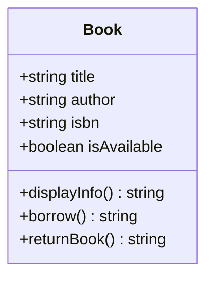
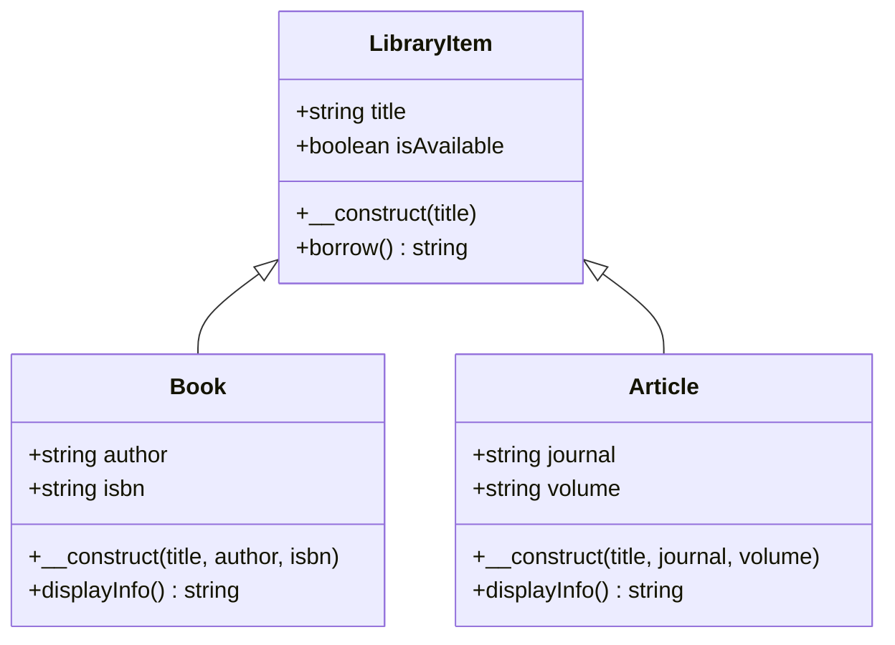

# Complete PHP OOP Tutorial: Library Management System

## Table of Contents

1. [Introduction to OOP](#introduction-to-oop)
2. [Classes and Objects](#classes-and-objects)
3. [Access Modifiers](#access-modifiers)
4. [Properties and Methods](#properties-and-methods)
5. [Constructors](#constructors)
6. [Inheritance](#inheritance)

---

## Introduction to OOP

**Object-Oriented Programming (OOP)** is a programming paradigm that organizes code around objects rather than functions. Think of it like building with LEGO blocks - each block (object) has specific properties and can do certain things (methods).

### Why Use OOP?

- **Organization**: Code is more organized and easier to maintain
- **Reusability**: You can reuse code without rewriting it
- **Scalability**: Easy to add new features
- **Real-world modeling**: Perfect for modeling real-world systems like our library

---

## Classes and Objects

### What is a Class?

A **class** is like a blueprint or template. Think of it as a cookie cutter - it defines the shape and structure.

### What is an Object?

An **object** is an instance of a class. It's like the actual cookie made from the cookie cutter.

```php
<?php
// Define a simple Book class (the blueprint)
class Book {
    // This is empty for now, we'll add stuff here
}

// Create objects (instances) of the Book class
$book1 = new Book();  // This creates a Book object
$book2 = new Book();  // This creates another Book object
?>
```



---

## Properties and Methods

### Properties

Properties are like characteristics or attributes of an object. A book has a title, author, ISBN, etc.

### Methods

Methods are like actions that an object can perform. A book can be borrowed, returned, displayed, etc.

```php
<?php
class Book {
    // Properties (characteristics)
    public $title;
    public $author;
    public $isbn;
    public $isAvailable;

    // Methods (actions)
    public function displayInfo() {
        return "Title: {$this->title}, Author: {$this->author}";
    }

    public function borrow() {
        if ($this->isAvailable) {
            $this->isAvailable = false;
            return "Book borrowed successfully!";
        }
        return "Book is not available!";
    }

    public function returnBook() {
        $this->isAvailable = true;
        return "Book returned successfully!";
    }
}

// Using the class
$book = new Book();
$book->title = "Harry Potter";
$book->author = "J.K. Rowling";
$book->isbn = "978-0439708180";
$book->isAvailable = true;

echo $book->displayInfo();  // Output: Title: Harry Potter, Author: J.K. Rowling
echo $book->borrow();       // Output: Book borrowed successfully!
?>
```

**Key Points:**

- `$this` refers to the current object
- `->` is used to access properties and methods of an object
- `public` means the property/method can be accessed from anywhere

---

## Constructors

A **constructor** is a special method that runs automatically when you create a new object. It's like setting up the initial state of your object.

```php
<?php
class Book {
    public $title;
    public $author;
    public $isbn;
    public $isAvailable;

    // Constructor - runs when new Book() is called
    public function __construct($title, $author, $isbn) {
        $this->title = $title;
        $this->author = $author;
        $this->isbn = $isbn;
        $this->isAvailable = true;  // New books are always available
    }

    public function displayInfo() {
        $status = $this->isAvailable ? "Available" : "Borrowed";
        return "Title: {$this->title}, Author: {$this->author}, Status: {$status}";
    }
}

// Now we can create books more easily
$book1 = new Book("1984", "George Orwell", "978-0451524935");
$book2 = new Book("To Kill a Mockingbird", "Harper Lee", "978-0061120084");

echo $book1->displayInfo();
?>
```

---

## Inheritance

**Inheritance** allows a class to inherit properties and methods from another class. It's like a child inheriting traits from a parent.

```php
<?php
// Base class (parent)
class LibraryItem {
    public $title;
    public $isAvailable;

    public function __construct($title) {
        $this->title = $title;
        $this->isAvailable = true;
    }

    public function borrow() {
        if ($this->isAvailable) {
            $this->isAvailable = false;
            return "{$this->title} borrowed successfully!";
        }
        return "{$this->title} is not available!";
    }
}

// Child class - inherits from LibraryItem
class Book extends LibraryItem {
    public $author;
    public $isbn;

    public function __construct($title, $author, $isbn) {
        parent::__construct($title);  // Call parent constructor
        $this->author = $author;
        $this->isbn = $isbn;
    }

    public function displayInfo() {
        return "Book: {$this->title} by {$this->author}";
    }
}

// Another child class
class Article extends LibraryItem {
    public $journal;
    public $volume;

    public function __construct($title, $journal, $volume) {
        parent::__construct($title);
        $this->journal = $journal;
        $this->volume = $volume;
    }

    public function displayInfo() {
        return "Article: {$this->title} from {$this->journal}, Vol. {$this->volume}";
    }
}

$book = new Book("Dune", "Frank Herbert", "978-0441172719");
$article = new Article("Climate Change Effects", "Science Journal", "45");

echo $book->displayInfo();     // Book: Dune by Frank Herbert
echo $article->displayInfo();  // Article: Climate Change Effects from Science Journal, Vol. 45
?>
```

**Key Points:**

- `extends` creates inheritance relationship
- `parent::` calls methods from the parent class
- Child classes inherit all public/protected properties and methods



---

## Access Modifiers

Access modifiers control who can access properties and methods:

- **public**: Accessible from anywhere
- **private**: Accessible only within the same class
- **protected**: Accessible within the class and its subclasses

```php
<?php
class BankAccount {
    public $accountNumber;     // Anyone can access
    protected $balance;        // Only this class and subclasses
    private $pin;             // Only this class

    public function __construct($accountNumber, $initialBalance, $pin) {
        $this->accountNumber = $accountNumber;
        $this->balance = $initialBalance;
        $this->pin = $pin;
    }

    public function getBalance() {
        return $this->balance;  // Public method to access protected property
    }

    private function validatePin($inputPin) {
        return $this->pin === $inputPin;  // Private method
    }

    public function withdraw($amount, $inputPin) {
        if (!$this->validatePin($inputPin)) {
            return "Invalid PIN";
        }

        if ($amount <= $this->balance) {
            $this->balance -= $amount;
            return "Withdrawn: $" . $amount;
        }
        return "Insufficient funds";
    }
}

$account = new BankAccount("123456", 1000, "1234");
echo $account->accountNumber;        // OK - public
echo $account->getBalance();         // OK - public method
// echo $account->balance;           // ERROR - protected
// echo $account->pin;               // ERROR - private
?>
```

---

Congratulations! You've learned the fundamental concepts of PHP OOP:

1. **Classes and Objects**: Blueprints and instances
2. **Properties and Methods**: Characteristics and behaviors
   2.5 **Access Modifiers**: Controlling visibility and access
3. **Constructors**: Automatic setup when creating objects
4. **Inheritance**: Child classes extending parent classes

The library management system demonstrates how these concepts work together to create a real-world application. Each concept builds upon the previous ones, creating a robust and maintainable system.

Remember: OOP is about modeling real-world problems in code. Think about the relationships between objects, what they can do, and how they interact with each other!
