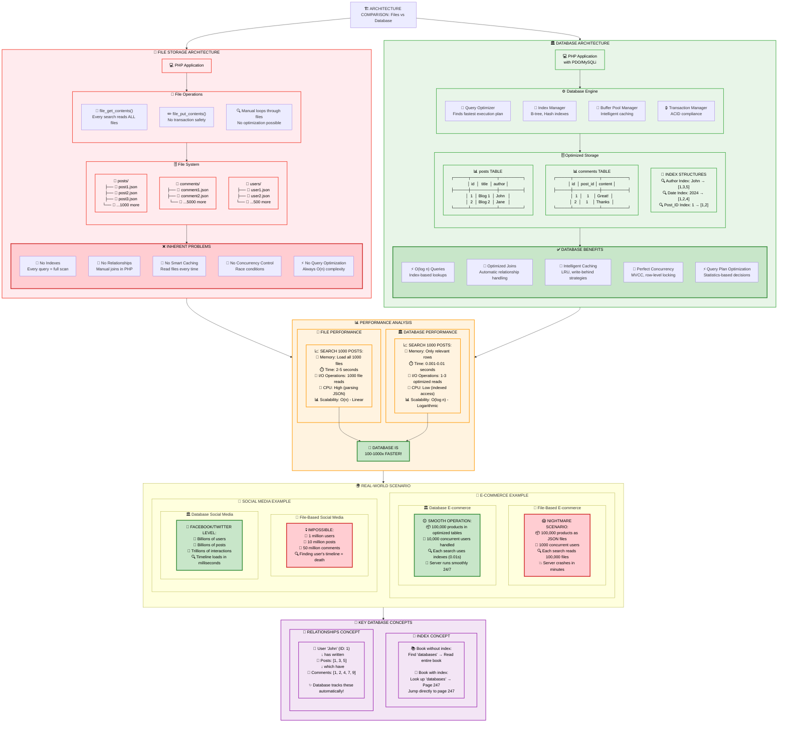

```mermaid
graph TD
%% File Storage Problems
subgraph FS["🗄️ FILE STORAGE APPROACH"]
direction TB

        subgraph FSProb["❌ PROBLEMS THAT EMERGE"]
            direction TB

            %% Problem 1: Slow Search
            subgraph P1["🐌 SLOW SEARCH PROBLEM"]
                F1[📄 Post1.json]
                F2[📄 Post2.json]
                F3[📄 Post3.json]
                F4[📄 Post4.json]
                F5[📄 Post5.json]
                F6[📄 ...]
                F7[📄 Post1000.json]

                SearchQ["🔍 Find posts by 'John'"]

                SearchQ -.->|"Must open & read"| F1
                SearchQ -.->|"Must open & read"| F2
                SearchQ -.->|"Must open & read"| F3
                SearchQ -.->|"Must open & read"| F4
                SearchQ -.->|"Must open & read"| F5
                SearchQ -.->|"Must open & read"| F6
                SearchQ -.->|"Must open & read"| F7

                SlowResult["⏱️ RESULT: 5+ seconds for 1000 posts<br/>❌ Gets exponentially slower"]
            end

            %% Problem 2: Memory Issues
            subgraph P2["💾 MEMORY OVERLOAD"]
                MemStart["📱 Server Memory: 2GB"]
                LoadAll["📥 Load ALL posts to sort by date"]
                MemFull["🚨 MEMORY FULL!<br/>💥 Server Crash"]

                MemStart --> LoadAll
                LoadAll --> MemFull
            end

            %% Problem 3: Concurrent Access
            subgraph P3["👥 CONCURRENT ACCESS CHAOS"]
                User1["👤 User 1<br/>Reads views: 100"]
                User2["👤 User 2<br/>Reads views: 100"]

                Inc1["📈 User 1: 100 + 1 = 101"]
                Inc2["📈 User 2: 100 + 1 = 101"]

                Save1["💾 Saves: 101"]
                Save2["💾 Saves: 101"]

                Lost["❌ LOST UPDATE!<br/>Should be 102, but is 101"]

                User1 --> Inc1 --> Save1
                User2 --> Inc2 --> Save2
                Save1 --> Lost
                Save2 --> Lost
            end
        end
    end

    %% Database Solution
    subgraph DB["🏛️ DATABASE SOLUTION"]
        direction TB

        subgraph DBSol["✅ HOW DATABASES SOLVE THESE"]
            direction TB

            %% Solution 1: Indexes
            subgraph S1["⚡ INSTANT SEARCH WITH INDEXES"]
                Index["📇 INDEX CARD SYSTEM"]
                IndexCards["📋 Author Index:<br/>John → Posts: 1,5,8<br/>Jane → Posts: 2,3,7<br/>Bob → Posts: 4,6,9"]

                FastQuery["🔍 Find posts by 'John'"]
                DirectAccess["🎯 Direct access to Posts 1,5,8"]
                FastResult["⚡ RESULT: 0.01 seconds!<br/>✅ Speed doesn't decrease with data growth"]

                FastQuery --> Index
                Index --> IndexCards
                IndexCards --> DirectAccess
                DirectAccess --> FastResult
            end

            %% Solution 2: Smart Memory Management
            subgraph S2["🧠 SMART MEMORY MANAGEMENT"]
                SmartDB["🎯 Database Engine"]
                OnlyNeeded["📊 Only loads what you need<br/>🔄 Caches frequently used data<br/>📄 Pages data efficiently"]
                MemoryOK["✅ Memory stays healthy<br/>🚀 Fast performance"]

                SmartDB --> OnlyNeeded --> MemoryOK
            end

            %% Solution 3: Transaction Control
            subgraph S3["🔒 TRANSACTION CONTROL"]
                Tx1["👤 User 1 starts transaction"]
                Tx2["👤 User 2 waits for lock"]

                Lock1["🔐 Database locks the record"]
                Update1["📈 User 1: 100 → 101 ✅"]
                Release["🔓 Release lock"]

                Lock2["🔐 Database locks for User 2"]
                Update2["📈 User 2: 101 → 102 ✅"]

                Final["✅ CORRECT RESULT: 102<br/>🎯 No lost updates!"]

                Tx1 --> Lock1 --> Update1 --> Release
                Tx2 --> Lock2 --> Update2
                Update2 --> Final
            end
        end
    end

    %% Performance Comparison
    subgraph PERF["📊 PERFORMANCE COMPARISON"]
        direction LR

        subgraph FilePerf["📁 FILE STORAGE"]
            FileChart["📈 Response Time vs Data Size<br/>📄 100 posts: 0.1s<br/>📄 1,000 posts: 1s<br/>📄 10,000 posts: 10s<br/>📄 100,000 posts: 💥 CRASH"]
        end

        subgraph DBPerf["🏛️ DATABASE"]
            DBChart["📈 Response Time vs Data Size<br/>🗃️ 100 posts: 0.01s<br/>🗃️ 1,000 posts: 0.01s<br/>🗃️ 10,000 posts: 0.02s<br/>🗃️ 100,000 posts: 0.03s"]
        end
    end

    %% Styling
    classDef problemBox fill:#ffcccc,stroke:#ff0000,stroke-width:2px,color:#000
    classDef solutionBox fill:#ccffcc,stroke:#00aa00,stroke-width:2px,color:#000
    classDef performanceBox fill:#cceeff,stroke:#0066cc,stroke-width:2px,color:#000
    classDef warningBox fill:#fff3cd,stroke:#ffc107,stroke-width:2px,color:#000

    class FSProb,P1,P2,P3 problemBox
    class DBSol,S1,S2,S3 solutionBox
    class PERF,FilePerf,DBPerf performanceBox
    class SlowResult,MemFull,Lost warningBox
```

```mermaid
graph TD
    %% Header
    Title["🚀 THE SCALING PROBLEM: Why Files Break Down"]

    %% Small Scale - Everything looks fine
    subgraph SMALL["🏠 SMALL BLOG (100 posts)"]
        direction TB

        SmallFiles["📁 posts/<br/>├── post1.json<br/>├── post2.json<br/>├── ...<br/>└── post100.json"]

        SmallOps["⚡ OPERATIONS:<br/>🔍 Search: 0.1s ✅<br/>📊 List all: 0.2s ✅<br/>👤 Find by author: 0.1s ✅<br/>💾 Memory: 50MB ✅"]

        SmallFiles --> SmallOps
        SmallHappy["😊 Developer thinks:<br/>'Files are perfect!'"]
        SmallOps --> SmallHappy
    end

    %% Medium Scale - Cracks appear
    subgraph MEDIUM["🏢 MEDIUM BLOG (10,000 posts)"]
        direction TB

        MediumFiles["📁 posts/ (10,000 files)<br/>├── post1.json<br/>├── post2.json<br/>├── ...<br/>├── post5000.json<br/>├── ...<br/>└── post10000.json"]

        MediumOps["⚠️ OPERATIONS:<br/>🐌 Search: 3s ⚠️<br/>📊 List all: 5s ⚠️<br/>👤 Find by author: 4s ⚠️<br/>💾 Memory: 500MB ⚠️"]

        MediumFiles --> MediumOps
        MediumWorried["😰 Developer thinks:<br/>'Maybe I need optimization...'"]
        MediumOps --> MediumWorried
    end

    %% Large Scale - System breaks
    subgraph LARGE["🏭 LARGE BLOG (100,000 posts)"]
        direction TB

        LargeFiles["📁 posts/ (100,000 files)<br/>├── post1.json<br/>├── post2.json<br/>├── ... (98,000 more files)<br/>└── post100000.json"]

        LargeOps["🚨 OPERATIONS:<br/>💥 Search: 30s+ ❌<br/>💥 List all: TIMEOUT ❌<br/>💥 Find by author: CRASH ❌<br/>💥 Memory: OUT OF MEMORY ❌"]

        LargeFiles --> LargeOps
        LargePanic["😱 Developer thinks:<br/>'My website is dead!'"]
        LargeOps --> LargePanic
    end

    %% Multi-user disaster
    subgraph CONCURRENT["👥 MULTI-USER DISASTER"]
        direction TB

        Users["👤👤👤 100 Concurrent Users<br/>All trying to:<br/>🔍 Search posts<br/>📝 Create posts<br/>👀 View posts<br/>💬 Add comments"]

        FileSystem["🗄️ File System trying to handle:<br/>📄 Read 100,000 files × 100 users<br/>🔒 File locks everywhere<br/>💾 Memory exhaustion<br/>⏱️ Disk I/O bottleneck"]

        Chaos["💥 TOTAL CHAOS:<br/>🐌 Website loads in 30+ seconds<br/>❌ Random crashes<br/>🔒 File corruption<br/>😡 Users leave angry"]

        Users --> FileSystem --> Chaos
    end

    %% Database Solution
    subgraph DBSOLUTION["🏛️ DATABASE SOLUTION: Scales Beautifully"]
        direction TB

        subgraph DBSMALL["🏠 100 posts"]
            DBSmallOps["⚡ Search: 0.001s<br/>📊 List: 0.002s<br/>👤 Author: 0.001s<br/>💾 Memory: 10MB"]
        end

        subgraph DBMEDIUM["🏢 10,000 posts"]
            DBMediumOps["⚡ Search: 0.002s<br/>📊 List: 0.003s<br/>👤 Author: 0.001s<br/>💾 Memory: 20MB"]
        end

        subgraph DBLARGE["🏭 100,000 posts"]
            DBLargeOps["⚡ Search: 0.005s<br/>📊 List: 0.008s<br/>👤 Author: 0.002s<br/>💾 Memory: 50MB"]
        end

        subgraph DBCONCURRENT["👥 1000 users"]
            DBConcurrentOps["⚡ All operations: <0.1s<br/>🔒 Perfect concurrency<br/>💾 Efficient memory use<br/>😊 Happy users"]
        end

        DBFeatures["✨ DATABASE FEATURES:<br/>📇 Smart indexes<br/>🧠 Query optimization<br/>🔄 Efficient caching<br/>🔒 Transaction control<br/>⚖️ Load balancing"]

        DBSmall --> DBFeatures
        DBMedium --> DBFeatures
        DBLarge --> DBFeatures
        DBConcurrent --> DBFeatures
    end

    %% Real-world analogy
    subgraph ANALOGY["🏪 REAL-WORLD ANALOGY"]
        direction TB

        subgraph GROCERY["🏪 GROCERY STORE"]
            GroceryProblem["❌ IMAGINE: No organization<br/>🥕 Carrots mixed with 🧻 toilet paper<br/>🍞 Bread scattered everywhere<br/>🔍 Finding milk takes 30 minutes<br/>😤 Customers frustrated"]
        end

        subgraph LIBRARY["📚 LIBRARY SYSTEM"]
            LibrarySolution["✅ ORGANIZED SYSTEM:<br/>📇 Card catalog (INDEX)<br/>🏷️ Dewey decimal system<br/>📍 Everything has a place<br/>🔍 Find any book in 30 seconds<br/>😊 Customers happy"]
        end

        GroceryProblem -.->|"Files are like"| GroceryProblem
        LibrarySolution -.->|"Databases are like"| LibrarySolution
    end

    %% Flow connections
    Title --> SMALL
    SMALL --> MEDIUM
    MEDIUM --> LARGE
    LARGE --> CONCURRENT
    CONCURRENT --> DBSOLUTION
    DBSOLUTION --> ANALOGY

    %% Styling
    classDef smallScale fill:#e8f5e8,stroke:#4caf50,stroke-width:2px
    classDef mediumScale fill:#fff8e1,stroke:#ff9800,stroke-width:2px
    classDef largeScale fill:#ffebee,stroke:#f44336,stroke-width:3px
    classDef dbSolution fill:#e3f2fd,stroke:#2196f3,stroke-width:2px
    classDef analogy fill:#f3e5f5,stroke:#9c27b0,stroke-width:2px
    classDef disaster fill:#ff5722,color:#fff,stroke:#bf360c,stroke-width:3px

    class SMALL,SmallFiles,SmallOps,SmallHappy smallScale
    class MEDIUM,MediumFiles,MediumOps,MediumWorried mediumScale
    class LARGE,LargeFiles,LargeOps,LargePanic largeScale
    class CONCURRENT,Chaos disaster
    class DBSOLUTION,DBSMALL,DBMEDIUM,DBLARGE,DBCONCURRENT,DBFeatures dbSolution
    class ANALOGY,GROCERY,LIBRARY analogy
```

```mermaid
graph TD
    %% Title
    MainTitle["🏗️ ARCHITECTURE COMPARISON: Files vs Database"]

    %% File Storage Architecture
    subgraph FILEMODE["📁 FILE STORAGE ARCHITECTURE"]
        direction TB

        FileApp["💻 PHP Application"]

        subgraph FILEOPS["🔧 File Operations"]
            direction TB
            FRead["📖 file_get_contents()<br/>Every search reads ALL files"]
            FWrite["✏️ file_put_contents()<br/>No transaction safety"]
            FSearch["🔍 Manual loops through files<br/>No optimization possible"]
        end

        subgraph FILESYSTEM["🗄️ File System"]
            direction TB
            PostsFolder["📁 posts/<br/>├── 📄 post1.json<br/>├── 📄 post2.json<br/>├── 📄 post3.json<br/>└── 📄 ...1000 more"]
            CommentsFolder["📁 comments/<br/>├── 📄 comment1.json<br/>├── 📄 comment2.json<br/>└── 📄 ...5000 more"]
            UsersFolder["📁 users/<br/>├── 📄 user1.json<br/>├── 📄 user2.json<br/>└── 📄 ...500 more"]
        end

        subgraph FILEPROBLEMS["❌ INHERENT PROBLEMS"]
            direction TB
            NoIndex["📇 No Indexes<br/>Every query = full scan"]
            NoRelations["🔗 No Relationships<br/>Manual joins in PHP"]
            NoCache["💾 No Smart Caching<br/>Read files every time"]
            NoConcurrency["👥 No Concurrency Control<br/>Race conditions"]
            NoOptimization["⚡ No Query Optimization<br/>Always O(n) complexity"]
        end

        FileApp --> FILEOPS
        FILEOPS --> FILESYSTEM
        FILESYSTEM --> FILEPROBLEMS
    end

    %% Database Architecture
    subgraph DBMODE["🏛️ DATABASE ARCHITECTURE"]
        direction TB

        DBApp["💻 PHP Application<br/>with PDO/MySQLi"]

        subgraph DBENGINE["⚙️ Database Engine"]
            direction TB
            QueryOptimizer["🧠 Query Optimizer<br/>Finds fastest execution plan"]
            IndexManager["📇 Index Manager<br/>B-tree, Hash indexes"]
            CacheManager["💾 Buffer Pool Manager<br/>Intelligent caching"]
            TransactionManager["🔒 Transaction Manager<br/>ACID compliance"]
        end

        subgraph STORAGE["🗄️ Optimized Storage"]
            direction TB
            TablePosts["📊 posts TABLE<br/>┌─────┬─────────┬────────┐<br/>│ id  │  title  │ author │<br/>├─────┼─────────┼────────┤<br/>│  1  │ Blog 1  │ John   │<br/>│  2  │ Blog 2  │ Jane   │<br/>└─────┴─────────┴────────┘"]

            TableComments["📊 comments TABLE<br/>┌─────┬─────────┬─────────┐<br/>│ id  │ post_id │ content │<br/>├─────┼─────────┼─────────┤<br/>│  1  │    1    │ Great!  │<br/>│  2  │    1    │ Thanks  │<br/>└─────┴─────────┴─────────┘"]

            IndexStructure["📇 INDEX STRUCTURES<br/>🔍 Author Index: John → [1,3,5]<br/>🔍 Date Index: 2024 → [1,2,4]<br/>🔍 Post_ID Index: 1 → [1,2]"]
        end

        subgraph DBBENEFITS["✅ DATABASE BENEFITS"]
            direction TB
            FastQuery["⚡ O(log n) Queries<br/>Index-based lookups"]
            SmartJoins["🔗 Optimized Joins<br/>Automatic relationship handling"]
            IntelligentCache["💾 Intelligent Caching<br/>LRU, write-behind strategies"]
            PerfectConcurrency["👥 Perfect Concurrency<br/>MVCC, row-level locking"]
            QueryPlan["⚡ Query Plan Optimization<br/>Statistics-based decisions"]
        end

        DBApp --> DBENGINE
        DBENGINE --> STORAGE
        STORAGE --> DBBENEFITS
    end

    %% Performance Comparison
    subgraph PERFORMANCE["📊 PERFORMANCE ANALYSIS"]
        direction TB

        subgraph FILEPERF["📁 FILE PERFORMANCE"]
            direction TB
            FileMetrics["📈 SEARCH 1000 POSTS:<br/>💾 Memory: Load all 1000 files<br/>⏱️ Time: 2-5 seconds<br/>🔄 I/O Operations: 1000 file reads<br/>🧠 CPU: High (parsing JSON)<br/>📊 Scalability: O(n) - Linear"]
        end

        subgraph DBPERF["🏛️ DATABASE PERFORMANCE"]
            direction TB
            DBMetrics["📈 SEARCH 1000 POSTS:<br/>💾 Memory: Only relevant rows<br/>⏱️ Time: 0.001-0.01 seconds<br/>🔄 I/O Operations: 1-3 optimized reads<br/>🧠 CPU: Low (indexed access)<br/>📊 Scalability: O(log n) - Logarithmic"]
        end

        ArrowComparison["🎯 DATABASE IS<br/>100-1000x FASTER!"]

        FileMetrics --> ArrowComparison
        DBMetrics --> ArrowComparison
    end

    %% Real-world scenario
    subgraph SCENARIO["🌍 REAL-WORLD SCENARIO"]
        direction TB

        subgraph ECOMMERCE["🛒 E-COMMERCE EXAMPLE"]
            direction TB

            subgraph FILECOM["📁 File-Based E-commerce"]
                FileEcom["😱 NIGHTMARE SCENARIO:<br/>📦 100,000 products as JSON files<br/>👥 1000 concurrent users<br/>🔍 Each search reads 100,000 files<br/>💥 Server crashes in minutes"]
            end

            subgraph DBCOM["🏛️ Database E-commerce"]
                DBEcom["😊 SMOOTH OPERATION:<br/>📦 100,000 products in optimized tables<br/>👥 10,000 concurrent users handled<br/>🔍 Each search uses indexes (0.01s)<br/>🚀 Server runs smoothly 24/7"]
            end
        end

        subgraph SOCIALMEDIA["📱 SOCIAL MEDIA EXAMPLE"]
            direction TB

            subgraph FILESOCIAL["📁 File-Based Social Media"]
                FileSocial["💀 IMPOSSIBLE:<br/>👤 1 million users<br/>📝 10 million posts<br/>💬 50 million comments<br/>🔍 Finding user's timeline = death"]
            end

            subgraph DBSOCIAL["🏛️ Database Social Media"]
                DBSocial["🎯 FACEBOOK/TWITTER LEVEL:<br/>👤 Billions of users<br/>📝 Billions of posts<br/>💬 Trillions of interactions<br/>🔍 Timeline loads in milliseconds"]
            end
        end
    end

    %% Key Concepts Visualization
    subgraph CONCEPTS["🧠 KEY DATABASE CONCEPTS"]
        direction TB

        subgraph INDEXCONCEPT["📇 INDEX CONCEPT"]
            direction LR
            BookAnalogy["📚 Book without index:<br/>Find 'databases' → Read entire book<br/><br/>📖 Book with index:<br/>Look up 'databases' → Page 247<br/>Jump directly to page 247"]
        end

        subgraph RELCONCEPT["🔗 RELATIONSHIPS CONCEPT"]
            direction TB
            RelationshipDemo["👤 User 'John' (ID: 1)<br/>  ↓ has written<br/>📝 Posts: [1, 3, 5]<br/>  ↓ which have<br/>💬 Comments: [1, 2, 4, 7, 9]<br/><br/>✨ Database tracks these automatically!"]
        end
    end

    %% Connect main sections
    MainTitle --> FILEMODE
    MainTitle --> DBMODE
    FILEMODE --> PERFORMANCE
    DBMODE --> PERFORMANCE
    PERFORMANCE --> SCENARIO
    SCENARIO --> CONCEPTS

    %% Styling
    classDef fileStyle fill:#ffebee,stroke:#f44336,stroke-width:2px,color:#000
    classDef dbStyle fill:#e8f5e8,stroke:#4caf50,stroke-width:2px,color:#000
    classDef performanceStyle fill:#fff3e0,stroke:#ff9800,stroke-width:2px,color:#000
    classDef conceptStyle fill:#f3e5f5,stroke:#9c27b0,stroke-width:2px,color:#000
    classDef problemStyle fill:#ffcdd2,stroke:#d32f2f,stroke-width:3px,color:#000
    classDef benefitStyle fill:#c8e6c9,stroke:#388e3c,stroke-width:3px,color:#000

    class FILEMODE,FILEOPS,FILESYSTEM,FileApp,PostsFolder,CommentsFolder,UsersFolder fileStyle
    class FILEPROBLEMS,FileEcom,FileSocial problemStyle
    class DBMODE,DBENGINE,STORAGE,DBApp,TablePosts,TableComments,IndexStructure dbStyle
    class DBBENEFITS,DBEcom,DBSocial,ArrowComparison benefitStyle
    class PERFORMANCE,FILEPERF,DBPERF,FileMetrics,DBMetrics performanceStyle
    class CONCEPTS,INDEXCONCEPT,RELCONCEPT,BookAnalogy,RelationshipDemo conceptStyle
```
