# Complete System Design and UML Tutorial: From Concepts to PHP Implementation

## Table of Contents

1. [Understanding System Design Fundamentals](#1-understanding-system-design-fundamentals)
2. [Why UML Became the Standard](#2-why-uml-became-the-standard)
3. [UML Diagrams Deep Dive](#3-uml-diagrams-deep-dive)
4. [From UML to PHP: Translation Strategies](#4-from-uml-to-php-translation-strategies)
5. [Understanding MVC Through UML](#5-understanding-mvc-through-uml)
6. [Practical Implementation Guide](#6-practical-implementation-guide)

---

## 1. Understanding System Design Fundamentals

### What is System Design?

Think of system design like being an architect for a building. Before construction begins, an architect creates detailed blueprints showing how rooms connect, where the plumbing goes, and how the electrical system works. System design serves the same purpose for software applications.

System design is the process of defining the architecture, components, modules, interfaces, and data for a system to satisfy specified requirements. It answers fundamental questions like:

- How will different parts of the application communicate?
- Where will data be stored and how will it flow?
- What happens when a user performs an action?
- How will the system handle growth and changes?

### The Building Blocks of Any System

Every software system, whether it's a simple calculator or Facebook, consists of three fundamental elements:

**Entities (The "Things")**: These are the core objects that your system manages. In a library system, entities might be Books, Members, and Loans. In an e-commerce system, they might be Products, Customers, and Orders.

**Processes (The "Actions")**: These are the operations that can be performed on or with entities. Examples include "borrowing a book," "placing an order," or "updating user profile."

**Relationships (The "Connections")**: These define how entities interact with each other. A Customer "places" Orders, a Book "belongs to" a Category, a User "has" a Profile.

### Why We Need Visual Representation

Imagine trying to explain the layout of a complex building using only words. You might say "the kitchen is next to the living room, which connects to the hallway that leads to three bedrooms." This becomes confusing quickly. A floor plan shows the same information instantly and clearly.

The same principle applies to software systems. When systems grow beyond a few simple functions, describing them in words becomes inadequate. We need visual models that can show:

- The static structure (what exists)
- The dynamic behavior (what happens)
- The relationships between components

---

## 2. Why UML Became the Standard

### The Historical Problem

Before UML (Unified Modeling Language), the software industry faced a tower of Babel problem. Different methodologists created their own diagramming techniques:

- James Rumbaugh had the Object Modeling Technique (OMT)
- Grady Booch had the Booch Method
- Ivar Jacobson had Object-Oriented Software Engineering (OOSE)

Each had strengths, but teams couldn't easily share designs or understand each other's documentation.

### The Unification

In the mid-1990s, Rumbaugh, Booch, and Jacobson (known as the "Three Amigos") joined forces to create UML. They combined the best aspects of their individual approaches into a single, standardized notation.

UML became the de facto standard because it provides:

- **Universality**: Everyone can understand the same symbols
- **Precision**: Clear rules for what each diagram element means
- **Completeness**: Covers both structure and behavior
- **Tool Support**: Standardization enabled widespread tool development

### UML's Core Philosophy

UML operates on a simple but powerful principle: separate the "what" from the "how." It focuses on modeling the essential characteristics of a system without getting bogged down in implementation details. This abstraction allows designers to:

- Focus on solving the right problems before worrying about code
- Communicate designs across teams and technologies
- Plan systems that can evolve and scale

---

## 3. UML Diagrams Deep Dive

UML provides 14 different diagram types, but they fall into two main categories: Structural (static) and Behavioral (dynamic). Let's explore each type with detailed examples.

### 3.1 Class Diagrams - The Foundation

Class diagrams are the most fundamental UML diagrams. They show the static structure of your system by depicting classes, their attributes, methods, and relationships.

#### Understanding the Components

**Class Representation**: A class is represented by a rectangle divided into three sections:

- Top: Class name (in bold or italics for abstract classes)
- Middle: Attributes (properties/fields)
- Bottom: Methods (functions/operations)

**Visibility Modifiers**:

- `+` Public: Accessible from anywhere
- `-` Private: Only accessible within the same class
- `#` Protected: Accessible within the class and its subclasses
- `~` Package: Accessible within the same package

Let's build a simple library system to demonstrate these concepts:

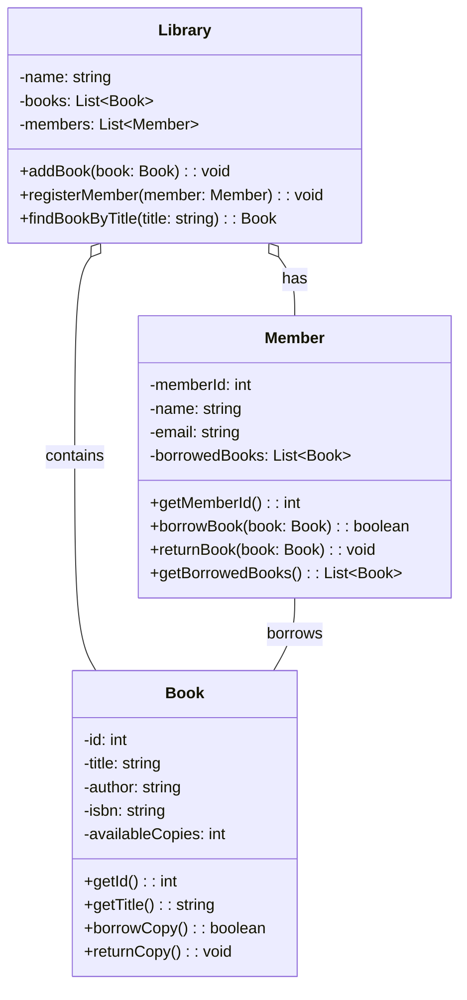

#### Key Questions to Ask When Creating Class Diagrams

When designing class diagrams, ask yourself these essential questions:

1. **What are the main entities in my domain?** Look for nouns in your requirements.
2. **What information does each entity need to store?** These become attributes.
3. **What can each entity do?** These become methods.
4. **How do entities relate to each other?** This determines relationships.
5. **What level of detail is appropriate?** Start high-level, then refine.

#### Relationship Types Explained

Understanding relationships is crucial for effective class diagrams:

**Association**: A general "uses" or "knows about" relationship. If a Student takes a Course, there's an association between them.

**Aggregation** (empty diamond): "Has-a" relationship where parts can exist independently. A Department has Employees, but employees can exist without the department.

**Composition** (filled diamond): "Part-of" relationship where parts cannot exist without the whole. A House has Rooms, but rooms cannot exist without the house.

**Inheritance** (empty arrow): "Is-a" relationship. A Dog is an Animal.

**Dependency** (dashed arrow): One class uses another temporarily, often as a parameter.

### 3.2 Use Case Diagrams - Understanding User Interactions

Use case diagrams capture the functional requirements of a system by showing how users (actors) interact with the system to achieve specific goals.

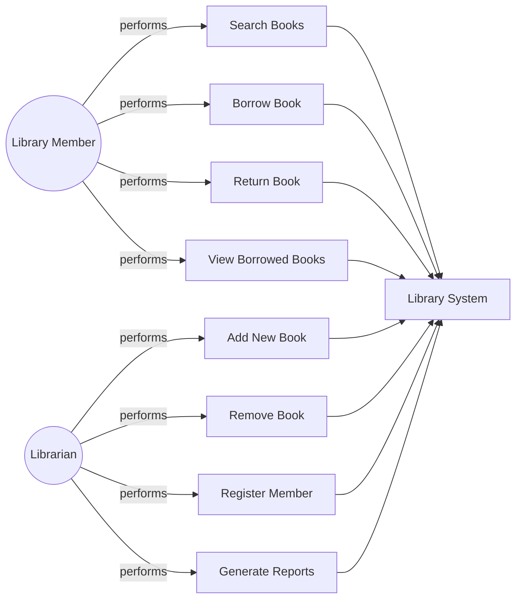

#### Questions for Use Case Analysis

1. **Who are the users of the system?** Identify all actor types.
2. **What does each user want to accomplish?** Each goal becomes a use case.
3. **Are there any relationships between use cases?** Look for inclusion and extension.
4. **What are the preconditions and postconditions?** Define what must be true before and after.

#### Use Case Relationships

**Include**: One use case always includes another. "Borrow Book" includes "Authenticate User."

**Extend**: One use case optionally extends another. "Process Payment" might extend "Purchase Item" only when payment is required.

**Generalization**: Similar to inheritance for use cases. "Login with Facebook" generalizes "Login."

### 3.3 Sequence Diagrams - Time-Based Interactions

Sequence diagrams show how objects interact over time. They're excellent for modeling complex processes and understanding the flow of messages between objects.

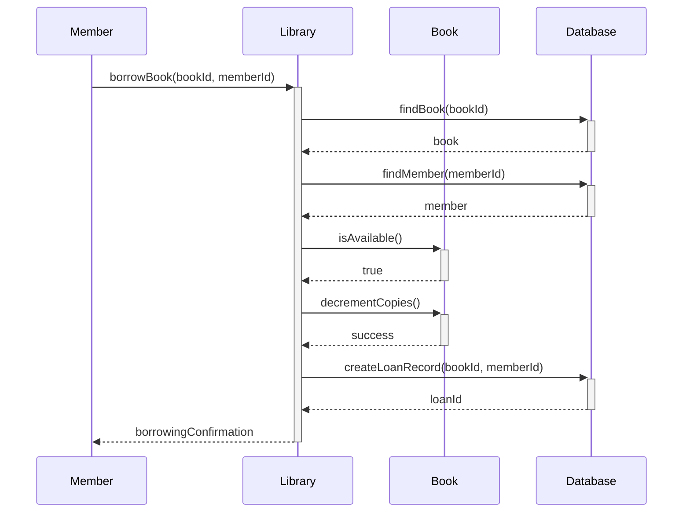

#### Reading Sequence Diagrams

The vertical axis represents time flowing downward. The horizontal axis shows the different objects or actors involved. Messages between objects are represented by arrows, and the type of arrow indicates the nature of the interaction:

- Solid arrows: Synchronous calls (caller waits for response)
- Dashed arrows: Return messages
- Open arrowheads: Asynchronous calls (fire and forget)

#### Questions for Sequence Diagram Design

1. **What triggers this interaction?** Identify the initiating event.
2. **Which objects need to be involved?** Include only necessary participants.
3. **What's the correct order of operations?** Sequence matters for correctness.
4. **Where might errors occur?** Consider alternative flows.
5. **What information flows between objects?** Parameters and return values.

### 3.4 Activity Diagrams - Process Flow Modeling

Activity diagrams model the flow of activities within a process. They're similar to flowcharts but with UML standardization and object-oriented concepts.

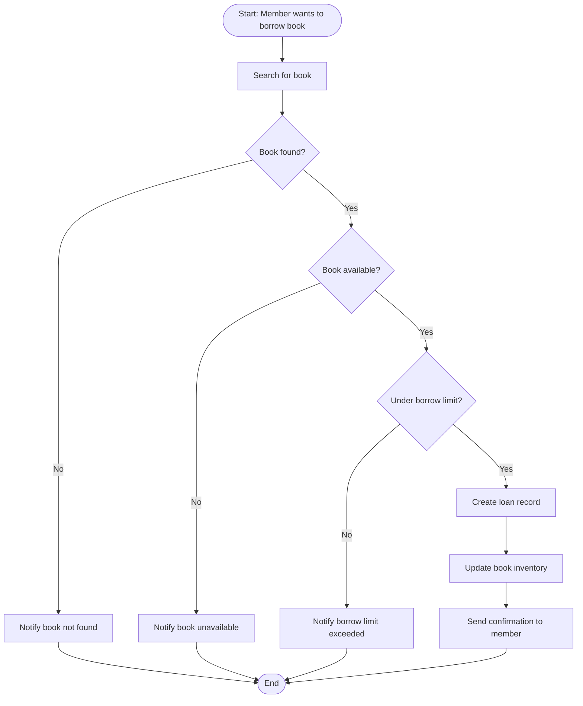

#### Activity Diagram Elements

**Activities**: Rounded rectangles representing tasks or operations.

**Decision Points**: Diamond shapes representing conditional logic.

**Fork/Join**: Parallel processing where multiple activities can happen simultaneously.

**Start/End Nodes**: Filled circles (start) and circles with borders (end).

#### When to Use Activity Diagrams

Activity diagrams excel at modeling:

- Business processes with multiple decision points
- Workflows that span multiple objects or systems
- Algorithms with complex logic
- User journeys through an application

### 3.5 State Diagrams - Object Lifecycle Modeling

State diagrams model how an object's behavior changes based on its internal state. They're particularly useful for objects with complex lifecycles.

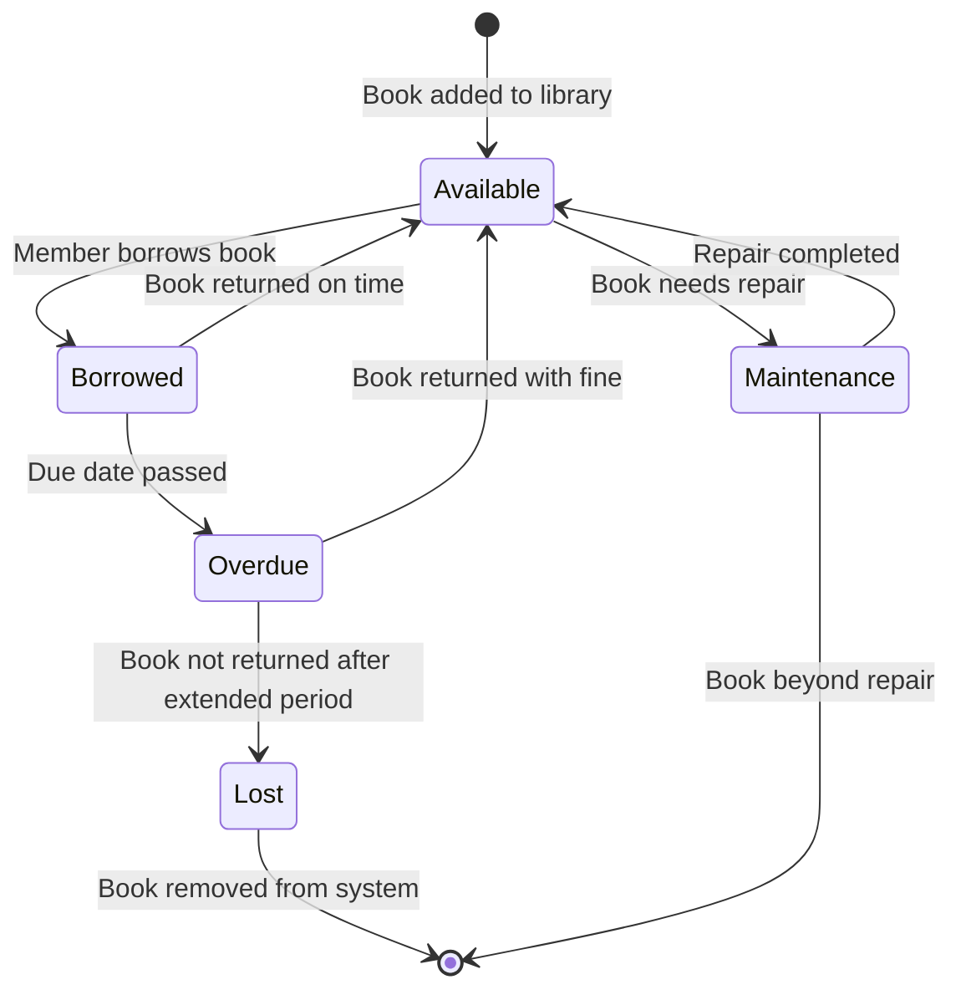

#### Understanding State Diagrams

States represent distinct conditions or situations an object can be in. Transitions represent events or conditions that cause the object to change from one state to another.

#### Questions for State Diagram Design

1. **What are the key states this object can be in?** Look for significantly different behaviors.
2. **What events cause state changes?** External triggers and internal conditions.
3. **Are there any constraints on state transitions?** Some changes might not be allowed.
4. **What actions occur during transitions?** Operations that happen when changing state.

### 3.6 Component Diagrams - System Architecture

Component diagrams show the high-level architecture of your system by depicting components and their interfaces.

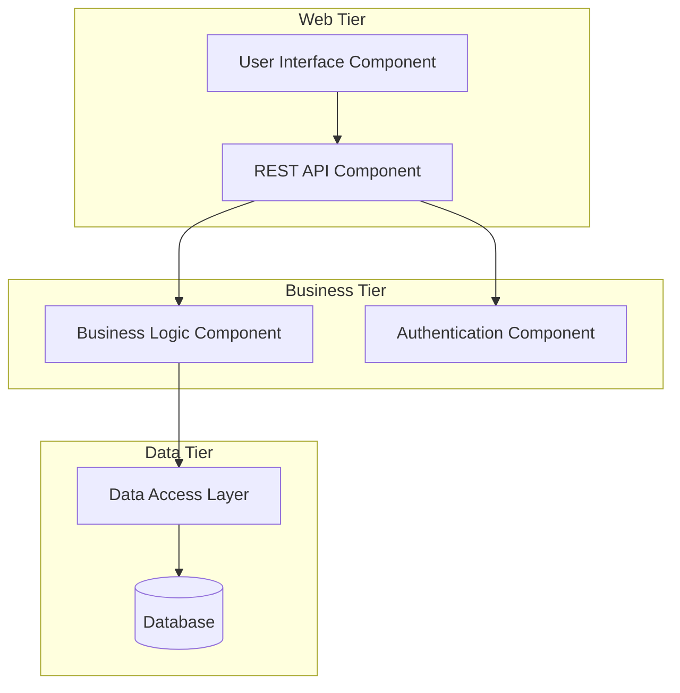

Component diagrams help you understand:

- How the system is divided into manageable pieces
- Dependencies between different parts of the system
- Interfaces and communication protocols
- Deployment and packaging strategies

---

## 4. From UML to PHP: Translation Strategies

Now comes the exciting part: transforming your UML designs into working PHP code. This translation process follows predictable patterns that, once mastered, make implementation much more straightforward.

### 4.1 Class Diagrams to PHP Classes

The translation from UML class diagrams to PHP code is the most direct transformation. Each UML class becomes a PHP class, maintaining the same structure and relationships.

#### Basic Class Translation

Let's take our Book class from the UML diagram and translate it to PHP:

```php
<?php
class Book {
    // Private attributes (- in UML)
    private int $id;
    private string $title;
    private string $author;
    private string $isbn;
    private int $availableCopies;

    // Constructor to initialize the object
    public function __construct(int $id, string $title, string $author, string $isbn, int $copies) {
        $this->id = $id;
        $this->title = $title;
        $this->author = $author;
        $this->isbn = $isbn;
        $this->availableCopies = $copies;
    }

    // Public methods (+ in UML)
    public function getId(): int {
        return $this->id;
    }

    public function getTitle(): string {
        return $this->title;
    }

    public function borrowCopy(): bool {
        if ($this->availableCopies > 0) {
            $this->availableCopies--;
            return true;
        }
        return false;
    }

    public function returnCopy(): void {
        $this->availableCopies++;
    }

    // Helper method to check availability
    public function isAvailable(): bool {
        return $this->availableCopies > 0;
    }
}
?>
```

#### Key Translation Principles

**Visibility Mapping**: UML visibility modifiers translate directly to PHP access modifiers. Private attributes in UML become private properties in PHP, ensuring encapsulation.

**Type Safety**: While UML shows data types, PHP allows you to enforce them using type declarations (available since PHP 7). This makes your code more robust and self-documenting.

**Method Signatures**: The UML method signatures translate directly to PHP method declarations, including parameter types and return types.

### 4.2 Implementing Relationships in PHP

Relationships shown in UML diagrams require careful consideration when implementing in PHP.

#### Association Implementation

When classes have associations, you typically implement them using object references:

```php
<?php
class Member {
    private int $memberId;
    private string $name;
    private string $email;
    private array $borrowedBooks; // Array of Book objects

    public function __construct(int $memberId, string $name, string $email) {
        $this->memberId = $memberId;
        $this->name = $name;
        $this->email = $email;
        $this->borrowedBooks = [];
    }

    public function borrowBook(Book $book): bool {
        if ($book->borrowCopy()) {
            $this->borrowedBooks[] = $book;
            return true;
        }
        return false;
    }

    public function returnBook(Book $book): void {
        $key = array_search($book, $this->borrowedBooks, true);
        if ($key !== false) {
            unset($this->borrowedBooks[$key]);
            $book->returnCopy();
            // Reindex array
            $this->borrowedBooks = array_values($this->borrowedBooks);
        }
    }

    public function getBorrowedBooks(): array {
        return $this->borrowedBooks;
    }
}
?>
```

#### Composition and Aggregation

The difference between composition and aggregation becomes important in PHP implementation:

```php
<?php
// Composition example: Order owns OrderItems
class Order {
    private array $orderItems;

    public function __construct() {
        $this->orderItems = [];
    }

    public function addItem(string $productName, int $quantity, float $price): void {
        // Creating OrderItem within Order (composition)
        $this->orderItems[] = new OrderItem($productName, $quantity, $price);
    }
}

class OrderItem {
    private string $productName;
    private int $quantity;
    private float $price;

    public function __construct(string $productName, int $quantity, float $price) {
        $this->productName = $productName;
        $this->quantity = $quantity;
        $this->price = $price;
    }
}

// Aggregation example: Department has Employees (but employees exist independently)
class Department {
    private array $employees;

    public function addEmployee(Employee $employee): void {
        $this->employees[] = $employee; // Employee created elsewhere
    }
}
?>
```

### 4.3 Translating Behavioral Diagrams

Behavioral diagrams guide the implementation of methods and interactions between objects.

#### Sequence Diagrams to Method Implementation

The sequence diagram we created for book borrowing translates to a method in the Library class:

```php
<?php
class Library {
    private array $books;
    private array $members;
    private DatabaseConnection $db;

    public function borrowBook(int $bookId, int $memberId): array {
        try {
            // Find book (corresponds to DB lookup in sequence diagram)
            $book = $this->findBookById($bookId);
            if (!$book) {
                return ['success' => false, 'message' => 'Book not found'];
            }

            // Find member (corresponds to DB lookup in sequence diagram)
            $member = $this->findMemberById($memberId);
            if (!$member) {
                return ['success' => false, 'message' => 'Member not found'];
            }

            // Check availability (corresponds to isAvailable() call)
            if (!$book->isAvailable()) {
                return ['success' => false, 'message' => 'Book not available'];
            }

            // Perform borrowing (corresponds to decrementCopies() call)
            if ($member->borrowBook($book)) {
                // Create loan record (corresponds to createLoanRecord() call)
                $loanId = $this->db->createLoanRecord($bookId, $memberId);

                return [
                    'success' => true,
                    'message' => 'Book borrowed successfully',
                    'loanId' => $loanId
                ];
            }

            return ['success' => false, 'message' => 'Unable to complete borrowing'];

        } catch (Exception $e) {
            return ['success' => false, 'message' => 'System error: ' . $e->getMessage()];
        }
    }

    private function findBookById(int $bookId): ?Book {
        // Implementation would query database
        // This is a simplified version
        foreach ($this->books as $book) {
            if ($book->getId() === $bookId) {
                return $book;
            }
        }
        return null;
    }

    private function findMemberById(int $memberId): ?Member {
        // Similar implementation for finding members
        foreach ($this->members as $member) {
            if ($member->getMemberId() === $memberId) {
                return $member;
            }
        }
        return null;
    }
}
?>
```

#### Activity Diagrams to Control Flow

Activity diagrams translate into the control flow structures within your PHP methods:

```php
<?php
public function processBorrowRequest(int $bookId, int $memberId): array {
    // Search for book (activity from diagram)
    $book = $this->searchBook($bookId);

    // Decision point: Book found?
    if (!$book) {
        return $this->notifyBookNotFound();
    }

    // Decision point: Book available?
    if (!$book->isAvailable()) {
        return $this->notifyBookUnavailable();
    }

    // Check borrow limit (decision point)
    $member = $this->findMember($memberId);
    if (!$this->checkBorrowLimit($member)) {
        return $this->notifyLimitExceeded();
    }

    // Create loan record (activity)
    $loanId = $this->createLoanRecord($bookId, $memberId);

    // Update inventory (activity)
    $this->updateInventory($bookId);

    // Send confirmation (activity)
    return $this->sendConfirmation($memberId, $loanId);
}
?>
```

### 4.4 State Diagrams to State Management

State diagrams can be implemented using various patterns in PHP. Here's a simple state machine for our Book:

```php
<?php
class Book {
    const STATE_AVAILABLE = 'available';
    const STATE_BORROWED = 'borrowed';
    const STATE_OVERDUE = 'overdue';
    const STATE_LOST = 'lost';
    const STATE_MAINTENANCE = 'maintenance';

    private string $state;
    private DateTime $dueDate;

    public function __construct() {
        $this->state = self::STATE_AVAILABLE;
    }

    public function borrow(int $loanPeriodDays = 14): bool {
        if ($this->state === self::STATE_AVAILABLE) {
            $this->state = self::STATE_BORROWED;
            $this->dueDate = new DateTime("+{$loanPeriodDays} days");
            return true;
        }
        return false;
    }

    public function returnBook(): bool {
        if (in_array($this->state, [self::STATE_BORROWED, self::STATE_OVERDUE])) {
            $this->state = self::STATE_AVAILABLE;
            $this->dueDate = null;
            return true;
        }
        return false;
    }

    public function checkOverdue(): void {
        if ($this->state === self::STATE_BORROWED &&
            $this->dueDate &&
            new DateTime() > $this->dueDate) {
            $this->state = self::STATE_OVERDUE;
        }
    }

    public function markLost(): void {
        if ($this->state === self::STATE_OVERDUE) {
            $this->state = self::STATE_LOST;
        }
    }

    public function getState(): string {
        return $this->state;
    }
}
?>
```

---

## 5. Understanding MVC Through UML

The Model-View-Controller (MVC) pattern is one of the most important architectural patterns in software development. Understanding how to derive and visualize MVC using UML diagrams provides deep insights into how to structure applications effectively.

### 5.1 What is MVC and Why Does it Matter?

MVC separates an application into three interconnected components, each with distinct responsibilities:

**Model**: Represents the data and business logic. It manages the application's state and rules for manipulating that state.

**View**: Handles the presentation layer. It displays data from the model to the user and sends user commands to the controller.

**Controller**: Acts as an intermediary between Model and View. It processes user input, manipulates the model, and determines which view to display.

This separation provides several crucial benefits:

- **Maintainability**: Changes to one component don't require changes to others
- **Testability**: Each component can be tested independently
- **Reusability**: Models can be used with different views, views can work with different models
- **Parallel Development**: Teams can work on different components simultaneously

### 5.2 Deriving MVC from UML Diagrams

Let's trace how MVC emerges naturally from proper UML analysis of our library system.

#### Step 1: Identify Business Logic (Future Models)

From our class diagrams, certain classes represent core business entities and rules:

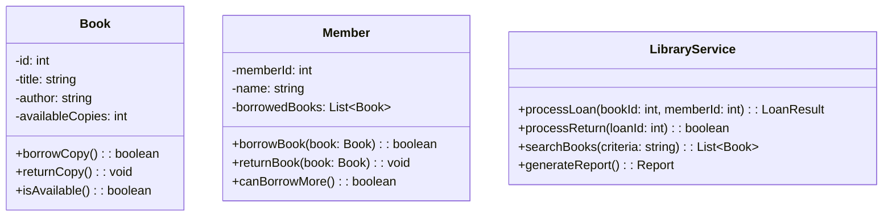

These classes contain business logic and data manipulation rules. They naturally become your **Models** in MVC.

#### Step 2: Identify User Interactions (Future Controllers)

From use case diagrams, we identify the actions users want to perform:

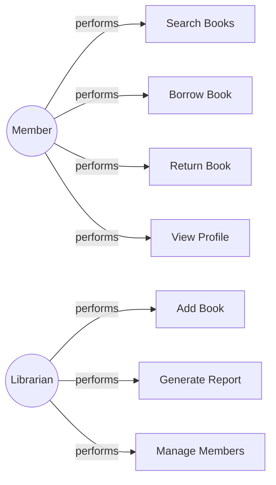

Each use case suggests a controller action. These user intentions become **Controller** methods that orchestrate the business logic.

#### Step 3: Identify Presentation Needs (Future Views)

Activity diagrams and user interface requirements reveal what information needs to be displayed:

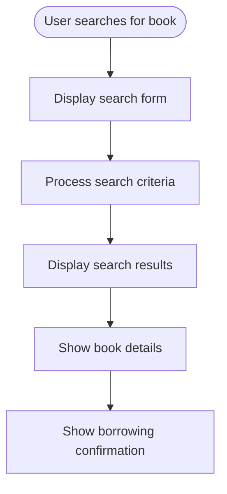

Each display step becomes a **View** that presents information to users.

### 5.3 MVC Component Diagram

Here's how the MVC components interact in our library system:

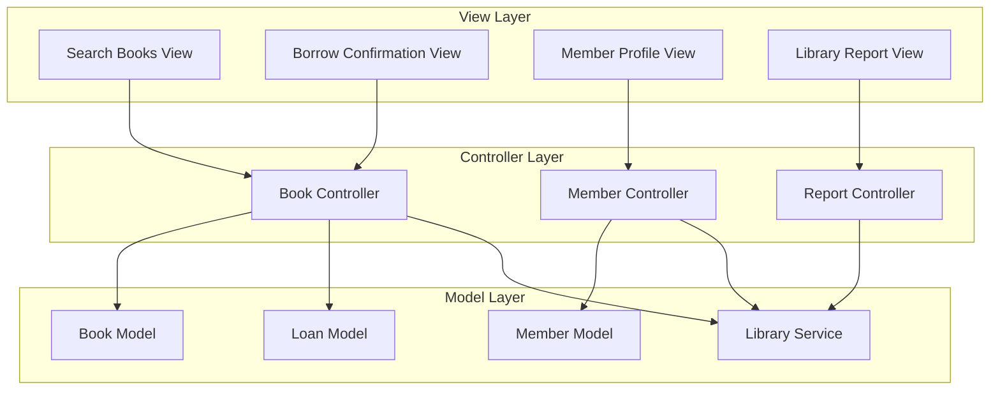

### 5.4 MVC Sequence Diagrams

Let's trace a complete user interaction through the MVC pattern:

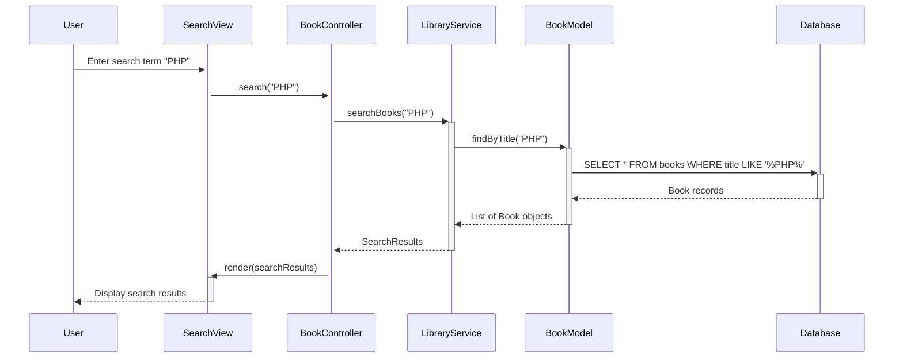

This sequence shows how MVC components collaborate:

1. **View** captures user input
2. **Controller** coordinates the operation
3. **Model** handles data logic
4. **View** presents results

### 5.5 Implementing MVC in PHP

Now let's implement our MVC design in PHP:

#### Model Implementation

```php
<?php
// Book Model - handles data and business logic
class BookModel {
    private PDO $database;

    public function __construct(PDO $database) {
        $this->database = $database;
    }

    public function findByTitle(string $title): array {
        $stmt = $this->database->prepare(
            "SELECT * FROM books WHERE title LIKE :title AND available_copies > 0"
        );
        $stmt->bindValue(':title', "%{$title}%");
        $stmt->execute();

        $books = [];
        while ($row = $stmt->fetch(PDO::FETCH_ASSOC)) {
            $books[] = new Book(
                $row['id'],
                $row['title'],
                $row['author'],
                $row['isbn'],
                $row['available_copies']
            );
        }

        return $books;
    }

    public function borrowBook(int $bookId): bool {
        try {
            $this->database->beginTransaction();

            // Check availability
            $stmt = $this->database->prepare(
                "SELECT available_copies FROM books WHERE id = :id"
            );
            $stmt->bindValue(':id', $bookId);
            $stmt->execute();

            $this->database->commit();
            return true;

        } catch (Exception $e) {
            $this->database->rollback();
            return false;
        }
    }
}

// Library Service - orchestrates business operations
class LibraryService {
    private BookModel $bookModel;
    private MemberModel $memberModel;
    private LoanModel $loanModel;

    public function __construct(BookModel $bookModel, MemberModel $memberModel, LoanModel $loanModel) {
        $this->bookModel = $bookModel;
        $this->memberModel = $memberModel;
        $this->loanModel = $loanModel;
    }

    public function searchBooks(string $searchTerm): array {
        return $this->bookModel->findByTitle($searchTerm);
    }

    public function processBorrowRequest(int $bookId, int $memberId): array {
        // Business rule: Check if member can borrow more books
        if (!$this->memberModel->canBorrowMore($memberId)) {
            return [
                'success' => false,
                'message' => 'Member has reached borrowing limit'
            ];
        }

        // Business rule: Check book availability
        if (!$this->bookModel->isAvailable($bookId)) {
            return [
                'success' => false,
                'message' => 'Book is not available'
            ];
        }

        // Execute the borrowing process
        if ($this->bookModel->borrowBook($bookId)) {
            $loanId = $this->loanModel->createLoan($bookId, $memberId);
            $this->memberModel->addBorrowedBook($memberId, $bookId);

            return [
                'success' => true,
                'message' => 'Book borrowed successfully',
                'loanId' => $loanId
            ];
        }

        return [
            'success' => false,
            'message' => 'Unable to process request'
        ];
    }
}
?>
```

#### Controller Implementation

```php
<?php
// Book Controller - handles HTTP requests and coordinates between View and Model
class BookController {
    private LibraryService $libraryService;
    private ViewRenderer $viewRenderer;

    public function __construct(LibraryService $libraryService, ViewRenderer $viewRenderer) {
        $this->libraryService = $libraryService;
        $this->viewRenderer = $viewRenderer;
    }

    public function search(): void {
        if ($_SERVER['REQUEST_METHOD'] === 'GET') {
            // Show search form
            $this->viewRenderer->render('book/search', [
                'title' => 'Search Books'
            ]);

        } elseif ($_SERVER['REQUEST_METHOD'] === 'POST') {
            // Process search
            $searchTerm = $_POST['search_term'] ?? '';

            if (empty($searchTerm)) {
                $this->viewRenderer->render('book/search', [
                    'title' => 'Search Books',
                    'error' => 'Please enter a search term'
                ]);
                return;
            }

            $books = $this->libraryService->searchBooks($searchTerm);

            $this->viewRenderer->render('book/search_results', [
                'title' => 'Search Results',
                'books' => $books,
                'searchTerm' => $searchTerm
            ]);
        }
    }

    public function borrow(): void {
        if ($_SERVER['REQUEST_METHOD'] === 'POST') {
            $bookId = (int)($_POST['book_id'] ?? 0);
            $memberId = (int)($_SESSION['member_id'] ?? 0);

            if ($bookId === 0 || $memberId === 0) {
                $this->viewRenderer->render('book/error', [
                    'title' => 'Error',
                    'message' => 'Invalid request parameters'
                ]);
                return;
            }

            $result = $this->libraryService->processBorrowRequest($bookId, $memberId);

            if ($result['success']) {
                $this->viewRenderer->render('book/borrow_success', [
                    'title' => 'Borrowing Successful',
                    'message' => $result['message'],
                    'loanId' => $result['loanId']
                ]);
            } else {
                $this->viewRenderer->render('book/borrow_error', [
                    'title' => 'Borrowing Failed',
                    'message' => $result['message']
                ]);
            }
        }
    }
}

// View Renderer - handles view rendering
class ViewRenderer {
    private string $viewsPath;

    public function __construct(string $viewsPath = 'views/') {
        $this->viewsPath = $viewsPath;
    }

    public function render(string $viewName, array $data = []): void {
        // Extract data array to variables
        extract($data);

        $viewFile = $this->viewsPath . $viewName . '.php';

        if (!file_exists($viewFile)) {
            throw new Exception("View file not found: {$viewFile}");
        }

        include $viewFile;
    }
}
?>
```

#### View Implementation

```php
<!-- views/book/search.php - Search Form View -->
<!DOCTYPE html>
<html>
<head>
    <title><?= htmlspecialchars($title) ?></title>
</head>
<body>
    <h1><?= htmlspecialchars($title) ?></h1>

    <?php if (isset($error)): ?>
        <div class="error"><?= htmlspecialchars($error) ?></div>
    <?php endif; ?>

    <form method="POST" action="/books/search">
        <label for="search_term">Search for books:</label>
        <input type="text" id="search_term" name="search_term" required>
        <button type="submit">Search</button>
    </form>
</body>
</html>

<!-- views/book/search_results.php - Search Results View -->
<!DOCTYPE html>
<html>
<head>
    <title><?= htmlspecialchars($title) ?></title>
</head>
<body>
    <h1>Search Results for "<?= htmlspecialchars($searchTerm) ?>"</h1>

    <?php if (empty($books)): ?>
        <p>No books found matching your search criteria.</p>
    <?php else: ?>
        <div class="book-grid">
            <?php foreach ($books as $book): ?>
                <div class="book-item">
                    <h3><?= htmlspecialchars($book->getTitle()) ?></h3>
                    <p>Author: <?= htmlspecialchars($book->getAuthor()) ?></p>
                    <p>Available: <?= $book->isAvailable() ? 'Yes' : 'No' ?></p>

                    <?php if ($book->isAvailable()): ?>
                        <form method="POST" action="/books/borrow">
                            <input type="hidden" name="book_id" value="<?= $book->getId() ?>">
                            <button type="submit">Borrow This Book</button>
                        </form>
                    <?php endif; ?>
                </div>
            <?php endforeach; ?>
        </div>
    <?php endif; ?>

    <a href="/books/search">New Search</a>
</body>
</html>

<!-- views/book/borrow_success.php - Success View -->
<!DOCTYPE html>
<html>
<head>
    <title><?= htmlspecialchars($title) ?></title>
</head>
<body>
    <h1><?= htmlspecialchars($title) ?></h1>
    <p><?= htmlspecialchars($message) ?></p>
    <p>Your loan ID is: <strong><?= htmlspecialchars($loanId) ?></strong></p>

    <nav>
        <a href="/books/search">Search More Books</a> |
        <a href="/member/profile">My Profile</a>
    </nav>
</body>
</html>
```

### 5.6 MVC Benefits Demonstrated

This implementation demonstrates key MVC benefits:

**Separation of Concerns**:

- Models handle data and business logic only
- Controllers manage user input and flow control
- Views focus purely on presentation

**Maintainability**:

- Changing the database structure only requires Model updates
- UI changes only affect Views
- Business logic changes stay in Models and Services

**Testability**:

- Each component can be unit tested independently
- Mock objects can replace dependencies during testing

**Reusability**:

- The same BookModel can serve web, API, and mobile interfaces
- Views can be easily themed or replaced
- Controllers can be adapted for different input methods

### 5.7 Advanced MVC Patterns

#### Repository Pattern Integration

The Repository pattern works excellently with MVC by providing a more abstract data access layer:

```php
<?php
interface BookRepositoryInterface {
    public function findById(int $id): ?Book;
    public function findByTitle(string $title): array;
    public function save(Book $book): void;
    public function delete(int $id): bool;
}

class DatabaseBookRepository implements BookRepositoryInterface {
    private PDO $database;

    public function __construct(PDO $database) {
        $this->database = $database;
    }

    public function findById(int $id): ?Book {
        $stmt = $this->database->prepare("SELECT * FROM books WHERE id = :id");
        $stmt->bindValue(':id', $id);
        $stmt->execute();

        $row = $stmt->fetch(PDO::FETCH_ASSOC);
        if (!$row) {
            return null;
        }

        return new Book(
            $row['id'],
            $row['title'],
            $row['author'],
            $row['isbn'],
            $row['available_copies']
        );
    }

    // Other methods...
}

// Models can now use repositories instead of direct database access
class LibraryService {
    private BookRepositoryInterface $bookRepository;

    public function __construct(BookRepositoryInterface $bookRepository) {
        $this->bookRepository = $bookRepository;
    }

    public function getBookDetails(int $bookId): ?Book {
        return $this->bookRepository->findById($bookId);
    }
}
?>
```

---

## 6. Practical Implementation Guide

### 6.1 From Concept to Code: Complete Workflow

Let's walk through a complete workflow from initial concept to working PHP application, demonstrating how UML guides every step of the development process.

#### Phase 1: Requirements Gathering and Analysis

**Step 1: Identify Stakeholders and Goals**

Before drawing any diagrams, understand who will use the system and what they want to achieve:

- **Primary Users**: Library members who want to find and borrow books
- **Secondary Users**: Librarians who manage the collection and members
- **System Goals**: Automate lending process, track inventory, provide search capabilities

**Step 2: Create Use Case Diagrams**

Start with high-level use cases to capture functional requirements:

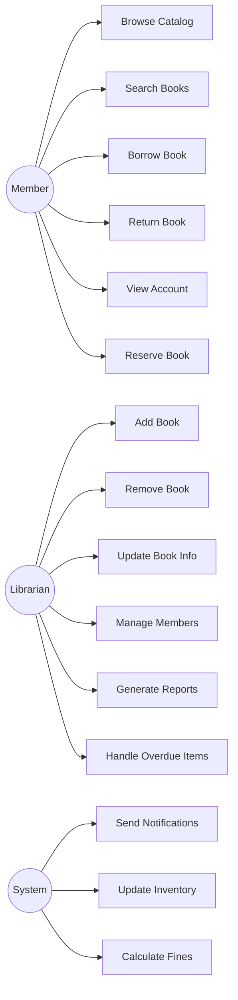

**Questions to Ask During Use Case Analysis:**

1. What can each type of user do?
2. Are there any use cases that include or extend others?
3. What are the preconditions for each use case?
4. What can go wrong in each scenario?
5. Are there any business rules that constrain use cases?

#### Phase 2: Domain Modeling

**Step 3: Create Initial Class Diagrams**

Identify the core domain entities and their relationships:

```mermaid
classDiagram
    class Book {
        -id: int
        -isbn: string
        -title: string
        -author: string
        -publisher: string
        -publishYear: int
        -category: string
        -totalCopies: int
        -availableCopies: int
        +isAvailable(): boolean
        +decrementCopies(): void
        +incrementCopies(): void
    }

    class Member {
        -memberId: int
        -firstName: string
        -lastName: string
        -email: string
        -phone: string
        -address: string
        -membershipDate: Date
        -membershipType: string
        +getFullName(): string
        +canBorrow(): boolean
        +getCurrentLoanCount(): int
    }

    class Loan {
        -loanId: int
        -bookId: int
        -memberId: int
        -loanDate: Date
        -dueDate: Date
        -returnDate: Date
        -status: string
        -fineAmount: decimal
        +isOverdue(): boolean
        +calculateFine(): decimal
        +markReturned(): void
    }

    class Fine {
        -fineId: int
        -loanId: int
        -amount: decimal
        -dateAssessed: Date
        -datePaid: Date
        -status: string
        +markPaid(): void
    }

    class Category {
        -categoryId: int
        -name: string
        -description: string
    }

    Member ||--o{ Loan : has
    Book ||--o{ Loan : involves
    Loan ||--o| Fine : may_incur
    Category ||--o{ Book : contains
```

**Questions for Domain Modeling:**

1. What are the core business entities?
2. What attributes are essential for each entity?
3. How do entities relate to each other?
4. What business rules govern these relationships?
5. Are there any derived attributes (calculated values)?

#### Phase 3: Behavioral Modeling

**Step 4: Model Key Processes with Activity Diagrams**

Map out complex business processes:

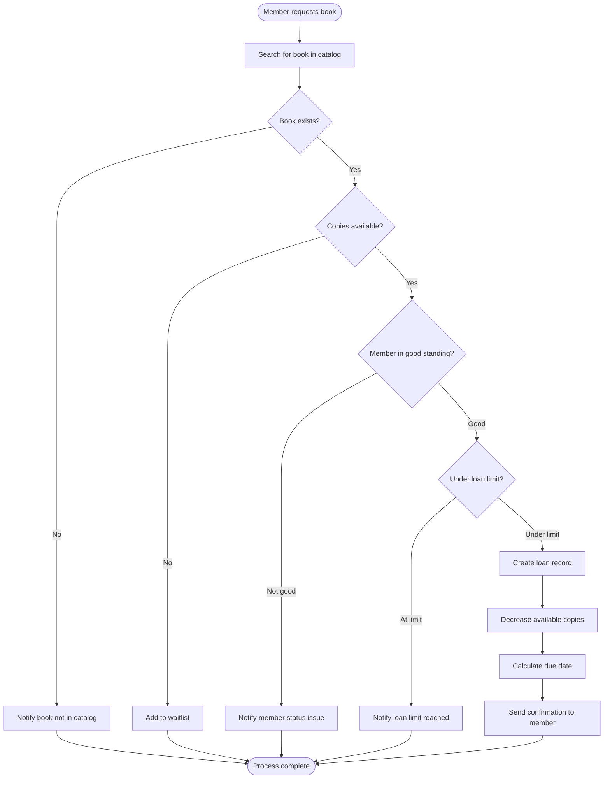

**Step 5: Detail Interactions with Sequence Diagrams**

For critical use cases, create sequence diagrams:

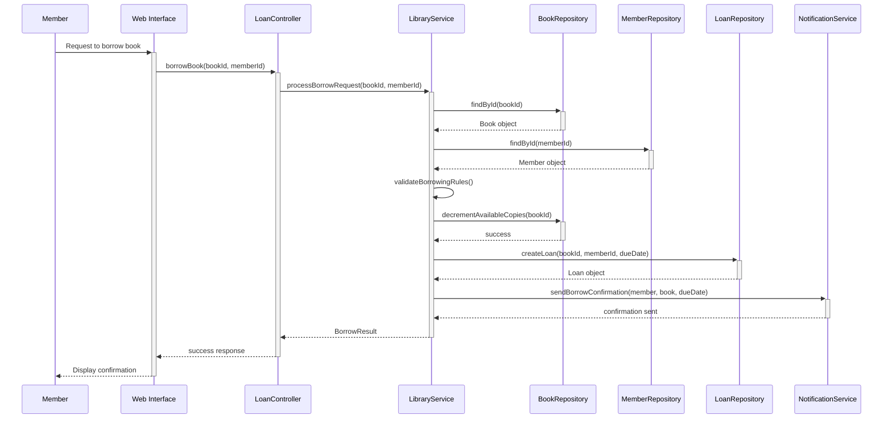

#### Phase 4: Architecture Design

**Step 6: Create Component Diagrams**

Design the high-level architecture:

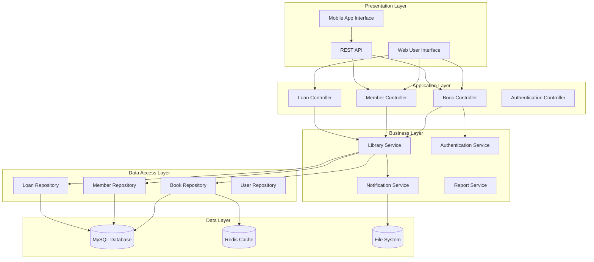

### 6.2 Implementation Strategy

#### Phase 5: Incremental Development

**Step 7: Implement Core Models First**

Start with the foundation - your domain models:

```php
<?php
// Book.php - Core domain entity
class Book {
    private int $id;
    private string $isbn;
    private string $title;
    private string $author;
    private string $publisher;
    private int $publishYear;
    private string $category;
    private int $totalCopies;
    private int $availableCopies;

    public function __construct(
        int $id,
        string $isbn,
        string $title,
        string $author,
        string $publisher,
        int $publishYear,
        string $category,
        int $totalCopies,
        int $availableCopies
    ) {
        $this->id = $id;
        $this->isbn = $isbn;
        $this->title = $title;
        $this->author = $author;
        $this->publisher = $publisher;
        $this->publishYear = $publishYear;
        $this->category = $category;
        $this->totalCopies = $totalCopies;
        $this->availableCopies = $availableCopies;
    }

    // Business logic methods
    public function isAvailable(): bool {
        return $this->availableCopies > 0;
    }

    public function borrowCopy(): bool {
        if ($this->isAvailable()) {
            $this->availableCopies--;
            return true;
        }
        return false;
    }

    public function returnCopy(): void {
        if ($this->availableCopies < $this->totalCopies) {
            $this->availableCopies++;
        }
    }

    // Getters
    public function getId(): int { return $this->id; }
    public function getIsbn(): string { return $this->isbn; }
    public function getTitle(): string { return $this->title; }
    public function getAuthor(): string { return $this->author; }
    public function getPublisher(): string { return $this->publisher; }
    public function getPublishYear(): int { return $this->publishYear; }
    public function getCategory(): string { return $this->category; }
    public function getTotalCopies(): int { return $this->totalCopies; }
    public function getAvailableCopies(): int { return $this->availableCopies; }
}

// Member.php - Member domain entity
class Member {
    private int $memberId;
    private string $firstName;
    private string $lastName;
    private string $email;
    private string $phone;
    private string $address;
    private DateTime $membershipDate;
    private string $membershipType;
    private array $currentLoans;

    public function __construct(
        int $memberId,
        string $firstName,
        string $lastName,
        string $email,
        string $phone,
        string $address,
        DateTime $membershipDate,
        string $membershipType
    ) {
        $this->memberId = $memberId;
        $this->firstName = $firstName;
        $this->lastName = $lastName;
        $this->email = $email;
        $this->phone = $phone;
        $this->address = $address;
        $this->membershipDate = $membershipDate;
        $this->membershipType = $membershipType;
        $this->currentLoans = [];
    }

    public function getFullName(): string {
        return $this->firstName . ' ' . $this->lastName;
    }

    public function canBorrow(): bool {
        // Business rule: Standard members can borrow up to 5 books
        $maxLoans = $this->membershipType === 'premium' ? 10 : 5;
        return count($this->currentLoans) < $maxLoans;
    }

    public function getCurrentLoanCount(): int {
        return count($this->currentLoans);
    }

    public function addLoan(Loan $loan): void {
        $this->currentLoans[] = $loan;
    }

    public function removeLoan(int $loanId): void {
        $this->currentLoans = array_filter(
            $this->currentLoans,
            fn($loan) => $loan->getLoanId() !== $loanId
        );
    }

    // Getters...
    public function getMemberId(): int { return $this->memberId; }
    public function getEmail(): string { return $this->email; }
    // ... other getters
}

// Loan.php - Loan domain entity
class Loan {
    private int $loanId;
    private int $bookId;
    private int $memberId;
    private DateTime $loanDate;
    private DateTime $dueDate;
    private ?DateTime $returnDate;
    private string $status;
    private float $fineAmount;

    public function __construct(
        int $loanId,
        int $bookId,
        int $memberId,
        DateTime $loanDate,
        DateTime $dueDate
    ) {
        $this->loanId = $loanId;
        $this->bookId = $bookId;
        $this->memberId = $memberId;
        $this->loanDate = $loanDate;
        $this->dueDate = $dueDate;
        $this->returnDate = null;
        $this->status = 'active';
        $this->fineAmount = 0.0;
    }

    public function isOverdue(): bool {
        if ($this->status === 'returned') {
            return false;
        }
        return new DateTime() > $this->dueDate;
    }

    public function calculateFine(): float {
        if (!$this->isOverdue()) {
            return 0.0;
        }

        $now = new DateTime();
        $overdueDays = $now->diff($this->dueDate)->days;

        // Business rule: $0.50 per day overdue
        return $overdueDays * 0.50;
    }

    public function markReturned(): void {
        $this->returnDate = new DateTime();
        $this->status = 'returned';
        $this->fineAmount = $this->calculateFine();
    }

    // Getters...
    public function getLoanId(): int { return $this->loanId; }
    public function getBookId(): int { return $this->bookId; }
    public function getMemberId(): int { return $this->memberId; }
    public function getDueDate(): DateTime { return $this->dueDate; }
    public function getStatus(): string { return $this->status; }
    public function getFineAmount(): float { return $this->fineAmount; }
}
?>
```

**Step 8: Implement Repository Layer**

Create the data access layer based on your component diagram:

```php
<?php
// BookRepository.php
interface BookRepositoryInterface {
    public function findById(int $id): ?Book;
    public function findByTitle(string $title): array;
    public function findByAuthor(string $author): array;
    public function findByCategory(string $category): array;
    public function save(Book $book): void;
    public function delete(int $id): bool;
    public function updateAvailableCopies(int $bookId, int $newCount): bool;
}

class BookRepository implements BookRepositoryInterface {
    private PDO $database;

    public function __construct(PDO $database) {
        $this->database = $database;
    }

    public function findById(int $id): ?Book {
        $stmt = $this->database->prepare(
            "SELECT * FROM books WHERE id = :id"
        );
        $stmt->bindValue(':id', $id);
        $stmt->execute();

        $row = $stmt->fetch(PDO::FETCH_ASSOC);
        if (!$row) {
            return null;
        }

        return $this->mapRowToBook($row);
    }

    public function findByTitle(string $title): array {
        $stmt = $this->database->prepare(
            "SELECT * FROM books WHERE title LIKE :title ORDER BY title"
        );
        $stmt->bindValue(':title', "%{$title}%");
        $stmt->execute();

        $books = [];
        while ($row = $stmt->fetch(PDO::FETCH_ASSOC)) {
            $books[] = $this->mapRowToBook($row);
        }

        return $books;
    }

    public function updateAvailableCopies(int $bookId, int $newCount): bool {
        $stmt = $this->database->prepare(
            "UPDATE books SET available_copies = :count WHERE id = :id"
        );
        $stmt->bindValue(':count', $newCount);
        $stmt->bindValue(':id', $bookId);

        return $stmt->execute();
    }

    private function mapRowToBook(array $row): Book {
        return new Book(
            (int)$row['id'],
            $row['isbn'],
            $row['title'],
            $row['author'],
            $row['publisher'],
            (int)$row['publish_year'],
            $row['category'],
            (int)$row['total_copies'],
            (int)$row['available_copies']
        );
    }

    // Other methods...
}
?>
```

**Step 9: Implement Service Layer**

Create business services that orchestrate domain logic:

```php
<?php
// LibraryService.php - Core business logic
class LibraryService {
    private BookRepositoryInterface $bookRepository;
    private MemberRepositoryInterface $memberRepository;
    private LoanRepositoryInterface $loanRepository;
    private NotificationServiceInterface $notificationService;

    public function __construct(
        BookRepositoryInterface $bookRepository,
        MemberRepositoryInterface $memberRepository,
        LoanRepositoryInterface $loanRepository,
        NotificationServiceInterface $notificationService
    ) {
        $this->bookRepository = $bookRepository;
        $this->memberRepository = $memberRepository;
        $this->loanRepository = $loanRepository;
        $this->notificationService = $notificationService;
    }

    public function processBorrowRequest(int $bookId, int $memberId): array {
        try {
            // Validate book exists and is available
            $book = $this->bookRepository->findById($bookId);
            if (!$book) {
                return $this->createErrorResponse('Book not found');
            }

            if (!$book->isAvailable()) {
                return $this->createErrorResponse('Book is not available');
            }

            // Validate member exists and can borrow
            $member = $this->memberRepository->findById($memberId);
            if (!$member) {
                return $this->createErrorResponse('Member not found');
            }

            if (!$member->canBorrow()) {
                return $this->createErrorResponse('Member has reached borrowing limit');
            }

            // Process the borrowing
            $dueDate = new DateTime('+14 days'); // 2-week loan period
            $loan = new Loan(
                0, // Will be set by repository
                $bookId,
                $memberId,
                new DateTime(),
                $dueDate
            );

            // Persist changes
            $loanId = $this->loanRepository->save($loan);
            $book->borrowCopy();
            $this->bookRepository->updateAvailableCopies($bookId, $book->getAvailableCopies());

            // Send confirmation
            $this->notificationService->sendBorrowConfirmation($member, $book, $dueDate);

            return [
                'success' => true,
                'message' => 'Book borrowed successfully',
                'loanId' => $loanId,
                'dueDate' => $dueDate->format('Y-m-d')
            ];

        } catch (Exception $e) {
            return $this->createErrorResponse('System error: ' . $e->getMessage());
        }
    }

    public function searchBooks(string $searchTerm, string $searchType = 'title'): array {
        switch ($searchType) {
            case 'title':
                return $this->bookRepository->findByTitle($searchTerm);
            case 'author':
                return $this->bookRepository->findByAuthor($searchTerm);
            case 'category':
                return $this->bookRepository->findByCategory($searchTerm);
            default:
                // Search across multiple fields
                $titleResults = $this->bookRepository->findByTitle($searchTerm);
                $authorResults = $this->bookRepository->findByAuthor($searchTerm);

                // Merge and deduplicate results
                $allResults = array_merge($titleResults, $authorResults);
                $uniqueResults = [];
                $seenIds = [];

                foreach ($allResults as $book) {
                    if (!in_array($book->getId(), $seenIds)) {
                        $uniqueResults[] = $book;
                        $seenIds[] = $book->getId();
                    }
                }

                return $uniqueResults;
        }
    }

    public function processReturnRequest(int $loanId): array {
        try {
            $loan = $this->loanRepository->findById($loanId);
            if (!$loan) {
                return $this->createErrorResponse('Loan not found');
            }

            if ($loan->getStatus() === 'returned') {
                return $this->createErrorResponse('Book already returned');
            }

            // Mark loan as returned
            $loan->markReturned();
            $this->loanRepository->update($loan);

            // Update book availability
            $book = $this->bookRepository->findById($loan->getBookId());
            $book->returnCopy();
            $this->bookRepository->updateAvailableCopies(
                $book->getId(),
                $book->getAvailableCopies()
            );

            // Handle fine if overdue
            $fine = 0;
            if ($loan->getFineAmount() > 0) {
                $fine = $loan->getFineAmount();
                // Create fine record or handle payment
            }

            return [
                'success' => true,
                'message' => 'Book returned successfully',
                'fine' => $fine
            ];

        } catch (Exception $e) {
            return $this->createErrorResponse('System error: ' . $e->getMessage());
        }
    }

    private function createErrorResponse(string $message): array {
        return [
            'success' => false,
            'message' => $message
        ];
    }
}
?>
```

**Step 10: Implement Controllers**

Build the MVC controllers based on your sequence diagrams:

```php
<?php
// BookController.php - Handles book-related HTTP requests
class BookController {
    private LibraryService $libraryService;
    private ViewRenderer $viewRenderer;
    private AuthService $authService;

    public function __construct(
        LibraryService $libraryService,
        ViewRenderer $viewRenderer,
        AuthService $authService
    ) {
        $this->libraryService = $libraryService;
        $this->viewRenderer = $viewRenderer;
        $this->authService = $authService;
    }

    public function search(): void {
        if ($_SERVER['REQUEST_METHOD'] === 'GET') {
            // Show search form
            $this->viewRenderer->render('book/search', [
                'title' => 'Search Library Catalog',
                'searchTypes' => ['title', 'author', 'category']
            ]);

        } elseif ($_SERVER['REQUEST_METHOD'] === 'POST') {
            $searchTerm = trim($_POST['search_term'] ?? '');
            $searchType = $_POST['search_type'] ?? 'title';

            // Validate input
            if (empty($searchTerm)) {
                $this->viewRenderer->render('book/search', [
                    'title' => 'Search Library Catalog',
                    'searchTypes' => ['title', 'author', 'category'],
                    'error' => 'Please enter a search term'
                ]);
                return;
            }

            // Perform search
            $books = $this->libraryService->searchBooks($searchTerm, $searchType);

            $this->viewRenderer->render('book/search_results', [
                'title' => "Search Results for '{$searchTerm}'",
                'books' => $books,
                'searchTerm' => $searchTerm,
                'searchType' => $searchType,
                'isLoggedIn' => $this->authService->isLoggedIn()
            ]);
        }
    }

    public function details(int $bookId): void {
        $book = $this->libraryService->getBookDetails($bookId);

        if (!$book) {
            $this->viewRenderer->render('error/404', [
                'title' => 'Book Not Found',
                'message' => 'The requested book could not be found.'
            ]);
            return;
        }

        $this->viewRenderer->render('book/details', [
            'title' => $book->getTitle(),
            'book' => $book,
            'canBorrow' => $this->authService->isLoggedIn() && $book->isAvailable()
        ]);
    }

    public function borrow(): void {
        // Ensure user is authenticated
        if (!$this->authService->isLoggedIn()) {
            $this->redirectToLogin();
            return;
        }

        if ($_SERVER['REQUEST_METHOD'] === 'POST') {
            $bookId = (int)($_POST['book_id'] ?? 0);
            $memberId = $this->authService->getCurrentMemberId();

            if ($bookId === 0) {
                $this->viewRenderer->render('error/400', [
                    'title' => 'Invalid Request',
                    'message' => 'Invalid book ID provided.'
                ]);
                return;
            }

            // Process borrowing request
            $result = $this->libraryService->processBorrowRequest($bookId, $memberId);

            if ($result['success']) {
                $this->viewRenderer->render('book/borrow_success', [
                    'title' => 'Borrowing Successful',
                    'message' => $result['message'],
                    'loanId' => $result['loanId'],
                    'dueDate' => $result['dueDate']
                ]);
            } else {
                $this->viewRenderer->render('book/borrow_error', [
                    'title' => 'Borrowing Failed',
                    'message' => $result['message'],
                    'bookId' => $bookId
                ]);
            }
        }
    }

    public function return(): void {
        if (!$this->authService->isLoggedIn()) {
            $this->redirectToLogin();
            return;
        }

        if ($_SERVER['REQUEST_METHOD'] === 'POST') {
            $loanId = (int)($_POST['loan_id'] ?? 0);

            if ($loanId === 0) {
                $this->viewRenderer->render('error/400', [
                    'title' => 'Invalid Request',
                    'message' => 'Invalid loan ID provided.'
                ]);
                return;
            }

            $result = $this->libraryService->processReturnRequest($loanId);

            if ($result['success']) {
                $this->viewRenderer->render('book/return_success', [
                    'title' => 'Return Successful',
                    'message' => $result['message'],
                    'fine' => $result['fine']
                ]);
            } else {
                $this->viewRenderer->render('book/return_error', [
                    'title' => 'Return Failed',
                    'message' => $result['message']
                ]);
            }
        }
    }

    private function redirectToLogin(): void {
        header('Location: /auth/login');
        exit;
    }
}

// MemberController.php - Handles member-related requests
class MemberController {
    private LibraryService $libraryService;
    private MemberService $memberService;
    private ViewRenderer $viewRenderer;
    private AuthService $authService;

    public function __construct(
        LibraryService $libraryService,
        MemberService $memberService,
        ViewRenderer $viewRenderer,
        AuthService $authService
    ) {
        $this->libraryService = $libraryService;
        $this->memberService = $memberService;
        $this->viewRenderer = $viewRenderer;
        $this->authService = $authService;
    }

    public function profile(): void {
        if (!$this->authService->isLoggedIn()) {
            $this->redirectToLogin();
            return;
        }

        $memberId = $this->authService->getCurrentMemberId();
        $member = $this->memberService->getMemberProfile($memberId);
        $currentLoans = $this->memberService->getCurrentLoans($memberId);
        $loanHistory = $this->memberService->getLoanHistory($memberId, 10); // Last 10 loans

        $this->viewRenderer->render('member/profile', [
            'title' => 'My Profile',
            'member' => $member,
            'currentLoans' => $currentLoans,
            'loanHistory' => $loanHistory
        ]);
    }

    public function loans(): void {
        if (!$this->authService->isLoggedIn()) {
            $this->redirectToLogin();
            return;
        }

        $memberId = $this->authService->getCurrentMemberId();
        $activeLoans = $this->memberService->getActiveLoans($memberId);
        $overdueLoans = $this->memberService->getOverdueLoans($memberId);

        $this->viewRenderer->render('member/loans', [
            'title' => 'My Loans',
            'activeLoans' => $activeLoans,
            'overdueLoans' => $overdueLoans
        ]);
    }

    private function redirectToLogin(): void {
        header('Location: /auth/login');
        exit;
    }
}
?>
```

### 6.3 Key Implementation Principles

#### Principle 1: Maintain UML-to-Code Traceability

Every UML element should have a clear counterpart in your code:

- **Classes** → PHP Classes
- **Attributes** → Private properties with getters/setters
- **Methods** → Public methods
- **Associations** → Object references or arrays
- **Inheritance** → PHP extends keyword
- **Interfaces** → PHP interfaces

#### Principle 2: Preserve Business Rules

Business rules identified in your UML diagrams must be enforced in code:

```php
<?php
class Member {
    public function canBorrow(): bool {
        // Business rule from class diagram: Members can't borrow if they have overdue items
        if ($this->hasOverdueLoans()) {
            return false;
        }

        // Business rule: Loan limits based on membership type
        $maxLoans = match($this->membershipType) {
            'student' => 3,
            'faculty' => 10,
            'premium' => 15,
            default => 5
        };

        return $this->getCurrentLoanCount() < $maxLoans;
    }
}
?>
```

#### Principle 3: Error Handling Matches Expected Flows

Your activity diagrams should include error conditions, and your code should handle them:

```php
<?php
public function processBorrowRequest(int $bookId, int $memberId): array {
    // Each return corresponds to a path in the activity diagram

    $book = $this->bookRepository->findById($bookId);
    if (!$book) {
        return $this->createErrorResponse('Book not found'); // Error path 1
    }

    if (!$book->isAvailable()) {
        return $this->createErrorResponse('Book not available'); // Error path 2
    }

    $member = $this->memberRepository->findById($memberId);
    if (!$member->canBorrow()) {
        return $this->createErrorResponse('Cannot borrow more books'); // Error path 3
    }

    // Success path continues...
    return $this->createSuccessResponse($loan);
}
?>
```

### 6.4 Testing Your UML-Based Implementation

One of the major advantages of UML-driven development is that your diagrams provide a clear testing roadmap.

#### Unit Testing Based on Class Diagrams

Each class method should be tested according to its specification in the class diagram:

```php
<?php
use PHPUnit\Framework\TestCase;

class BookTest extends TestCase {
    private Book $book;

    protected function setUp(): void {
        $this->book = new Book(
            1,
            '978-0123456789',
            'Test Book',
            'Test Author',
            'Test Publisher',
            2023,
            'Technology',
            3, // total copies
            2  // available copies
        );
    }

    public function testIsAvailableReturnsTrueWhenCopiesExist(): void {
        $this->assertTrue($this->book->isAvailable());
    }

    public function testBorrowCopyDecreasesAvailableCopies(): void {
        $initialCopies = $this->book->getAvailableCopies();
        $result = $this->book->borrowCopy();

        $this->assertTrue($result);
        $this->assertEquals($initialCopies - 1, $this->book->getAvailableCopies());
    }

    public function testBorrowCopyFailsWhenNoCopiesAvailable(): void {
        // Borrow all available copies
        $this->book->borrowCopy();
        $this->book->borrowCopy();

        $result = $this->book->borrowCopy();

        $this->assertFalse($result);
        $this->assertEquals(0, $this->book->getAvailableCopies());
    }
}

class LibraryServiceTest extends TestCase {
    private LibraryService $libraryService;
    private BookRepositoryInterface $mockBookRepository;
    private MemberRepositoryInterface $mockMemberRepository;

    protected function setUp(): void {
        $this->mockBookRepository = $this->createMock(BookRepositoryInterface::class);
        $this->mockMemberRepository = $this->createMock(MemberRepositoryInterface::class);
        $mockLoanRepository = $this->createMock(LoanRepositoryInterface::class);
        $mockNotificationService = $this->createMock(NotificationServiceInterface::class);

        $this->libraryService = new LibraryService(
            $this->mockBookRepository,
            $this->mockMemberRepository,
            $mockLoanRepository,
            $mockNotificationService
        );
    }

    public function testProcessBorrowRequestFailsWhenBookNotFound(): void {
        $this->mockBookRepository
            ->expects($this->once())
            ->method('findById')
            ->with(999)
            ->willReturn(null);

        $result = $this->libraryService->processBorrowRequest(999, 1);

        $this->assertFalse($result['success']);
        $this->assertEquals('Book not found', $result['message']);
    }

    public function testProcessBorrowRequestFailsWhenMemberCannotBorrow(): void {
        $book = $this->createMock(Book::class);
        $book->method('isAvailable')->willReturn(true);

        $member = $this->createMock(Member::class);
        $member->method('canBorrow')->willReturn(false);

        $this->mockBookRepository->method('findById')->willReturn($book);
        $this->mockMemberRepository->method('findById')->willReturn($member);

        $result = $this->libraryService->processBorrowRequest(1, 1);

        $this->assertFalse($result['success']);
        $this->assertStringContainsString('borrowing limit', $result['message']);
    }
}
?>
```

#### Integration Testing Based on Sequence Diagrams

Sequence diagrams guide integration tests that verify object interactions:

```php
<?php
class BookBorrowingIntegrationTest extends TestCase {
    private LibraryService $libraryService;
    private PDO $database;

    protected function setUp(): void {
        // Set up test database
        $this->database = new PDO('sqlite::memory:');
        $this->createTables();
        $this->seedTestData();

        // Set up real repositories with test database
        $bookRepository = new BookRepository($this->database);
        $memberRepository = new MemberRepository($this->database);
        $loanRepository = new LoanRepository($this->database);
        $notificationService = new EmailNotificationService();

        $this->libraryService = new LibraryService(
            $bookRepository,
            $memberRepository,
            $loanRepository,
            $notificationService
        );
    }

    public function testCompleteBookBorrowingWorkflow(): void {
        // This test follows the sequence diagram exactly

        // Arrange: Set up initial conditions
        $bookId = 1;
        $memberId = 1;

        // Act: Execute the borrowing process
        $result = $this->libraryService->processBorrowRequest($bookId, $memberId);

        // Assert: Verify all expected changes occurred
        $this->assertTrue($result['success']);
        $this->assertArrayHasKey('loanId', $result);
        $this->assertArrayHasKey('dueDate', $result);

        // Verify book inventory was updated
        $book = (new BookRepository($this->database))->findById($bookId);
        $this->assertEquals(2, $book->getAvailableCopies()); // Was 3, now 2

        // Verify loan was created
        $loan = (new LoanRepository($this->database))->findById($result['loanId']);
        $this->assertNotNull($loan);
        $this->assertEquals($bookId, $loan->getBookId());
        $this->assertEquals($memberId, $loan->getMemberId());
        $this->assertEquals('active', $loan->getStatus());
    }

    private function createTables(): void {
        $this->database->exec("
            CREATE TABLE books (
                id INTEGER PRIMARY KEY,
                isbn TEXT,
                title TEXT,
                author TEXT,
                publisher TEXT,
                publish_year INTEGER,
                category TEXT,
                total_copies INTEGER,
                available_copies INTEGER
            )
        ");

        // Create other tables...
    }

    private function seedTestData(): void {
        $this->database->exec("
            INSERT INTO books VALUES
            (1, '978-0123456789', 'Test Book', 'Test Author', 'Publisher', 2023, 'Tech', 3, 3)
        ");

        // Insert test members, etc.
    }
}
?>
```

### 6.5 Maintenance and Evolution

#### Keeping UML and Code in Sync

As your system evolves, maintain consistency between UML diagrams and code:

1. **Update diagrams first**: When adding new features, update UML diagrams before coding
2. **Regular reviews**: Periodically check that code still matches the architectural vision
3. **Version control**: Keep UML diagrams in version control alongside code
4. **Documentation**: Maintain a mapping document showing how UML elements correspond to code

#### Refactoring Guided by UML

UML diagrams help identify refactoring opportunities:

- **Large classes**: Classes with too many responsibilities need to be split
- **Complex methods**: Long sequence diagrams suggest methods that need breakdown
- **Tight coupling**: Dependency relationships in component diagrams reveal coupling issues
- **Missing abstractions**: Repeated patterns across diagrams suggest need for new abstractions

---

## Key Takeaways

### The UML-to-PHP Translation Process

1. **Domain First**: Start with class diagrams to understand your business entities
2. **Behavior Second**: Use behavioral diagrams to understand interactions and processes
3. **Architecture Third**: Use component diagrams to plan your system structure
4. **Implementation Last**: Write code that directly reflects your UML models

### Critical Success Factors

1. **Consistency**: Every UML element should have a clear code counterpart
2. **Traceability**: You should be able to trace from requirements through UML to code
3. **Business Rules**: Preserve business logic identified in UML throughout implementation
4. **Testing Strategy**: Use UML diagrams to guide your testing approach

### The Power of MVC Through UML

MVC naturally emerges from proper UML analysis:

- **Models** come from class diagrams and business logic
- **Views** come from user interface requirements and presentation needs
- **Controllers** come from use cases and sequence diagrams

Understanding this connection helps you build better, more maintainable applications that truly separate concerns and remain flexible as requirements change.

### Moving Forward

This tutorial provides the foundation, but mastery comes from practice. Start with simple projects, create UML diagrams first, then implement them in PHP. As you gain experience, you'll develop intuition for spotting design problems early and creating more robust, scalable applications.

The investment in learning UML and system design pays dividends throughout your career, making you a more effective developer who can think architecturally and communicate design decisions clearly to both technical and non-technical stakeholders.
