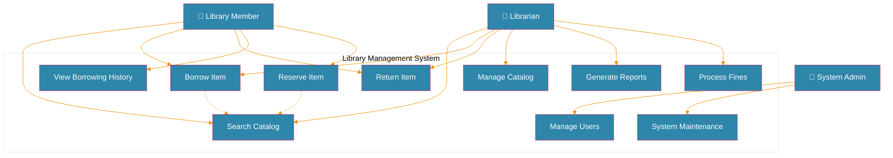
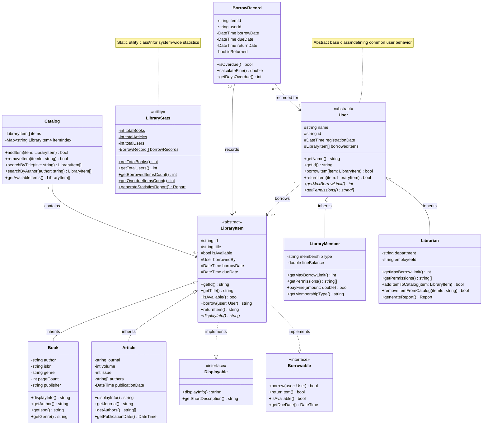
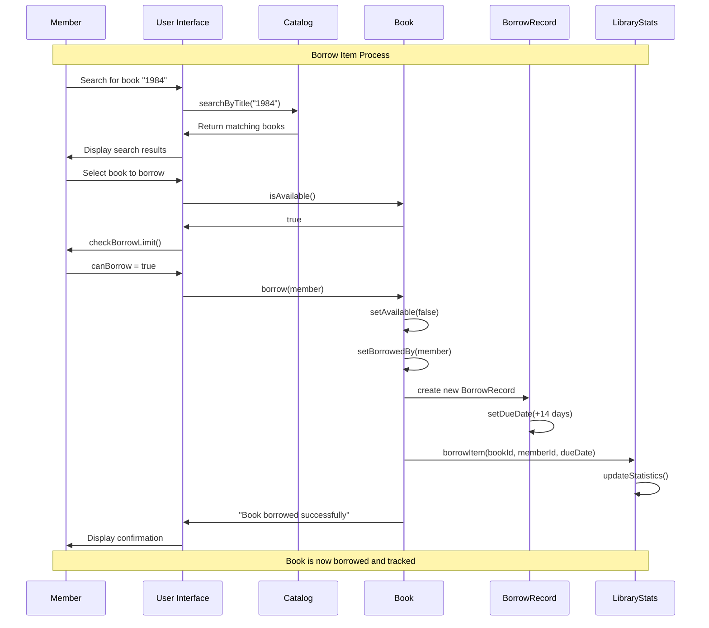
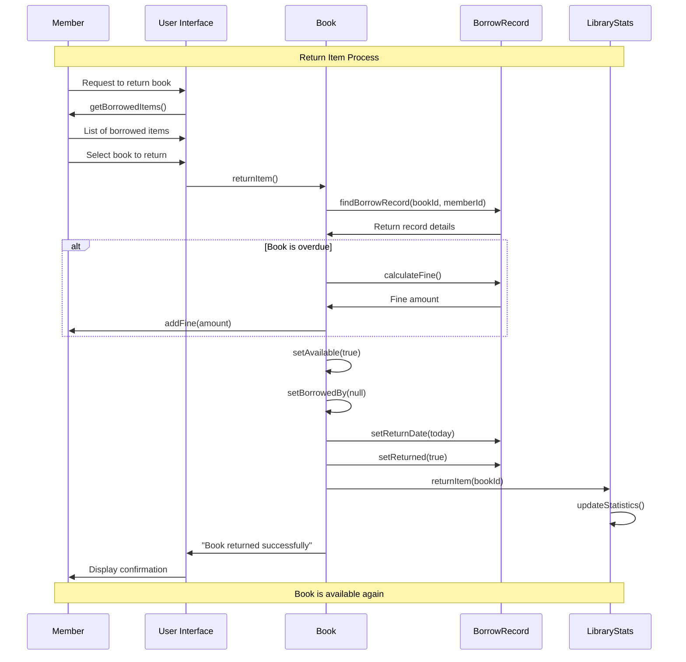
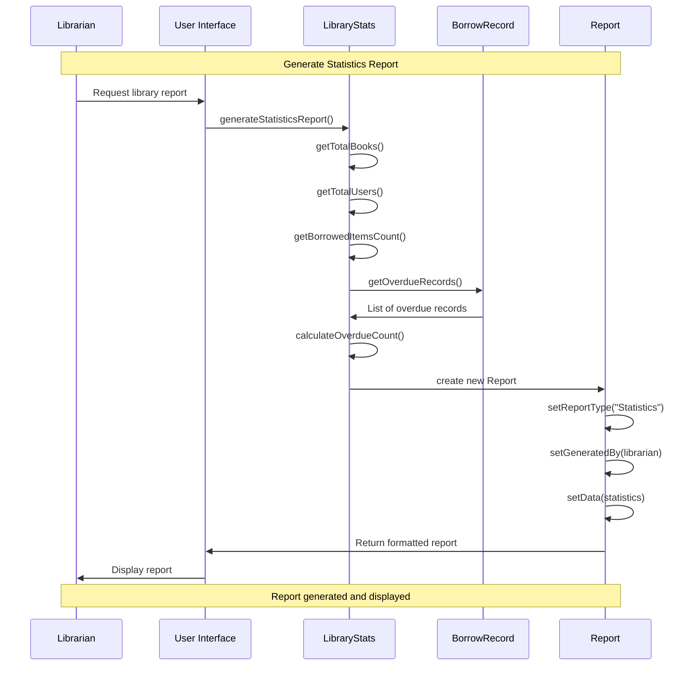
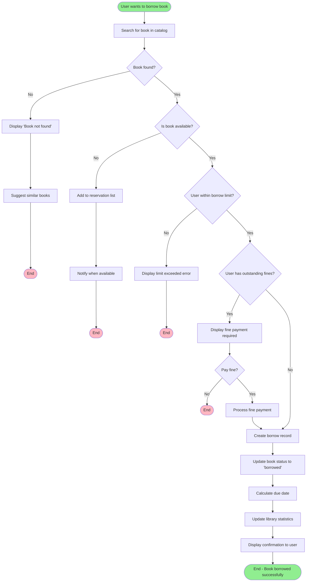
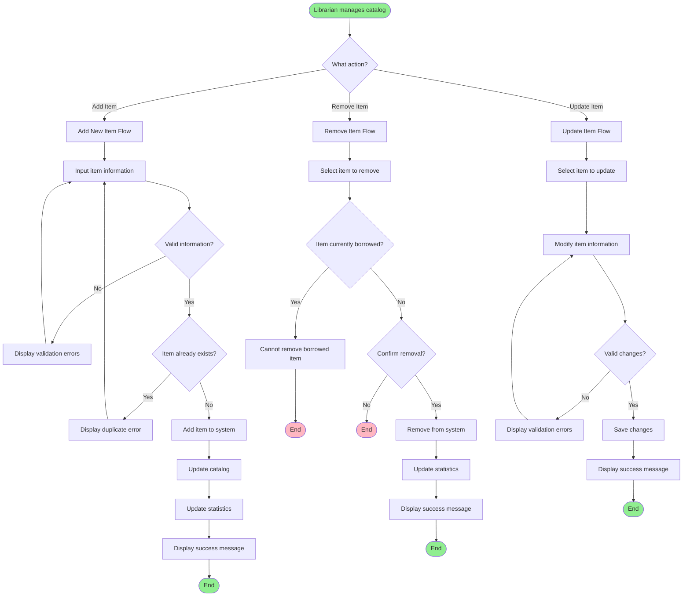
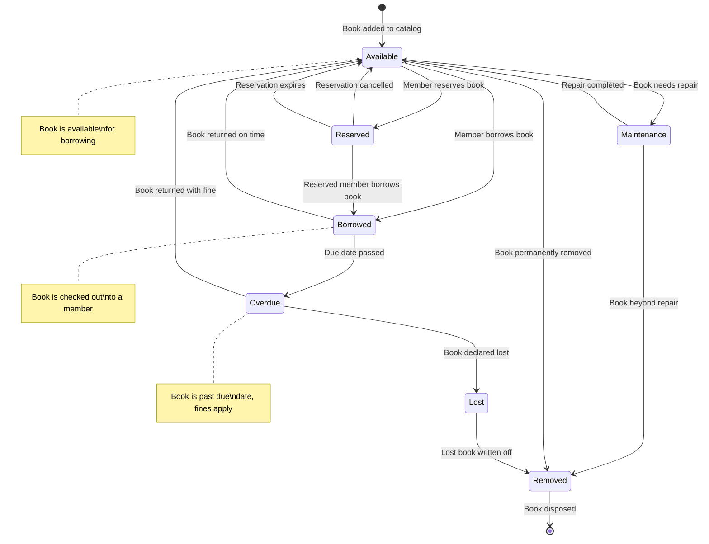
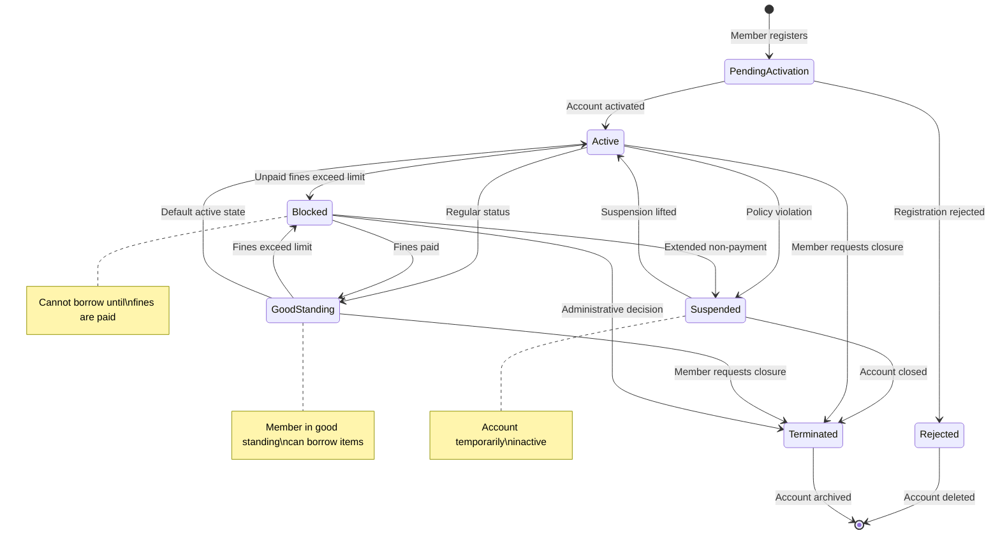

# From System Analysis to UML Design to PHP Implementation
## Library Management System Case Study

## Table of Contents
1. [System Analysis & Requirements](#system-analysis--requirements)
2. [Introduction to UML](#introduction-to-uml)
3. [Use Case Modeling](#use-case-modeling)
4. [Class Diagram Design](#class-diagram-design)
5. [Sequence Diagrams](#sequence-diagrams)
6. [Activity Diagrams](#activity-diagrams)
7. [State Diagrams](#state-diagrams)
8. [From UML to PHP Implementation](#from-uml-to-php-implementation)
9. [Complete System Implementation](#complete-system-implementation)

---

## System Analysis & Requirements

### 1.1 Case Study: City Library Management System

**Background:**
The City Library wants to modernize their book management system. Currently, they track everything manually using paper records, which leads to lost books, overdue items not being tracked properly, and difficulty in generating reports.

### 1.2 Stakeholder Analysis

**Primary Stakeholders:**
- **Library Members**: People who borrow books and articles
- **Librarians**: Staff who manage the library operations
- **Library Manager**: Oversees the entire library system
- **System Administrator**: Maintains the technical system

### 1.3 Functional Requirements

**What the system must do:**

1. **User Management**
   - Register new library members
   - Manage librarian accounts
   - Track user information and borrowing history

2. **Inventory Management**
   - Add new books and articles to the catalog
   - Remove items from the catalog
   - Track item availability and location

3. **Borrowing System**
   - Allow members to borrow available items
   - Process item returns
   - Calculate and track due dates
   - Identify overdue items

4. **Reporting System**
   - Generate library statistics
   - Track borrowing patterns
   - Identify most popular items
   - Generate overdue reports

### 1.4 Non-Functional Requirements

**How the system should perform:**

- **Performance**: System should handle 1000+ concurrent users
- **Availability**: 99.9% uptime during library hours
- **Security**: User data must be protected
- **Usability**: Intuitive interface for all user types
- **Scalability**: Support multiple library branches

### 1.5 Business Rules

1. Members can borrow maximum 5 items
2. Librarians can borrow maximum 20 items
3. Loan period is 14 days for books, 7 days for articles
4. Overdue items incur daily fines
5. Members with overdue items cannot borrow new items
6. Only librarians can add/remove items from catalog

---

## Introduction to UML

### 2.1 What is UML?

**Unified Modeling Language (UML)** is a standardized modeling language used to visualize, specify, construct, and document software systems. Think of it as blueprints for software, just like architectural blueprints for buildings.

### 2.2 UML Diagram Types

**Structural Diagrams** (show the static structure):
- Class Diagrams
- Object Diagrams
- Component Diagrams
- Deployment Diagrams

**Behavioral Diagrams** (show dynamic behavior):
- Use Case Diagrams
- Sequence Diagrams
- Activity Diagrams
- State Diagrams

### 2.3 UML Notation Basics

**Class Notation:**
```
┌─────────────────┐
│   ClassName     │
├─────────────────┤
│ - attribute1    │
│ + attribute2    │
├─────────────────┤
│ + method1()     │
│ - method2()     │
└─────────────────┘
```

**Visibility Modifiers:**
- `+` Public: Accessible from anywhere
- `-` Private: Accessible only within the class
- `#` Protected: Accessible within class and subclasses
- `~` Package: Accessible within the same package

**Relationship Types:**
- **Association**: "has a" relationship (→)
- **Inheritance**: "is a" relationship (△→)
- **Composition**: "part of" relationship (♦→)
- **Aggregation**: "contains" relationship (◇→)
- **Dependency**: "uses" relationship (- - →)
- **Implementation**: Interface implementation (△- - →)

---

## Use Case Modeling

### 3.1 Use Case Diagram

Use case diagrams show **who** can do **what** with the system.



### 3.2 Use Case Specifications

**Use Case: Borrow Item**

| Element | Description |
|---------|-------------|
| **Use Case Name** | Borrow Item |
| **Actor** | Library Member, Librarian |
| **Description** | User borrows an available item from the library |
| **Preconditions** | - User is registered<br>- Item is available<br>- User has not exceeded borrow limit |
| **Main Flow** | 1. User searches for item<br>2. System displays item details<br>3. User selects "Borrow"<br>4. System checks availability and user limits<br>5. System records borrowing transaction<br>6. System updates item status to "borrowed"<br>7. System calculates due date<br>8. System confirms borrowing |
| **Alternative Flows** | - Item not available: System suggests alternatives<br>- User limit exceeded: System displays error message |
| **Postconditions** | - Item status changed to "borrowed"<br>- Borrowing record created<br>- Due date calculated |

---

## Class Diagram Design

### 4.1 Domain Model

First, let's identify the main entities (classes) from our requirements:



### 4.2 Class Diagram Relationships Explained

**Inheritance (Generalization):**
- `LibraryMember` and `Librarian` inherit from `User`
- `Book` and `Article` inherit from `LibraryItem`
- Shown with hollow triangle arrow (△→)

**Interface Implementation:**
- `LibraryItem` implements `Displayable` and `Borrowable` interfaces
- Shown with dashed line and hollow triangle (△---)

**Association:**
- `User` borrows `LibraryItem` (one-to-many relationship)
- `Catalog` contains `LibraryItem` (one-to-many relationship)
- Shown with solid line and multiplicity (1, 0..*, etc.)

**Composition:**
- `BorrowRecord` is composed of references to `User` and `LibraryItem`
- Strong "part-of" relationship

### 4.3 Class Responsibilities

**User Classes:**
- **User (Abstract)**: Common user behavior and attributes
- **LibraryMember**: Regular library user with borrowing capabilities
- **Librarian**: Staff member with additional administrative permissions

**Item Classes:**
- **LibraryItem (Abstract)**: Common item behavior
- **Book**: Physical book with author, ISBN, etc.
- **Article**: Journal article with publication details

**Utility Classes:**
- **LibraryStats**: System-wide statistics and reporting
- **BorrowRecord**: Transaction record for borrowing/returning
- **Catalog**: Item management and search functionality

---

## Sequence Diagrams

### 5.1 Borrow Item Sequence

Sequence diagrams show **how** objects interact over **time** to accomplish a specific task.



### 5.2 Return Item Sequence



### 5.3 Generate Library Report Sequence



---

## Activity Diagrams

### 6.1 Book Borrowing Process

Activity diagrams show the **workflow** and **decision points** in a process.



### 6.2 Library Item Management Process



---

## State Diagrams

### 7.1 Book State Diagram

State diagrams show how an object's **state** changes in response to **events**.



### 7.2 Member Account State Diagram



---

## From UML to PHP Implementation

### 8.1 Mapping UML to PHP Code

**UML Class → PHP Class:**

```php
// UML Class Notation:
// ┌─────────────────┐
// │      Book       │
// ├─────────────────┤
// │ - title: string │
// │ - author: string│
// │ + isAvailable   │
// ├─────────────────┤
// │ + displayInfo() │
// │ - calculateFine │
// └─────────────────┘

// PHP Implementation:
class Book {
    private $title;     // - means private
    private $author;    // - means private
    public $isAvailable; // + means public
    
    public function displayInfo() {    // + means public
        return $this->title . " by " . $this->author;
    }
    
    private function calculateFine() { // - means private
        // Implementation here
    }
}
```

**UML Inheritance → PHP extends:**

```php
// UML: LibraryMember ---|> User (inheritance)
// PHP Implementation:
abstract class User { /* parent class */ }
class LibraryMember extends User { /* child class */ }
```

**UML Interface → PHP implements:**

```php
// UML: Book .....|> Displayable (interface implementation)
// PHP Implementation:
interface Displayable { /* interface definition */ }
class Book implements Displayable { /* class implementation */ }
```

**UML Association → PHP Properties:**

```php
// UML: User "1" --> "0..*" LibraryItem (one-to-many association)
// PHP Implementation:
class User {
    private $borrowedItems = []; // Array of LibraryItem objects
}
```

### 8.2 Design Patterns from UML

**Template Method Pattern (from Abstract Classes):**

```php
abstract class LibraryItem {
    // Template method - defines the algorithm structure
    public function processReturn() {
        $this->validateReturn();
        $this->updateAvailability();
        $this->recordTransaction();
        $this->notifyUser();
    }
    
    // Abstract methods - subclasses must implement
    abstract protected function validateReturn();
    abstract protected function recordTransaction();
    
    // Concrete methods - common implementation
    protected function updateAvailability() {
        $this->isAvailable = true;
    }
    
    protected function notifyUser() {
        echo "Item returned successfully!";
    }
}
```

**Strategy Pattern (from Interface Implementation):**

```php
interface DisplayStrategy {
    public function displayInfo($item);
}

class DetailedDisplayStrategy implements DisplayStrategy {
    public function displayInfo($item) {
        // Detailed display implementation
    }
}

class SummaryDisplayStrategy implements DisplayStrategy {
    public function displayInfo($item) {
        // Summary display implementation
    }
}
```

### 8.3 Translating UML Relationships

**Composition Relationship:**

```php
// UML: BorrowRecord ♦--> User (composition)
class BorrowRecord {
    private $user;          // User object is part of BorrowRecord
    private $item;          // LibraryItem object is part of BorrowRecord
    private $borrowDate;
    private $dueDate;
    
    public function __construct(User $user, LibraryItem $item) {
        $this->user = $user;
        $this->item = $item;
        $this->borrowDate = new DateTime();
        $this->dueDate = new DateTime('+14 days');
    }
}
```

**Aggregation Relationship:**

```php
// UML: Catalog ◇--> LibraryItem (aggregation)
class Catalog {
    private $items = [];    // Collection of LibraryItem objects
    
    public function addItem(LibraryItem $item) {
        $this->items[$item->getId()] = $item;
    }
    
    public function removeItem($itemId) {
        unset($this->items[$itemId]);
    }
}
```

---

## Complete System Implementation

### 9.1 Requirements to Code Mapping

Let's trace how our original requirements became code:

**Requirement:** "Members can borrow maximum 5 items"
**UML:** `LibraryMember` class with `getMaxBorrowLimit(): int` method
**PHP Code:**

```php
class LibraryMember extends User {
    public function getMaxBorrowLimit() {
        return 5; // Business rule implemented
    }
}
```

**Requirement:** "Track overdue items and calculate fines"
**UML:** `BorrowRecord` class with `isOverdue(): bool` and `calculateFine(): double` methods
**PHP Code:**

```php
class BorrowRecord {
    public function isOverdue() {
        return new DateTime() > $this->dueDate;
    }
    
    public function calculateFine() {
        if ($this->isOverdue()) {
            $daysOverdue = $this->getDaysOverdue();
            return $daysOverdue * 0.50; // $0.50 per day
        }
        return 0;
    }
}
```

### 9.2 Complete PHP Implementation

Now let's implement the complete system based on our UML design:

```php
<?php

// ===========================
// INTERFACES (from UML)
// ===========================

interface Displayable {
    public function displayInfo();
    public function getShortDescription();
}

interface Borrowable {
    public function borrow(User $user);
    public function returnItem();
    public function isAvailable();
    public function getDueDate();
}

// ===========================
// UTILITY CLASSES
// ===========================

class BorrowRecord {
    private $itemId;
    private $userId;
    private $borrowDate;
    private $dueDate;
    private $returnDate;
    private $isReturned;
    
    public function __construct($itemId, $userId, $dueDate) {
        $this->itemId = $itemId;
        $this->userId = $userId;
        $this->borrowDate = new DateTime();
        $this->dueDate = new DateTime($dueDate);
        $this->returnDate = null;
        $this->isReturned = false;
    }
    
    public function isOverdue() {
        if ($this->isReturned) return false;
        return new DateTime() > $this->dueDate;
    }
    
    public function calculateFine() {
        if (!$this->isOverdue()) return 0;
        
        $daysOverdue = $this->getDaysOverdue();
        return $daysOverdue * 0.50; // $0.50 per day
    }
    
    public function getDaysOverdue() {
        if (!$this->isOverdue()) return 0;
        
        $today = new DateTime();
        $interval = $today->diff($this->dueDate);
        return $interval->days;
    }
    
    public function markReturned() {
        $this->isReturned = true;
        $this->returnDate = new DateTime();
    }
    
    // Getters
    public function getItemId() { return $this->itemId; }
    public function getUserId() { return $this->userId; }
    public function getBorrowDate() { return $this->borrowDate; }
    public function getDueDate() { return $this->dueDate; }
    public function isReturnedStatus() { return $this->isReturned; }
}

class LibraryStats {
    private static $totalBooks = 0;
    private static $totalArticles = 0;
    private static $totalUsers = 0;
    private static $borrowRecords = [];
    
    public static function addBook() {
        self::$totalBooks++;
    }
    
    public static function addArticle() {
        self::$totalArticles++;
    }
    
    public static function addUser() {
        self::$totalUsers++;
    }
    
    public static function addBorrowRecord(BorrowRecord $record) {
        self::$borrowRecords[] = $record;
    }
    
    public static function getTotalBooks() {
        return self::$totalBooks;
    }
    
    public static function getTotalUsers() {
        return self::$totalUsers;
    }
    
    public static function getBorrowedItemsCount() {
        $count = 0;
        foreach (self::$borrowRecords as $record) {
            if (!$record->isReturnedStatus()) {
                $count++;
            }
        }
        return $count;
    }
    
    public static function getOverdueItemsCount() {
        $count = 0;
        foreach (self::$borrowRecords as $record) {
            if ($record->isOverdue()) {
                $count++;
            }
        }
        return $count;
    }
    
    public static function generateStatisticsReport() {
        return "=== LIBRARY STATISTICS REPORT ===\n" .
               "Generated on: " . date('Y-m-d H:i:s') . "\n" .
               "Total Books: " . self::$totalBooks . "\n" .
               "Total Articles: " . self::$totalArticles . "\n" .
               "Total Users: " . self::$totalUsers . "\n" .
               "Currently Borrowed Items: " . self::getBorrowedItemsCount() . "\n" .
               "Overdue Items: " . self::getOverdueItemsCount() . "\n" .
               "Available Items: " . (self::$totalBooks + self::$totalArticles - self::getBorrowedItemsCount()) . "\n";
    }
    
    public static function getBorrowRecords() {
        return self::$borrowRecords;
    }
}

class Catalog {
    private $items = [];
    private $itemIndex = [];
    
    public function addItem(LibraryItem $item) {
        $this->items[$item->getId()] = $item;
        $this->buildIndex($item);
        return true;
    }
    
    public function removeItem($itemId) {
        if (isset($this->items[$itemId])) {
            unset($this->items[$itemId]);
            $this->rebuildIndex();
            return true;
        }
        return false;
    }
    
    public function searchByTitle($title) {
        $results = [];
        foreach ($this->items as $item) {
            if (stripos($item->getTitle(), $title) !== false) {
                $results[] = $item;
            }
        }
        return $results;
    }
    
    public function searchByAuthor($author) {
        $results = [];
        foreach ($this->items as $item) {
            if ($item instanceof Book && stripos($item->getAuthor(), $author) !== false) {
                $results[] = $item;
            }
        }
        return $results;
    }
    
    public function getAvailableItems() {
        $available = [];
        foreach ($this->items as $item) {
            if ($item->isAvailable()) {
                $available[] = $item;
            }
        }
        return $available;
    }
    
    public function getItemById($itemId) {
        return isset($this->items[$itemId]) ? $this->items[$itemId] : null;
    }
    
    public function getAllItems() {
        return array_values($this->items);
    }
    
    private function buildIndex(LibraryItem $item) {
        // Build search index for faster searching
        $this->itemIndex[strtolower($item->getTitle())][] = $item->getId();
    }
    
    private function rebuildIndex() {
        $this->itemIndex = [];
        foreach ($this->items as $item) {
            $this->buildIndex($item);
        }
    }
}

// ===========================
// ABSTRACT CLASSES (from UML)
// ===========================

abstract class User {
    protected $name;
    protected $id;
    protected $registrationDate;
    protected $borrowedItems;
    protected $fineBalance;
    
    public function __construct($name, $id) {
        $this->name = $name;
        $this->id = $id;
        $this->registrationDate = new DateTime();
        $this->borrowedItems = [];
        $this->fineBalance = 0.0;
        LibraryStats::addUser();
    }
    
    public function getName() {
        return $this->name;
    }
    
    public function getId() {
        return $this->id;
    }
    
    public function getBorrowedItems() {
        return $this->borrowedItems;
    }
    
    public function getFineBalance() {
        return $this->fineBalance;
    }
    
    public function addFine($amount) {
        $this->fineBalance += $amount;
    }
    
    public function payFine($amount) {
        if ($amount <= $this->fineBalance) {
            $this->fineBalance -= $amount;
            return true;
        }
        return false;
    }
    
    public function canBorrow() {
        return count($this->borrowedItems) < $this->getMaxBorrowLimit() && 
               $this->fineBalance < 10.00; // Cannot borrow if fines exceed $10
    }
    
    public function borrowItem(LibraryItem $item) {
        if ($this->canBorrow()) {
            $this->borrowedItems[] = $item;
            return true;
        }
        return false;
    }
    
    public function returnItem(LibraryItem $item) {
        $key = array_search($item, $this->borrowedItems);
        if ($key !== false) {
            unset($this->borrowedItems[$key]);
            $this->borrowedItems = array_values($this->borrowedItems); // Reindex
            return true;
        }
        return false;
    }
    
    public function getRegistrationDate() {
        return $this->registrationDate;
    }
    
    // Abstract methods - must be implemented by subclasses
    abstract public function getMaxBorrowLimit();
    abstract public function getPermissions();
}

abstract class LibraryItem implements Displayable, Borrowable {
    protected $id;
    protected $title;
    protected $isAvailable;
    protected $borrowedBy;
    protected $borrowDate;
    protected $dueDate;
    
    public function __construct($id, $title) {
        $this->id = $id;
        $this->title = $title;
        $this->isAvailable = true;
        $this->borrowedBy = null;
        $this->borrowDate = null;
        $this->dueDate = null;
    }
    
    public function getId() {
        return $this->id;
    }
    
    public function getTitle() {
        return $this->title;
    }
    
    public function isAvailable() {
        return $this->isAvailable;
    }
    
    public function getBorrowedBy() {
        return $this->borrowedBy;
    }
    
    public function getDueDate() {
        return $this->dueDate;
    }
    
    public function borrow(User $user) {
        if ($this->isAvailable && $user->borrowItem($this)) {
            $this->isAvailable = false;
            $this->borrowedBy = $user;
            $this->borrowDate = new DateTime();
            $this->dueDate = new DateTime('+14 days'); // Default 14 days
            
            // Create borrow record
            $record = new BorrowRecord($this->id, $user->getId(), $this->dueDate->format('Y-m-d'));
            LibraryStats::addBorrowRecord($record);
            
            return "'{$this->title}' borrowed by {$user->getName()}. Due: " . $this->dueDate->format('Y-m-d');
        }
        
        if (!$this->isAvailable) {
            return "'{$this->title}' is not available (borrowed by {$this->borrowedBy->getName()})";
        }
        
        if (!$user->canBorrow()) {
            return "{$user->getName()} cannot borrow items (limit exceeded or outstanding fines)";
        }
        
        return "Cannot borrow '{$this->title}'";
    }
    
    public function returnItem() {
        if (!$this->isAvailable && $this->borrowedBy) {
            $user = $this->borrowedBy;
            
            // Calculate fine if overdue
            $fine = 0;
            if (new DateTime() > $this->dueDate) {
                $daysOverdue = (new DateTime())->diff($this->dueDate)->days;
                $fine = $daysOverdue * 0.50;
                $user->addFine($fine);
            }
            
            // Update borrow record
            $records = LibraryStats::getBorrowRecords();
            foreach ($records as $record) {
                if ($record->getItemId() === $this->id && 
                    $record->getUserId() === $user->getId() && 
                    !$record->isReturnedStatus()) {
                    $record->markReturned();
                    break;
                }
            }
            
            $user->returnItem($this);
            $this->isAvailable = true;
            $this->borrowedBy = null;
            $this->borrowDate = null;
            $this->dueDate = null;
            
            $message = "'{$this->title}' returned successfully";
            if ($fine > 0) {
                $message .= ". Fine applied: $" . number_format($fine, 2);
            }
            
            return $message;
        }
        
        return "'{$this->title}' was not borrowed";
    }
    
    // Abstract method - subclasses must implement
    abstract public function getShortDescription();
}

// ===========================
// CONCRETE CLASSES (from UML)
// ===========================

class LibraryMember extends User {
    private $membershipType;
    
    public function __construct($name, $id, $membershipType = "Regular") {
        parent::__construct($name, $id);
        $this->membershipType = $membershipType;
    }
    
    public function getMaxBorrowLimit() {
        switch ($this->membershipType) {
            case "Premium":
                return 10;
            case "Student":
                return 3;
            default:
                return 5; // Regular membership
        }
    }
    
    public function getPermissions() {
        return ["borrow_items", "reserve_items", "view_catalog", "view_account"];
    }
    
    public function getMembershipType() {
        return $this->membershipType;
    }
    
    public function upgradeMembership($newType) {
        $this->membershipType = $newType;
        return "Membership upgraded to {$newType}";
    }
}

class Librarian extends User {
    private $department;
    private $employeeId;
    
    public function __construct($name, $id, $department, $employeeId) {
        parent::__construct($name, $id);
        $this->department = $department;
        $this->employeeId = $employeeId;
    }
    
    public function getMaxBorrowLimit() {
        return 20; // Librarians can borrow more items
    }
    
    public function getPermissions() {
        return [
            "borrow_items", "add_items", "remove_items", "manage_users", 
            "generate_reports", "manage_fines", "view_all_records"
        ];
    }
    
    public function getDepartment() {
        return $this->department;
    }
    
    public function getEmployeeId() {
        return $this->employeeId;
    }
    
    public function addItemToCatalog(LibraryItem $item, Catalog $catalog) {
        if (in_array("add_items", $this->getPermissions())) {
            $catalog->addItem($item);
            return "Item '{$item->getTitle()}' added to catalog by {$this->name}";
        }
        return "Permission denied: Cannot add items to catalog";
    }
    
    public function removeItemFromCatalog($itemId, Catalog $catalog) {
        if (in_array("remove_items", $this->getPermissions())) {
            $item = $catalog->getItemById($itemId);
            if ($item && $item->isAvailable()) {
                $catalog->removeItem($itemId);
                return "Item removed from catalog by {$this->name}";
            }
            return "Cannot remove item: Item not found or currently borrowed";
        }
        return "Permission denied: Cannot remove items from catalog";
    }
    
    public function generateReport() {
        if (in_array("generate_reports", $this->getPermissions())) {
            return LibraryStats::generateStatisticsReport();
        }
        return "Permission denied: Cannot generate reports";
    }
}

class Book extends LibraryItem {
    private $author;
    private $isbn;
    private $genre;
    private $pageCount;
    private $publisher;
    
    public function __construct($id, $title, $author, $isbn, $genre = "General", $pageCount = 0, $publisher = "") {
        parent::__construct($id, $title);
        $this->author = $author;
        $this->isbn = $isbn;
        $this->genre = $genre;
        $this->pageCount = $pageCount;
        $this->publisher = $publisher;
        LibraryStats::addBook();
    }
    
    public function displayInfo() {
        $status = $this->isAvailable ? "Available" : "Borrowed";
        $borrowInfo = !$this->isAvailable ? " (Borrowed by: {$this->borrowedBy->getName()}, Due: " . $this->dueDate->format('Y-m-d') . ")" : "";
        
        return "=== BOOK INFORMATION ===\n" .
               "ID: {$this->id}\n" .
               "Title: {$this->title}\n" .
               "Author: {$this->author}\n" .
               "ISBN: {$this->isbn}\n" .
               "Genre: {$this->genre}\n" .
               "Pages: {$this->pageCount}\n" .
               "Publisher: {$this->publisher}\n" .
               "Status: {$status}{$borrowInfo}\n";
    }
    
    public function getShortDescription() {
        return "{$this->title} by {$this->author}";
    }
    
    // Getters
    public function getAuthor() { return $this->author; }
    public function getIsbn() { return $this->isbn; }
    public function getGenre() { return $this->genre; }
    public function getPageCount() { return $this->pageCount; }
    public function getPublisher() { return $this->publisher; }
}

class Article extends LibraryItem {
    private $journal;
    private $volume;
    private $issue;
    private $authors;
    private $publicationDate;
    
    public function __construct($id, $title, $journal, $volume, $issue, $authors, $publicationDate) {
        parent::__construct($id, $title);
        $this->journal = $journal;
        $this->volume = $volume;
        $this->issue = $issue;
        $this->authors = is_array($authors) ? $authors : [$authors];
        $this->publicationDate = new DateTime($publicationDate);
        LibraryStats::addArticle();
    }
    
    public function displayInfo() {
        $status = $this->isAvailable ? "Available" : "Borrowed";
        $borrowInfo = !$this->isAvailable ? " (Borrowed by: {$this->borrowedBy->getName()}, Due: " . $this->dueDate->format('Y-m-d') . ")" : "";
        $authorsStr = implode(", ", $this->authors);
        
        return "=== ARTICLE INFORMATION ===\n" .
               "ID: {$this->id}\n" .
               "Title: {$this->title}\n" .
               "Journal: {$this->journal}\n" .
               "Volume: {$this->volume}, Issue: {$this->issue}\n" .
               "Authors: {$authorsStr}\n" .
               "Publication Date: " . $this->publicationDate->format('Y-m-d') . "\n" .
               "Status: {$status}{$borrowInfo}\n";
    }
    
    public function getShortDescription() {
        return "{$this->title} ({$this->journal} Vol.{$this->volume})";
    }
    
    public function borrow(User $user) {
        // Articles have shorter loan period (7 days instead of 14)
        if ($this->isAvailable && $user->borrowItem($this)) {
            $this->isAvailable = false;
            $this->borrowedBy = $user;
            $this->borrowDate = new DateTime();
            $this->dueDate = new DateTime('+7 days'); // Articles: 7 days
            
            // Create borrow record
            $record = new BorrowRecord($this->id, $user->getId(), $this->dueDate->format('Y-m-d'));
            LibraryStats::addBorrowRecord($record);
            
            return "'{$this->title}' borrowed by {$user->getName()}. Due: " . $this->dueDate->format('Y-m-d');
        }
        
        if (!$this->isAvailable) {
            return "'{$this->title}' is not available (borrowed by {$this->borrowedBy->getName()})";
        }
        
        if (!$user->canBorrow()) {
            return "{$user->getName()} cannot borrow items (limit exceeded or outstanding fines)";
        }
        
        return "Cannot borrow '{$this->title}'";
    }
    
    // Getters
    public function getJournal() { return $this->journal; }
    public function getVolume() { return $this->volume; }
    public function getIssue() { return $this->issue; }
    public function getAuthors() { return $this->authors; }
    public function getPublicationDate() { return $this->publicationDate; }
}

// ===========================
// SYSTEM DEMONSTRATION
// ===========================

echo "=== LIBRARY MANAGEMENT SYSTEM DEMONSTRATION ===\n";
echo "From UML Design to PHP Implementation\n\n";

// Create catalog
$catalog = new Catalog();

// Create users (demonstrating inheritance and polymorphism)
echo "=== CREATING USERS ===\n";
$member1 = new LibraryMember("Alice Johnson", "M001", "Premium");
$member2 = new LibraryMember("Bob Smith", "M002", "Regular");
$student = new LibraryMember("Carol Davis", "S001", "Student");
$librarian = new Librarian("Dr. Sarah Wilson", "L001", "Reference", "EMP001");

echo "Users created:\n";
echo "- {$member1->getName()} ({$member1->getMembershipType()} Member, Limit: {$member1->getMaxBorrowLimit()})\n";
echo "- {$member2->getName()} ({$member2->getMembershipType()} Member, Limit: {$member2->getMaxBorrowLimit()})\n";
echo "- {$student->getName()} ({$student->getMembershipType()} Member, Limit: {$student->getMaxBorrowLimit()})\n";
echo "- {$librarian->getName()} (Librarian, Dept: {$librarian->getDepartment()}, Limit: {$librarian->getMaxBorrowLimit()})\n\n";

// Create library items (demonstrating abstract classes and interfaces)
echo "=== ADDING ITEMS TO CATALOG ===\n";
$book1 = new Book("B001", "To Kill a Mockingbird", "Harper Lee", "978-0061120084", "Fiction", 324, "Harper Perennial");
$book2 = new Book("B002", "1984", "George Orwell", "978-0451524935", "Dystopian Fiction", 328, "Signet Classics");
$book3 = new Book("B003", "The Great Gatsby", "F. Scott Fitzgerald", "978-0743273565", "Classic Literature", 180, "Scribner");

$article1 = new Article("A001", "Climate Change Effects on Biodiversity", "Environmental Science Review", 45, 3, 
                       ["Dr. Jane Smith", "Prof. John Doe"], "2024-01-15");
$article2 = new Article("A002", "Machine Learning in Library Systems", "Information Technology Quarterly", 12, 2,
                       ["Dr. Alice Brown", "Dr. Bob Wilson"], "2024-02-20");

// Add items to catalog
$catalog->addItem($book1);
$catalog->addItem($book2);
$catalog->addItem($book3);
$catalog->addItem($article1);
$catalog->addItem($article2);

echo "Items added to catalog:\n";
foreach ($catalog->getAllItems() as $item) {
    echo "- " . $item->getShortDescription() . "\n";
}
echo "\n";

// Demonstrate borrowing (showing state changes)
echo "=== BORROWING DEMONSTRATION ===\n";
echo $book1->borrow($member1) . "\n";
echo $book2->borrow($member2) . "\n";
echo $article1->borrow($student) . "\n";
echo $book3->borrow($librarian) . "\n";

// Try to borrow unavailable item
echo "\n--- Attempting to borrow unavailable item ---\n";
echo $book1->borrow($member2) . "\n";

// Try to exceed borrow limit
echo "\n--- Testing borrow limits ---\n";
for ($i = 1; $i <= 5; $i++) {
    $testBook = new Book("TEST{$i}", "Test Book {$i}", "Test Author", "123456789{$i}");
    $catalog->addItem($testBook);
    echo $testBook->borrow($student) . "\n";
}

echo "\n";

// Show current status
echo "=== CURRENT SYSTEM STATUS ===\n";
echo $book1->displayInfo() . "\n";
echo $article1->displayInfo() . "\n";

// Demonstrate search functionality
echo "=== SEARCH DEMONSTRATION ===\n";
$searchResults = $catalog->searchByTitle("Great");
echo "Search for 'Great':\n";
foreach ($searchResults as $item) {
    echo "- " . $item->getShortDescription() . "\n";
}

$searchResults = $catalog->searchByAuthor("Orwell");
echo "\nSearch for author 'Orwell':\n";
foreach ($searchResults as $item) {
    echo "- " . $item->getShortDescription() . "\n";
}
echo "\n";

// Simulate overdue items (for demonstration)
echo "=== OVERDUE ITEMS SIMULATION ===\n";
// Manually set an earlier due date to simulate overdue
$records = LibraryStats::getBorrowRecords();
if (!empty($records)) {
    // Simulate that first borrowed item is overdue
    echo "Simulating overdue item...\n";
    $member1->addFine(2.50); // Add overdue fine
    echo "Fine added to {$member1->getName()}: $2.50\n";
}

// Demonstrate return process
echo "\n=== RETURN DEMONSTRATION ===\n";
echo $book1->returnItem() . "\n";
echo "Updated status after return:\n";
echo $book1->displayInfo() . "\n";

// Show member's fine balance
echo "Member fine balance: $" . number_format($member1->getFineBalance(), 2) . "\n";

// Pay fine
echo "Paying fine...\n";
$member1->payFine(2.50);
echo "Fine balance after payment: $" . number_format($member1->getFineBalance(), 2) . "\n\n";

// Librarian operations
echo "=== LIBRARIAN OPERATIONS ===\n";
$newBook = new Book("B004", "Brave New World", "Aldous Huxley", "978-0060850524", "Science Fiction", 268);
echo $librarian->addItemToCatalog($newBook, $catalog) . "\n";

// Generate report
echo "\n=== LIBRARY STATISTICS REPORT ===\n";
echo $librarian->generateReport() . "\n";

// Show polymorphism in action
echo "=== POLYMORPHISM DEMONSTRATION ===\n";
echo "Displaying all items using polymorphic displayInfo() method:\n\n";
foreach ($catalog->getAllItems() as $item) {
    echo $item->displayInfo() . "\n";
}

echo "=== UML TO PHP MAPPING DEMONSTRATED ===\n";
echo "✓ Abstract Classes → PHP abstract classes (User, LibraryItem)\n";
echo "✓ Inheritance → PHP extends (LibraryMember extends User)\n";
echo "✓ Interfaces → PHP implements (LibraryItem implements Displayable, Borrowable)\n";
echo "✓ Static Methods → PHP static (LibraryStats class)\n";
echo "✓ Associations → PHP object properties (User has LibraryItem[])\n";
echo "✓ Composition → PHP object composition (BorrowRecord composed of User + LibraryItem)\n";
echo "✓ Aggregation → PHP object collections (Catalog contains LibraryItem[])\n";
echo "✓ Access Modifiers → PHP public/private/protected\n";
echo "✓ Polymorphism → PHP method overriding and interface implementation\n";
echo "✓ Business Rules → PHP method implementations with validation\n";

?>
```

## Summary

This comprehensive guide demonstrated the complete software development process:

### 1. **System Analysis** (Requirements Engineering)
- Identified stakeholders and their needs
- Defined functional and non-functional requirements
- Established business rules and constraints

### 2. **UML Modeling** (Design Phase)
- **Use Case Diagrams**: Who can do what
- **Class Diagrams**: System structure and relationships
- **Sequence Diagrams**: Object interactions over time
- **Activity Diagrams**: Process workflows
- **State Diagrams**: Object state changes

### 3. **Design to Code Mapping**
- UML classes → PHP classes
- UML inheritance → PHP `extends`
- UML interfaces → PHP `implements`
- UML associations → PHP object properties
- UML static elements → PHP `static`

### 4. **Implementation Patterns**
- **Template Method**: Abstract classes with common algorithms
- **Strategy Pattern**: Interface-based behavior switching
- **Factory Pattern**: Object creation encapsulation
- **Observer Pattern**: Event notification systems

### Key Benefits of This Approach:

1. **Traceability**: Every line of code traces back to a requirement
2. **Maintainability**: Clear structure makes changes easier
3. **Scalability**: Design supports system growth
4. **Communication**: UML provides common language for teams
5. **Quality**: Systematic approach reduces bugs and improves design

The library management system serves as a perfect example because it contains all the essential OOP concepts while being complex enough to demonstrate real-world design challenges and solutions.